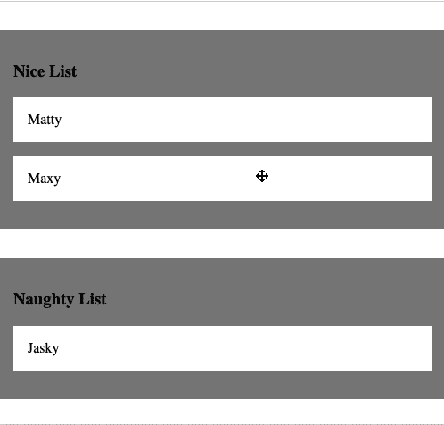

# 如何使用 JavaScript 拖放

> 原文：<https://javascript.plainenglish.io/how-to-drag-and-drop-using-javascript-46e3772b535e?source=collection_archive---------3----------------------->

## JavaScript 拖放与数据库持久性


想象一下，如果没有拖放，web 应用程序会是什么样子。在 Google Drive 或 Dropbox 中移动项目会更加繁琐。您需要单独打开文件夹，然后手动将文件添加到该文件夹中。多痛苦啊！幸运的是，HTML、CSS 和 JavaScript 的强大组合使得拖放操作变得轻而易举，从而使日常功能对用户来说更加实用。

在本文中，我将介绍如何使用普通的 JavaScript 以及基本的 HTML 和 CSS 来实现拖放。我还将解释如何确保对 DOM 所做的更改在数据库中持久化——有人说过全栈开发吗？

如果您想测试应用程序，[这里是存储库](https://github.com/gabriel-demes/drag-drop-prac)。

# 概观

在我们开始编写代码之前，最好对我们将要构建的内容有一个大致的了解。我们的网站将是一个简单的，没有装饰的页面，将显示两个列表:一个好的列表，和一个淘气的列表。这些列表将用我们数据库中的名字填充——为了简单起见，我将使用一个 *db.json* 文件，但是您也可以使用 Rails API、Node 或任何其他您想要的后端技术。到本文结束时，我们将能够将一个学生从一个列表拖到另一个列表，并且即使在我们重新加载页面后，这些更改仍然存在。下图演示了使用拖放功能后我们的页面会是什么样子。



Demonstration of Final Product

# 设置 HTML 和 CSS

我们的第一步是建立一个基本的 HTML 文件。在 HTML 的头部，我们需要链接 CSS 样式表和 JavaScript 文件。当链接 JavaScript 文件时，一定要给脚本标签一个 defer 属性。这是一个经常被忽略的重要步骤，并且经常会导致网页出现故障。在 HTML 文件的主体中，我们将设置两个*div*，它们将成为我们列表的容器。每个 *div* 都有一个名为“container”的*类*，一个 *div* 有一个“nice”的 *id* ，而另一个有一个“naughty”的 *id* 。为了清楚起见，每个 *div* 都将包含一个*标题*，标题中包含该 *div 中的列表名称。*使用所附代码作为如何设置 HTML 文件的参考。

我们的样式表也将非常简单。首先我们要去掉我们*身体*的*页边空白*；然而，这是完全可选的。接下来，我们将设置列表容器的*背景色*为灰色。我们还需要给容器添加一个*1 边缘填充*以及一个*2 边缘顶部*。我们要做的最后一件事是给我们最终的学生添加样式。我们需要确保他们的*背景色*是白色；这将更容易看到我们的列表和可拖动项目之间的对比。我们还想给它们添加一个*1 红色填充*。最后，我们应该将光标设置为' *move '，*这只是增加了用户体验，并有助于进一步显示这些项目可以被拖放。请参考下面的样式表代码。

# 设置数据库

如前所述，我们将为数据库使用一个简单的 *db.json* 文件。我们的数据库由一个 students 对象组成，它的值是 student-objects 的列表。每个学生都有一个 id，一个名字，以及他们当前的名单，无论是淘气的还是乖的。使用下面附加的代码来帮助你建立你的数据库。

**注意:如果使用一个 *db.json* 文件，确保在您的终端中，在您的项目所在的同一个目录下运行以下命令:**

```
**npm install json-server
json-server --watch db.json**
```

# 用数据库中的名称填充列表

现在我们已经有了 HTML、CSS 和数据库设置，是时候使用 JavaScript 来发出获取请求以及操作我们的 DOM 了。在页面加载时，我们要做的第一件事是发出一个 *GET* 请求，然后用我们学生的名字填充我们的列表。我们将创建一个加载函数，该函数将使用*获取*来创建*获取*请求。然后，我们需要将的响应传递给另一个函数，该函数将根据学生的列表属性将每个学生的名字添加到适当的列表中。

```
**const** load = () =>{
     dropEvent() *//I'll talk about this line later*
     **fetch**('http://localhost:3000/students') //makes our get request
          **.then**(resp => resp.json())
          **.then**(students => {
               students**.forEach**(studentObj =>{
                    **addStudentToList**(studentObj) 
               })
          })
}
// ***be sure to call load() at the bottom of this JS file!***
```

为了将每个学生添加到列表中，我们的 addStudentToList 函数接受一个 student 对象的参数。然后，我们需要根据 student 对象的 list 属性选择正确的列表。然后，我们需要创建一个保存学生姓名的 p 标签。p 标签将有一个“draggable”类，这是我们如何在 CSS 中为每个名字添加样式的。接下来，我们需要将 draggable 属性设置为 *"true"* ，以便让 *p-tag* 真正成为一个可拖动的元素。现在，我们将*数据 id* 设置为学生的 id，并将*数据列表*设置为学生应该出现的列表。最后，我们将 *p-tag* 元素添加到我们选择的列表中。

```
**const** addStudentToList = (studentObj) => {
   **const** correctList = document**.querySelector**(`#${studentObj.list}`)
   **const** nameP = document**.createElement**('p')
   nameP**.textContent** = studentObj.name
   nameP**.classList.add**('draggable')
   nameP**.draggable** = "true" //makes element draggable 
   nameP**.dataset.id** = studentObj.id //sets data-id
   nameP**.dataset.list** = studentObj.list //sets data-list
   correctList**.append**(nameP) //adds student to the list                      
   **dragEvent**(nameP) //*I'll talk about this line later*
}
```

# 在列表之间拖放名称

现在，我们已经将数据库中的名字添加到适当的列表中，并赋予每个名字被拖动的能力，我们需要某种方法来将被拖动的条目放到另一个列表中。这就是 *EventListeners* 发挥作用的地方。在我们创建 *p 标签*元素的最后一行代码中，我们将该元素传递给了 *dragEvent* 函数。该函数将向每个 *p-tag* 元素添加两个*event listener*。

第一个 *EventListener* 将在元素被拖动的开始发生。在此事件中，元素将获得一个名为“拖动”的*类*。这将帮助我们跟踪哪个元素正在被拖动。第二个 *EventListener* 将在元素被放下或拖动结束时发生。当元素被放下时,“拖动”类将从 name 元素中删除。因此，一次只有一个元素具有“drawing”*类*——这是有意义的，因为一次只能拖动一个元素。

```
**const** dragEvent = p =>{
     p**.addEventListener**('dragstart', ()=>{
          p**.classList.add**('dragging')
     })
     p**.addEventListener**('dragend', ()=>{
          p**.classList.remove**('dragging')
          **handleMovement**(p) // I'll talk about this later
     })
}
```

我们的 *dragEvent* 函数只负责被拖动的元素。然而，目前我们没有办法将元素放到一个新的列表中。在我们之前的代码中，当我们加载页面时，我们调用了一个名为 *dropEvent()的函数。**drop event*函数将一个 *EventListener* 添加到保存列表的容器( *div* )中。当一个元素被拖动到容器上并放下时，我们选择带有“拖动”类的项目(被拖动的项目)，并将该元素添加到容器中。一定要包含一个 *preventDefault* ，因为这是允许 div 能够将元素放到它上面的。

```
**const** droptEvent = () => {
     containers**.forEach**(container => {
          container**.addEventListener**("dragover", (event)=>{
               event**.preventDefault**()
               const item = document**.querySelector**(".dragging")
               container**.append**(item)
          })
     })
}
```

# 数据库中的持久性

使用我们目前拥有的代码，我们可以成功地将名字从一个列表拖放到另一个列表。然而，一旦我们重新加载页面，列表将返回到它们的原始状态。为了让列表在我们重新加载页面时反映它们的新状态，我们需要将更改保存到数据库中。这就是当我们在 *dragEvent* 函数中放下元素时 *handleMovement* 函数发挥作用的地方。

我们的 *handleMovement* 函数将 name 元素作为其参数。我们声明一个名为 currentList 的变量，它存储元素的原始*数据列表*属性。然后，我们检查原始的*数据列表*是否与删除元素的列表相同——这将是 *p 标签*的父元素。如果它们是相同的，这意味着这个名字实际上没有被移动，我们什么也不做。如果它们不同，我们将 currentList 设置为新列表。然后，我们必须使用 fetch 发出一个 *PATCH* 请求，用学生所在的列表更新学生列表。一旦更新完成，我们也可以用新列表更新数据列表*。*

```
**const** containers = document**.querySelectorAll**('.container') **const** handleMovement = p =>{
     **let** currList = p**.dataset.list**
     **if** (currList != p.**parentElement.id**){
          **if** (currList === 'naughty'){currList = 'nice'}
          **else**{currList = 'naughty'}
          **fetch**(`http://localhost:3000/students/${p.dataset.id}`, {
               **method**: "PATCH",
               **headers**: {"Content-Type": "application/json"},
               **body**: JSON.**stringify**({list: currList})
          })
               .**then**(resp => resp.json())
               .**then**(student => {p.dataset.list = student.list})
     }
}
```

# 结论

我们最终实现了一个拖放功能，它也可以与后端数据库交互。这只是一个功能非常少的准系统网页。唯一的目的是作为一个教程，让您开始在项目中实现拖放功能。请注意，JavaScript 和各种框架有许多可用的库，它们也处理拖放特性——有些具有不同程度的功能。和往常一样，JavaScript 的可能性是无限的，可用的资源也在不断增加。我鼓励你尝试一下你在这里学到的东西，并且看看你可以使用的许多图书馆。

# 有用的资源

*   [https://developer . Mozilla . org/en-US/docs/Web/API/Document/drag _ event](https://developer.mozilla.org/en-US/docs/Web/API/Document/drag_event)
*   [https://www . CSS script . com/lightweight-js-sorting-library-with-native-html 5-drag-and-drop-sortable/](https://www.cssscript.com/lightweight-js-sorting-library-with-native-html5-drag-and-drop-sortable/)
*   [https://www . CSS script . com/best-drag-drop-JavaScript-libraries/](https://www.cssscript.com/best-drag-drop-javascript-libraries/)
*   [https://blog . use journal . com/a-quick-guide-to-regex-in-ruby-8540885057 D6](https://blog.usejournal.com/a-quick-guide-to-regex-in-ruby-8540885057d6)

*更多内容请看*[***plain English . io***](https://plainenglish.io/)