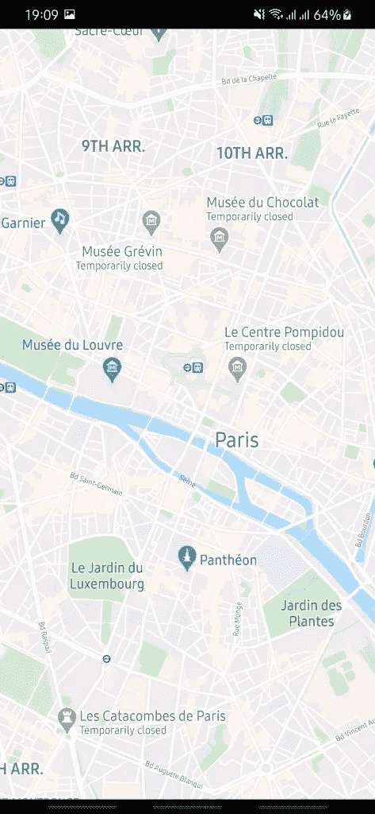
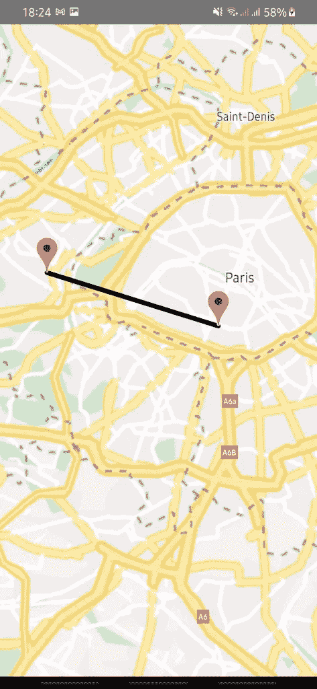
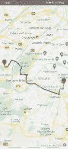

# 如何在 React Native 中在地图上绘制方向

> 原文：<https://javascript.plainenglish.io/how-to-draw-directions-on-a-map-in-react-native-f40825e8194a?source=collection_archive---------16----------------------->


Photo by [Glenn Carstens-Peters](https://unsplash.com/@glenncarstenspeters?utm_source=medium&utm_medium=referral) on [Unsplash](https://unsplash.com?utm_source=medium&utm_medium=referral)

今天我们将在 React Native 的地图上绘制方向路线，展示两个不同位置之间的路径。我们将利用 **react-native-maps** ，这是一个强大的库，允许我们在多个坐标之间绘制折线。我们还将使用谷歌方向 API，以获取两个坐标之间的精确方向路线。

值得注意的是，截至本文撰写之时，react-native-maps 库仅正式支持最新 React Native 版本上的折线模块，因为 React Native 生态系统中的变化越来越多，不容易跟上。

## 装置

让我们安装并配置这个库。根据您首选的包管理器，只需运行:

```
npm install react-native-maps --save-exact
```

或者

```
yarn add react-native-maps -E
```

专业提示:-E 标志安装这个库的最新版本

## 设置

**iOS**

```
cd ios
pod install
```

从您的 Google 控制台获取一个 Google API 密钥。你可以在我们的[用户位置](https://www.instamobile.io/react-native-tutorials/react-native-location/)教程中一步步学习如何获得 Google API 密匙。一旦你有了 API 密匙，编辑你的 ***AppDelegate.m*** 文件:

```
+ #import <GoogleMaps/GoogleMaps.h>@implementation AppDelegate
...- (BOOL)application:(UIApplication *)application didFinishLaunchingWithOptions:(NSDictionary *)launchOptions
{
+  [GMSServices provideAPIKey:@"_YOUR_API_KEY_"]; // add this line using the api key obtained from Google Console
...
```

将以下内容添加到`use_native_modules!`函数上方的 ***Podfile*** 中，并运行 *ios* 文件夹中的`pod install`:

```
# React Native Maps dependencies
rn_maps_path = '../node_modules/react-native-maps'
pod 'react-native-google-maps', :path => rn_maps_path
pod 'GoogleMaps'
pod 'Google-Maps-iOS-Utils'
```

**安卓**

如果您已经定义了*项目级属性*(推荐！)在你的根`build.gradle`中，这个库会检测到下列属性的存在:

```
buildscript {...}
allprojects {...}/**
 + Project-wide Gradle configuration properties
 */
ext {
    compileSdkVersion   = xxx
    targetSdkVersion    = xxx
    buildToolsVersion   = "xxx"
    minSdkVersion       = xxx
    supportLibVersion   = "xxx"
    playServicesVersion = "17.0.0" // or get latest version
    androidMapsUtilsVersion = "xxx"
}
```

或者你可以

```
buildscript {
    ext {
        buildToolsVersion = "xxx"
        minSdkVersion = xxx
        compileSdkVersion = xxx
        targetSdkVersion = xxx
        supportLibVersion = "xxx"
        playServicesVersion = "17.0.0" // or find latest version
        androidMapsUtilsVersion = "xxx"
    }
}
...
```

如果您没有**也没有**定义*项目范围的属性*并且有一个与该库中包含的版本不同的 play-services 版本，请使用以下版本(切换到 17.0.0 和/或 17.2.1 以获得所需版本):

```
...
dependencies {
   ...
   implementation(project(':react-native-maps')){
       exclude group: 'com.google.android.gms', module: 'play-services-base'
       exclude group: 'com.google.android.gms', module: 'play-services-maps'
   }
   implementation 'com.google.android.gms:play-services-base:17.2.1'
   implementation 'com.google.android.gms:play-services-maps:17.0.0'
}
```

最后，您必须将已经检索到的 Google API 密钥添加到***androidmanifest . XML***:

```
<application>
   <!-- You will only need to add this meta-data tag, but make sure it's a child of application -->
   <meta-data
     android:name="com.google.android.geo.API_KEY"
     android:value="Your Google maps API Key Here"/>

   <!-- You will also only need to add this uses-library tag -->
   <uses-library android:name="org.apache.http.legacy" android:required="false"/>
</application>
```

## 使用

该库的基本用法如下:

```
/**
 * Sample React Native App
 * [https://github.com/facebook/react-native](https://github.com/facebook/react-native)
 *
 * @format
 * @flow strict-local
 */import React from 'react';
import {StyleSheet, View, Dimensions} from 'react-native';import MapView from 'react-native-maps';const App = () => {
  return (
    <View style={styles.container}>
      <MapView
        style={styles.maps}
        initialRegion={{
          latitude: 48.864716,
          longitude: 2.349014,
          latitudeDelta: 0.0622,
          longitudeDelta: 0.0121,
        }}/>
    </View>
  );
};const styles = StyleSheet.create({
  container: {
    flex: 1,
  },
  maps: {
    width: Dimensions.get('screen').width,
    height: Dimensions.get('screen').height,
  },
});export default App;
```

这段代码呈现了一个以法国巴黎为中心的基本地图。正如我们在下面看到的，这只是一张空白地图，但是我们将添加一些功能来渲染一条显示两个位置之间方向的线。



为了实现本文的目标，我们必须看看由 **react-native-maps** 提供的名为 **Polyline、**的元素，它在地图上绘制两点之间的方向路线。

```
const App = () => {
  const [coordinates] = useState([
    {
      latitude: 48.8587741,
      longitude: 2.2069771,
    },
    {
      latitude: 48.8323785,
      longitude: 2.3361663,
    },
  ]); return (
    <View style={styles.container}>
      <MapView
        style={styles.maps}
        initialRegion={{
          latitude: coordinates[0].latitude, 
          longitude: coordinates[0].longitude,
          latitudeDelta: 0.0622,
          longitudeDelta: 0.0121,
        }}>
        <Marker coordinate={coordinates[0]} />
        <Marker coordinate={coordinates[1]} />
        <Polyline
          coordinates={coordinates}
          strokeColor="#000" // fallback for when `strokeColors` is not supported by the map-provider
          strokeColors={['#7F0000']}
          strokeWidth={6}
        />
      </MapView>
    </View>
  );
};
```

正如我们在下面的截图中看到的，它只是在地图上的两个标记之间显示了一条直线，这对我们的目的没有帮助，因为它没有向我们显示两个位置之间的路径。



为了解决这个问题，我们必须使用一个外部库`react-native-maps-directions`来帮助我们绘制两个期望位置之间的正确方向路线。这个库使用了 [Google Directions API](https://developers.google.com/maps/documentation/directions/overview) 的，这是 Google 提供的一个 REST 端点，您可以通过一个简单的 HTTP 调用查询它来获得两个坐标之间的方向路线。

```
const App = () => {
  const [coordinates] = useState([
    {
      latitude: 48.8587741,
      longitude: 2.2069771,
    },
    {
      latitude: 48.8323785,
      longitude: 2.3361663,
    },
  ]); return (
    <View style={styles.container}>
      <MapView
        style={styles.maps}
        initialRegion={{
          latitude: coordinates[0].latitude,
          longitude: coordinates[0].longitude,
          latitudeDelta: 0.0622,
          longitudeDelta: 0.0121,
        }}>
        <MapViewDirections
          origin={coordinates[0]}
          destination={coordinates[1]}
          apikey={GOOGLE_API_KEY} // insert your API Key here
          strokeWidth={4}
          strokeColor="#111111"
        />
        <Marker coordinate={coordinates[0]} />
        <Marker coordinate={coordinates[1]} />
      </MapView>
    </View>
  );
};
```

有了它，我们就能实现我们的目标。



## 结论

如果您已经密切关注，您将能够在 React 本地地图上呈现方向。但是请注意，如果您正在测试 Android，您应该启用**方向 API** 来渲染方向，如果您正在测试 iOS，您应该启用 **Google Maps for Android** 或 **Google Maps API for iOS** 。

通过使用地图库和 Google Directions API 端点，我们能够在 React Native 的地图上绘制两个给定位置之间的路线。

如果你觉得这个 React Native 教程有用，请通过分享到你的社区来传播它。干杯！