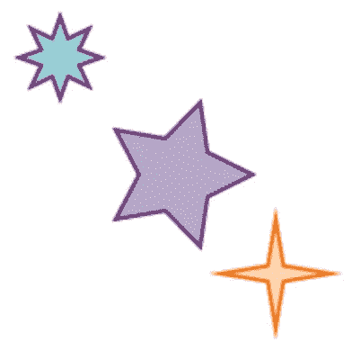
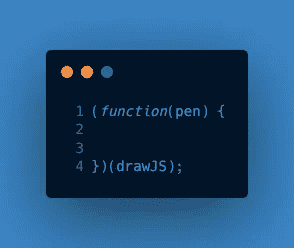
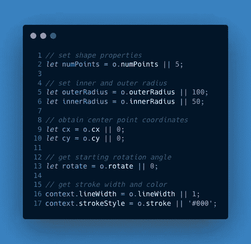
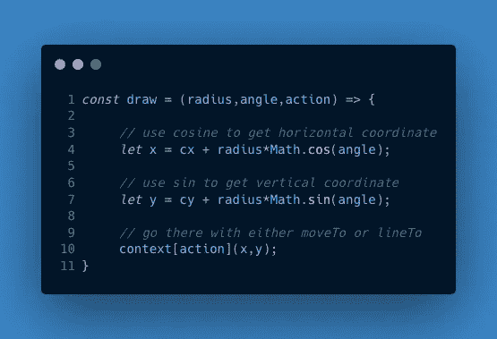
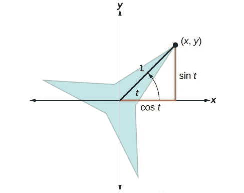
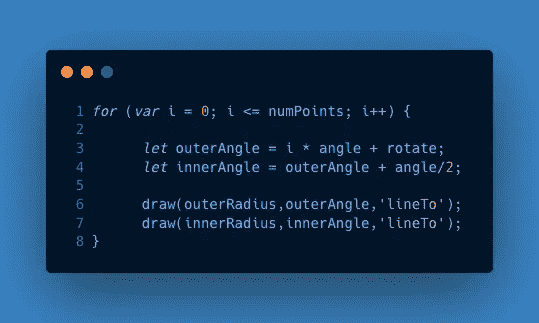

# 如何用 JavaScript 和 HTML5 画布画星星

> 原文：<https://javascript.plainenglish.io/how-to-draw-stars-with-javascript-and-html5-canvas-33ece95c19bf?source=collection_archive---------1----------------------->


Photo by [Tim Mossholder](https://unsplash.com/@timmossholder?utm_source=unsplash&utm_medium=referral&utm_content=creditCopyText) on [Unsplash](https://unsplash.com/s/photos/star-shape?utm_source=unsplash&utm_medium=referral&utm_content=creditCopyText)

HTML Canvas API 是创建各种形状、复杂图形、动画和基于网络的游戏的绝佳工具。也就是说，当我从 Flash 和 ActionScript 转向 HTML5 和 JavaScript 时，我发现 Canvas API 非常低级，因为它需要许多行代码来简单地绘制一个基本形状。为了使这个过程更有效率，我一直在创建自定义库来处理渲染细节，让我可以专注于工作的创造性方面。

在本教程中，我们将编写一个 JavaScript 微库，其中包含一个渲染自定义星形的方法。通过多次调用此方法，您可以使用它来创建带有许多星星的图像。在这个过程中，我们将学习结合 JavaScript 技术，如[立即调用函数表达式](https://developer.mozilla.org/en-US/docs/Glossary/IIFE)、[对象初始化器](https://developer.mozilla.org/en-US/docs/Web/JavaScript/Guide/Working_with_Objects#creating_new_objects)、[箭头函数表达式](https://developer.mozilla.org/en-US/docs/Web/JavaScript/Reference/Functions/Arrow_functions)、l [逻辑或(](https://developer.mozilla.org/en-US/docs/Web/JavaScript/Reference/Operators/Logical_OR) `[||](https://developer.mozilla.org/en-US/docs/Web/JavaScript/Reference/Operators/Logical_OR)` [)运算符](https://developer.mozilla.org/en-US/docs/Web/JavaScript/Reference/Operators/Logical_OR)、[数学对象](https://developer.mozilla.org/en-US/docs/Web/JavaScript/Reference/Global_Objects/Math)，当然还有[画布 API 方法](https://developer.mozilla.org/en-US/docs/Web/API/Canvas_API)。因为写星形逻辑涉及到[三角学](https://www.mathsisfun.com/algebra/trig-finding-side-right-triangle.html)，所以会有一个数学插曲，尽管你可以想学多少就学多少。

虽然本教程与我之前的关于如何用画布绘制圆形和多边形的教程有关，但是这里的库并不依赖于它。也就是说，最后的演示结合了星形方法和其他教程中的圆形和多边形方法。

# 图书馆演示

我们可以在下面看到运行中的 star 库。

每颗星星都是通过一种叫做`drawStar`的方法绘制的，这种方法允许我们确定以下属性:

*   恒星中心点的位置，由`cy`和`cy`值指定
*   描边和填充颜色
*   外部点数
*   线条宽度
*   外半径，即中心和任何外点之间的距离
*   内半径，即中心与任何内角之间的距离
*   旋转角

考虑上面演示的截图。



These three stars are drawn with this library.

您在上面看到的紫色星星是通过使用下面的语法调用`drawStar`方法呈现的。

Method call for drawing a purple star.

正如你所看到的，你可以简单地添加属性，`drawJS`将处理渲染细节。

# 奠定基础

让我们准备一个 HTML 页面，添加一点 CSS，然后开始编写 JavaScript。

## HTML 和 CSS

就你的 HTML 而言，你所需要的只是一个如下所示的`<canvas>`元素。

```
<canvas id="myCanvas" width="200" height="200"></canvas>
```

CSS 也很少。

```
body {
  text-align: center;
}
canvas {
  border: 1px solid #000;
}
```

## 初始 JavaScript

让我们从将`drawJS`初始化为一个空对象开始。

```
let drawJS = {};
```

为了设置我们的作用域，让我们创建一个函数包装器，将`drawJS`传递给它。在包装器中，`drawJS`被称为`pen`。



Our function wrapper.

在这个包装器中，让我们创建附加到`pen`对象的`drawStar`方法。注意，`drawStar`有一个参数:一个名为`o`的对象。正如您在`o = {}`表达式中所看到的，如果没有传入任何内容，那么默认情况下它将是一个空对象。

```
(function(pen) { pen.drawStar = function(**o = {}**) { }})(drawJS); 
```

## 获取画布上下文

下一步是编写找到`<canvas>`元素并获取其绘图上下文的逻辑，这实质上是一组呈现方法。

首先，我们检查传入的对象是否有一个`id`。如果是，我们将它作为我们的选择器，如果不是，我们将获取页面上的第一个画布。

```
let selector = (o.id) ? '#'+o.id : 'canvas';
```

然后我们获取对`<canvas>`元素的引用，只要该元素存在，我们就获取上下文。

```
let canvas = document.querySelector(selector);if (canvas) {
     let context = canvas.getContext("2d");
}
```

这是我们图书馆目前的样子。

The beginnings of the drawStar method.

## 拉入属性

现在让我们使用 OR ( `||`)选择器来获取传入对象的属性，以提供默认值。例如，如果`o`没有`numPoints`属性，我们的值默认为`5`。



Pulling in properties

注意最后两行将`lineWidth`和`strokeStyle`直接应用于`context`，而不是存储在变量中。

这是我们所有代码现在的样子。

Obtaining the context and pulling in properties.

好了，基础已经打好了。现在该写绘图逻辑了。

# 让我们画画吧

在得到我们的属性后，我们调用`context`上的`beginPath`，这对于清除以前绘制的星星留下的旧属性是必要的。

```
context.beginPath();
```

当我们创建多个星星时，需要`beginPath()`来改变一个星星到下一个星星的颜色。

## moveTo 和 lineTo 方法

还有另外两个`context`方法需要注意。

*   `moveTo()`方法，它从页面上拿起笔，并将其移动到某个地方。
*   `lineTo()`方法，按住笔，画一条线。

你可以用点语法调用这些方法中的任何一个—

```
context.lineTo();
```

—或者您可以将方法的名称存储在字符串中，并使用括号语法来调用它。

```
let action = 'lineTo';context[action]();
```

## “绘制”助手方法

我们将在下面的一个叫做`draw`的助手方法中使用括号语法。



The “draw” helper method.

这个方法有三个参数:

*   `radius`或者笔离中心有多远
*   `angle`相对于恒星的三点钟位置
*   一个`action`，它或者是`moveTo`或者是`lineTo`

注意`radius`和`angle`是数字，而`action`是字符串。在调用这个`draw`函数之前，我们先分析一下它是如何工作的。

## 用数学绘制星点

让我们快速看一下`draw`函数使用的底层数学。在下面的例子中，我们有一个半径为 1 的三点星形，中心有一个**角 t** ，我们的程序用它来到达第一个点。由于我们从水平开始，逆时针画，我们的笔从右上角开始，用坐标 **(x，y)标注。**



Here, the sin and cosine of angle t are used to determine the coordinates of a star’s point.

下面的三角形显示了两个触发函数，sin 和余弦，与我们的点的(x，y)坐标和角度 t 的关系。


A close-up of the outer angle and the triangle.

您可能已经猜到了， **cos t** 用于查找 x 坐标，而 **sin t** 用于查找 y 坐标。下面是这些方程的快速复习。观察三角形时，考虑角 t 的对边与 y 坐标的关系，以及角 t 的邻边与 x 坐标的关系。


The sin and cosine equations.

## 从数学到代码

在`draw`函数的第一行代码中，`angle`的`cos`用于查找`x`坐标。因为`radius`不总是 1，我们用`Math.cos(angle)`乘以`radius`来得到 x 坐标。添加`cx`将使`x`的坐标相对于恒星的中心。

```
let x = cx + Math.cos(angle) * radius;
```

`angle`的`sin`用于以同样的方式寻找`y`坐标，这次`cy`代表中心点的`y`值。

```
let y = cy + Math.sin(angle) * radius;
```

`draw`中的第三行也是最后一行使用`action`到达该点，或者是笔向上(如`moveTo`)或者是笔向下(如`lineTo`)。这就是我们的括号语法出现的地方。

```
context[action](x,y);
```

## 转到起点

现在让我们使用新的`draw`函数将我们的笔移动到起点，也就是星形的第一个外角。

```
draw(outerRadius, rotate, 'moveTo');
```

*   `outerRadius`表示从中心到最外点的距离。
*   `rotate`值是起始角度，默认为零——恒星的 3 点钟位置。
*   `action`是`moveTo`，因为我们还没有放下笔。

## 求两点之间的角度

现在让我们找出星点之间的角度。

```
let angle = 2 * Math.PI / numPoints;
```

这里我用`2 * Math.PI`来表示 2π弧度或者 360 度。然后我用它除以`numPoints`，或者说是星星的点数，得到角度。

## 循环通过这些点

现在，我们到目前为止所做的准备工作将在这个循环中使用，这将画出我们的星星。



因为我们不需要在画画的时候拿起笔，`lineTo`既适用于外点，也适用于内点:

```
draw(outerRadius,outerAngle,**'lineTo'**);draw(innerRadius,innerAngle,**'lineTo'**);
```

## 添加描边和填充

现在已经画出了星星的路径——但是为了让用户看到它，我们需要添加描边和填充。虽然这里总是调用`stroke()`方法，但是您可以很容易地在这里添加`if`逻辑，使其成为可选的。

```
// add the outline
context.stroke();// add the fill
if (o.fill) {
     context.fillStyle = o.fill;
     context.fill();
}
```

我们完了！此时，`stroke`和`fill`方法应该渲染出我们用`moveTo`和`lineTo`画出的星星。下面是整个方法。

The entire drawStar method.

# 星形、圆形和多边形

如果我们将我们的星形方法与[圆形和多边形教程](https://betterprogramming.pub/create-your-own-html5-canvas-toolkit-with-vanilla-javascript-1d2ad1047219?sk=d381699afd03f1a953acbebd17503b86)中的两种方法结合起来，我们可以用一个库画出所有三个形状，如下图所示。

本文的重点是整个`drawStar`函数，所以我们只是触及了数学的表面。如果你感兴趣的话，可以看看用 JavaScript 渲染的星星背后的数学知识。

[](/the-math-behind-stars-rendered-with-javascript-94d4dee2754a) [## 用 JavaScript 渲染星星背后的数学

### 三角学如何引导数字笔？

javascript.plainenglish.io](/the-math-behind-stars-rendered-with-javascript-94d4dee2754a) 

我希望你喜欢这篇教程，并且学到了一些可以应用到你自己的项目中的技巧。感谢阅读！

## 进一步阅读

[](https://betterprogramming.pub/create-your-own-html5-canvas-toolkit-with-vanilla-javascript-1d2ad1047219) [## 用普通的 JavaScript 创建你自己的 HTML5 画布工具包

### 帮助创作者画出令人惊叹的形状的工具包

better 编程. pub](https://betterprogramming.pub/create-your-own-html5-canvas-toolkit-with-vanilla-javascript-1d2ad1047219) [](https://medium.com/codex/create-an-animated-banner-with-vanilla-javascript-and-html5-canvas-8b499c294b88) [## 用普通的 JavaScript 和画布 API 创建一个动画横幅

### 画布会忘记，但我们的物体不会。

medium.com](https://medium.com/codex/create-an-animated-banner-with-vanilla-javascript-and-html5-canvas-8b499c294b88) 

*更多内容请看*[***plain English . io***](http://plainenglish.io)