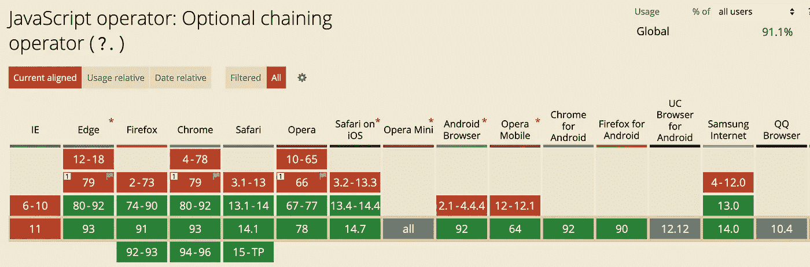
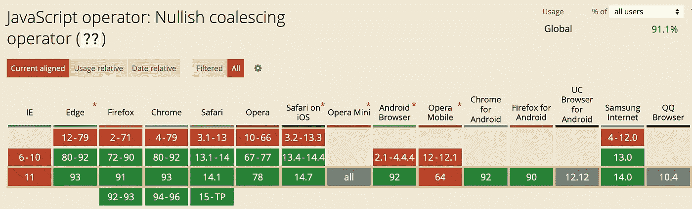

# 如何使用可选链接安全地钻取 JavaScript 对象

> 原文：<https://javascript.plainenglish.io/how-to-drill-into-a-javascript-object-safely-with-optional-chaining-522ff3b94a46?source=collection_archive---------7----------------------->

## 用最少的代码以无错的方式探索不确定的对象


Photo by [Markus Spiske](https://unsplash.com/@markusspiske?utm_source=unsplash&utm_medium=referral&utm_content=creditCopyText) on [Unsplash](https://unsplash.com/s/photos/chain-links?utm_source=unsplash&utm_medium=referral&utm_content=creditCopyText)

在[的上一篇文章](https://betterprogramming.pub/how-to-check-for-javascript-properties-without-mid-function-returns-46f39d09975b)中，我写了如何在不使用中间函数返回的情况下检查可能不存在的深度嵌套的对象属性。下面是我们检查的对象类型。

A sample teacher object.

在本文中，我们用不同的方法处理相同的场景。

# 场景

以前，我们想要获得一个教师对象的第一个类的第一个学生。但是并不是所有的教师对象看起来都像上面的那样——或者甚至不存在。即使对象被证明是有效的，类中的`pupils`属性——就此而言，还有`classes`和`data`属性——可能不存在。那么我们如何安全地检查第一个小学生呢？

我们在上一篇文章中最终使用的`getFirstPupil`函数，如下所示，使用了`&&` (AND)操作符来递增地检查越来越深的属性。

Here we use the AND operator to incrementally drill into an object.

# 新方法

虽然上面的函数是有效的，但实际上有一种更紧凑的方法来安全地检查深度嵌套的属性，使用一种称为[可选链接](https://developer.mozilla.org/en-US/docs/Web/JavaScript/Reference/Operators/Optional_chaining)的技术。使用`?.`操作符，您可以检查对象中的属性，而不必验证属性链中的每个“链接”是否存在。下面是一个使用可选链接的`getFirstPupil`函数。

Drilling into the teacher object using optional chaining.

让我们来分析一下这里发生了什么。

*   我们不知道`teacher`是否存在，所以我们使用`teacher?.`
*   假设我们得到一个`teacher`对象，如果`data`不存在，我们不想出错，所以我们使用`data?.`
*   现在`data`可能存在，但是它的`classes`可能不存在，所以我们用`classes?.`
*   假设我们找到一个`classes`数组，我们不知道它是否有任何元素，所以我们使用`[0]?.`以防在索引`0`处没有类。
*   假设我们找到了一个类。如果`pupils`数组不存在，我们使用`pupils?.[0]`，它将给出一个`undefined`值而不会抛出错误。
*   如果我们不希望在最坏的情况下有一个`undefined`值，我们使用 nullish 合并(`??`)操作符，它允许我们使用一个缺省值—在本例中是`null`。

# 箭头功能

如果我们想用一种更简洁的方式来写它，我们可以使用一个箭头函数。

Using an arrow function to make this less compact.

如果我们真的只需要一行代码，我们可以去掉括号。

Drilling into an object safely with a one-line function.

如果您希望`getFirstPupil`在更大的功能中扮演助手的角色，箭头功能方法可能是理想的。

下面是一个代码笔，它将向您展示这个一行程序的实际应用。

Finding the first pupil in a teacher’s first class using optional chaining.

# 何时不使用可选链接

当思考可选链接的潜在缺点时，有两个特别引起了我的注意:掩盖您想知道的重要错误，以及关于浏览器兼容性的限制。

## 错误沉默

请记住，如果某个对象或其属性确实应该存在，您可能希望代码引发错误。例如，如果一个`teacher`对象和它的`data`属性应该总是存在，你可能不想使用可选链接。在下面的例子中，我们只使用了`?.`操作符来索引`classes`数组，它可能存在也可能不存在。

```
let firstClass = teacher.data.classes?.[0];
```

如果想标记不存在的`teacher`或`data`对象而不抛出实际错误，可以使用`try / catch`块。

```
let firstClass = null;try {
  firstClass = teacher.data.classes?.[0];
}
catch (e) {
   alert('Handling error here: ' + e);
}
```

## 浏览器兼容性

由于可选链接是 ECMAScript 2020 的一部分，所以它是一个相当新的特性，并不兼容所有浏览器。下面是来自 c[aniuse.com](https://caniuse.com/?search=optional%20chaining)的兼容性快照。请注意对 IE 的明显缺乏支持，以及对旧浏览器的有限支持。



Optional chaining operator from caniuse.com. Data captured on 9/9/2021.

自从零化聚结(？？)运算符也是 ES2020 的一个特性，它有[类似的兼容性统计数据](https://caniuse.com/?search=null%20coalescing)。



Nullish coelescing operator from caniuse.com. Data captured on 9/9/2021.

那么，如何在不破坏浏览器的情况下使用这些酷操作符呢？我推荐尝试一下 [Babel 插件](https://babeljs.io/)，它可以将前沿的 JavaScript 代码移植到更老的、支持更好的代码上，这些代码将得到更广泛的支持。Chetan Raj 写了一篇[很棒的文章](/the-optional-chaining-operator-in-javascript-e151ecafcbd8),讲述了如何使用带有可选链接和无效合并操作符的 Babel 插件。

# 对不确定的方法使用可选链接

假设我们获得了`firstClass`，我们想调用一个`getClassName()`方法，这个方法可能存在也可能不存在。我们还可以使用可选链接来尝试调用此方法，同时再次使用 nullish 合并操作符来提供默认值。

```
let firstName = firstClass.getClassName?.() ?? 'No name';
```

如您所见，`?.`操作符只允许您在前面的对象存在的情况下继续钻取，而如果您空手而归，nullish 合并(`??`)操作符会提供默认值。

# 比较性能

我很好奇我的 AND 运算符函数和可选的 chaining 函数是否有明显的性能差异，所以我测量了运行每个版本的`getFirstPupil`函数一百万次需要多长时间。为了测试这一点，我为每个函数设置了一个`for`循环，并使用`performance.now()`获得每个循环运行前后的时间。

在刷新后的第一次测试中，我并没有看到显著的性能差异，这通常需要更长的时间来运行。在所有后续测试中，AND 操作符函数的运行速度稍快。下面是一个示例测试:

```
Optional chaining performance: 23.3 msAND operator performance: 16.5 ms
```

在大多数情况下，这可能不是一个很大的区别，鉴于我只在一台机器上运行这些测试，结果绝不是决定性的。也就是说，有趣的是，更紧凑的链接方法似乎效率稍低。你可以在这个[代码笔](https://codepen.io/nevkatz/pen/WNOpRvq)上运行这些测试。

# 后续步骤

*   创建您自己的 JavaScript 对象进行检查。
*   尝试每种方法，看看哪一种更适合你。
*   尝试性能测试，并考虑编写自己的测试。
*   下载 [Babel](https://babeljs.io/) 并考虑与这些新操作符一起使用。
*   请看一下上一篇文章，了解更多的背景知识。

[](https://betterprogramming.pub/how-to-check-for-javascript-properties-without-mid-function-returns-46f39d09975b) [## 如何编写安全的 JavaScript 并避免函数中途返回

### 假设积极的一面，同时抓住灾难

better 编程. pub](https://betterprogramming.pub/how-to-check-for-javascript-properties-without-mid-function-returns-46f39d09975b) 

感谢 Scotty Jamison，他在我的上一篇文章中指出了这种技术。

## 参考

[MDN:可选链接](https://developer.mozilla.org/en-US/docs/Web/JavaScript/Reference/Operators/Optional_chaining)

*更多内容请看*[***plain English . io***](http://plainenglish.io/)