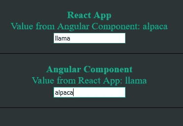

# 如何动态集成 Angular in React 并在两者之间共享数据

> 原文：<https://javascript.plainenglish.io/how-to-dynamically-integrate-angular-in-react-and-share-data-between-both-c507e90b1f09?source=collection_archive---------2----------------------->

Original photo by [Дмитрий Хрусталев-Григорьев](https://unsplash.com/@hrustall?utm_source=medium&utm_medium=referral) on [Unsplash](https://unsplash.com?utm_source=medium&utm_medium=referral)

**用例:**最近我不得不想办法在一个 React app 内部集成一个角度模块。两者需要共享数据，React 应用程序将数据向下传递到 Angular 模块以触发一个动作，然后一些数据向上传递回 React 应用程序。集成的模块必须动态呈现，这意味着如果模块代码被更新，那么整个 React 应用不需要重启。理想情况下，两者应该在不同的 URL 上独立运行，而不需要在同一个 repo 甚至服务器上协同工作。

**解决方案:** Web 组件！经过大量的研究和反复试验，Web 组件化险为夷。有相当多的文章解释了如何将 Web 组件与 Angular 和 React 一起使用，但是共享数据和动态呈现的好例子很少。所以我决定写这篇文章，介绍从头开始创建动态多应用程序所需的所有步骤。完整的代码可以在[这里](https://github.com/MachineLlama/multi-app)找到。

**注意:**我还尝试了使用 Webpack 5 模块联合，这可能是一个潜在的解决方案，但是需要很多复杂的开销。这里的最终解决方案不需要 Webpack 5，我们创建的 Angular Web 组件可以以简单、与框架无关的方式动态加载到任何 JavaScript 应用程序中。

# 使用 Web 组件的 Angular 应用程序设置

首先，我们将开始创建一个名为“angular-app”的新 Angular 应用程序，它将把一个简单的模块转换成一个 Web 组件，并使用`@angular/elements`构建一些静态脚本(您需要安装`[ng](https://angular.io/guide/setup-local)`并准备好使用)

1.  创建一个新的角度项目:`ng new angular-app`
2.  安装依赖项:`ng add @angular/elements`
3.  修改*angular-app/src/app/app . component . html*，将所有内容替换为简单文本:

4.修改*angular-app/src/app/app . module . ts*在其构造函数中创建 Angular 模块的 Web 组件；全部替换为:

5.在 *angular-app* 中，运行`ng build`来构建静态 Web 组件文件，我们稍后将在我们的主机 React 应用程序中使用这些文件

# React 应用程序设置

接下来，我们将创建一个简单、最小的 React 应用程序，名为“react-app”(您需要安装 [npm](https://www.npmjs.com/get-npm) 和[节点](https://nodejs.org/en/download/)并准备好使用)

1.  使用[https://github.com/MachineLlama/react-setup](https://github.com/MachineLlama/react-setup)创建一个新的 React 应用。运行方式:`node start react-app`

*   或者，您可以使用 [React Create App](https://create-react-app.dev/docs/getting-started/)

# 在 React 中构建、复制和运行角度模块

现在，我们可以将 Angular 应用程序中构建的所需脚本复制到 React 应用程序中，并将其导入到组件中

1.  新建一个文件夹:*react-app/src/angular-files*
2.  将这些文件从*angular-app/dist/angular-app*复制到*react-app/src/angular-files*:*main . js*、 *polyfills.js* 、 *runtime.js* 、 *styles.css* 、 *styles.js* (如果存在)和 *vendor.js*
3.  修改 *react-app/src/App.js* 以导入 Angular Web 组件静态文件并呈现新的定制元素

4.在 *react-app* 中，运行`npm run start`

*   你应该会在正在运行的应用程序上看到“骆驼”，它来自 Angular Web 组件(耶！)

# 将数据从 React 向下传递到 Angular Web 组件

在大多数情况下，我们希望应用程序的 React 和 Angular 部分能够相互通信。因此，让我们看看如何使用属性值将数据传递给 Angular Web 组件

1.  向*Angular-app/src/app/app . component . ts*中的角度模块添加一个输入变量

2.在*angular-app/src/app/app . component . html*中显示 **reactValue** 。全部替换为:

3.在 *react-app/src/App.js* 中添加一个输入，我们将把它的值从 react 应用程序传递到 Angular Web 组件(重要:注意 Web 组件中的属性是`react-value`以匹配角度变量`reactValue`)

4.在 *angular-app* 中，运行`ng build`并将文件从*angular-app/dist/angular-app*复制到*react-app/src/angular-files*

5.在 *react-app* 中，运行`npm run start`

*   您应该在 React 应用程序中看到一个输入，它将更新 Angular Web 组件(nifty)中的文本

# 将数据从 Angular Web 组件向上传递到 React 应用程序

在 Angular Web 组件中执行一个动作之后，我们可能希望将数据传递回 React 应用程序，或者在 Web 组件之外触发另一个动作。为此，我们将利用自定义事件，这是一种观察您想要从 Web 组件发出的任何数据的简单方法

1.  在*angular-app/src/app/app . component . html*中添加一个输入，将所有内容替换为:

2.可选:在*angular-app/src/app/app . component/scss 中为 angular-app-container 添加一些样式*

3.向*Angular-app/src/app . app . component . ts*添加一个 **onKey** 函数，每当角度输入改变时，该函数发出一个自定义事件:

4.在 *react-app/src/App.js* 中，添加一个监听器来获取并显示从 Web 组件发出的角度输入值:

5.在 *angular-app* 中，运行`ng build`，将*angular-app/dist/angular-app*中的文件复制到*react-app/src/angular-files*

6.在 *react-app* 中，运行`npm run start`

*   现在我们有了一个 React 应用程序，它呈现了一个包装在 Web 组件中的 Angular 模块，数据可以在两者之间双向传输(很好)

最终产品:

# 动态加载脚本(不再需要复制)

这对于大规模生产应用程序至关重要，因为这意味着我们可以对应用程序的小部分(可以在不同的端口或服务器上独立运行)进行更新，而无需更新或重启主应用程序。用户只需刷新浏览器就能看到新内容，应用程序不会停机

1.  在 *react-app* 中，运行`npm i web-component-load`
2.  更新 *react-app/src/App.js* 移除静态导入；您可以使用给定的 URL 从 *web-component-load* 调用 load 函数，所有的 Angular chunk 文件将作为脚本(或 styles.css 文件的链接)附加到正在运行的应用程序的 document head 部分，如果该特定脚本/链接还不存在的话

3.用`ng serve`运行*角度 app* 。这将在给定的端口(本例中为 4200)上运行应用程序，我们可以从那里访问必要的 Web 组件脚本(通过 *web 组件加载*中的加载函数)

4.用`npm run start`运行 *react-app* ，一切应该和以前一样工作

5.现在尝试更新*angular-app/src/app/app . component . html*并用`ng serve`重启 *angular-app* 。如果您在浏览器中刷新 React 应用程序，您将看到 Angular Web 组件的更新，而无需复制静态构建文件，也无需重启 React 应用程序(太酷了)

这样，我们就可以创建一个 Angular Web 组件(它可以做普通 Angular 模块能做的任何事情),并在任何其他应用程序中动态地呈现它。

感谢您的阅读。

[*更多内容看 plainenglish.io*](http://plainenglish.io/)