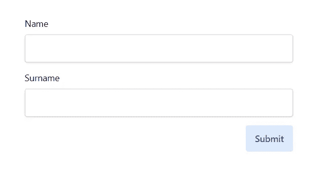

# 使用组合 API 与 Vue 3 中的多个 v 模型同步

> 原文：<https://javascript.plainenglish.io/how-to-easily-sync-with-multiple-v-models-in-vue-3-using-composition-api-1e36440d932?source=collection_archive---------17----------------------->


本文原载于[企业之路](https://theroadtoenterprise.com/blog/how-to-easily-sync-with-multiple-v-models-in-vue-3-using-composition-api)。

Vue 3 带来了许多新特性，在同一个元素上使用多个 v-model 指令的能力就是其中之一。我想与您分享一个快速技巧，告诉您在使用多个 v-model 时如何处理父组件状态的更新。在处理表单的时候特别有用。您可以在这个 [GitHub 资源库](https://github.com/ThomasFindlay/handle-multiple-vmodels-using-composition-api)中找到完整的代码示例。

对于本例，我们将使用下图所示的表单。



下面你可以找到它的代码。我们有两个文件— `App.vue`，它们具有表单状态并呈现`Form`组件。`Form.vue`组件呈现带有标签和输入字段的表单元素。

**App.vue**

```
<template>
  <div :class="$style.container">
    <Form
      v-model:name="form.name"
      v-model:surname="form.surname"
      @submit="onSubmit"
    />
  </div>
</template>

<script>
import { ref } from 'vue'
import Form from './components/Form.vue'

export default {
  components: {
    Form,
  },
  setup() {
    const form = ref({
      name: '',
      surname: '',
    })

    const onSubmit = () => console.log(form)

    return {
      form,
      onSubmit,
    }
  },
}
</script>

<style module>
.container {
  max-width: 30rem;
  @apply mx-auto py-8;
}
</style>
```

**组件/表单. vue**

```
<template>
  <form @submit.prevent="$emit('submit')">
    <div :class="$style.formBlock">
      <label :class="$style.label">Name</label>
      <input
        v-model="nameState"
        :class="$style.input"
        type="text"
        aria-label="Name input"
      />
    </div>
    <div :class="$style.formBlock">
      <label :class="$style.label">Surname</label>
      <input
        v-model="surnameState"
        :class="$style.input"
        type="text"
        aria-label="Surname input"
      />
    </div>
    <div>
      <button
        class="float-right bg-blue-100 text-blue-900 px-4 py-3 rounded font-semibold"
        type="submit"
      >
        Submit
      </button>
    </div>
  </form>
</template>

<script>
import { useVModel } from '../composables/useVModel.js'
export default {
  emits: ['update:name', 'update:surname', 'submit'],
  props: {
    name: String,
    surname: String,
  },
  setup(props) {
    return {
      nameState: useVModel(props, 'name'),
      surnameState: useVModel(props, 'surname'),
    }
  },
}
</script>

<style module>
.formBlock {
  @apply flex flex-col mb-4;
}
.label {
  @apply mb-2;
}
.input {
  @apply px-4 py-3 shadow rounded border border-gray-300 bg-white;
}
</style>
```

为了更新父节点中的状态，我们需要发出一个`update:<modelValue>`事件。

这里是`useVModel`助手的代码。

**composables/usev model . js**

```
import { computed, getCurrentInstance } from 'vue'

export const useVModel = (props, propName) => {
  const vm = getCurrentInstance().proxy

  return computed({
    get() {
      return props[propName]
    },
    set(value) {
      vm.$emit(`update:${propName}`, value)
    },
  })
}
```

我们必须通过`props`对象来保持反应的完整性和我们想要同步的属性名。在`useVModel`内部，我们通过`getCurrentInstance()`访问当前实例，因为我们需要访问`$emit`方法。`computed`接收一个带有 getter 和 setter 的对象。getter 返回通过 props 传递的值，而 setter 发出一个事件来更新该值。多亏了这个小帮手，通过 v-models 保持通过道具传递的状态就干净简单多了。

我希望你喜欢这篇文章。如果你想学习更多与 Vue 相关的技巧、高级模式、技术和最佳实践，你可能想看看[“Vue——通往企业之路”](https://theroadtoenterprise.com/?utm_source=theroadtoenterprise_blog&utm_medium=article_learn_more&utm_campaign=vue_the_road_to_enterprise)这本书。