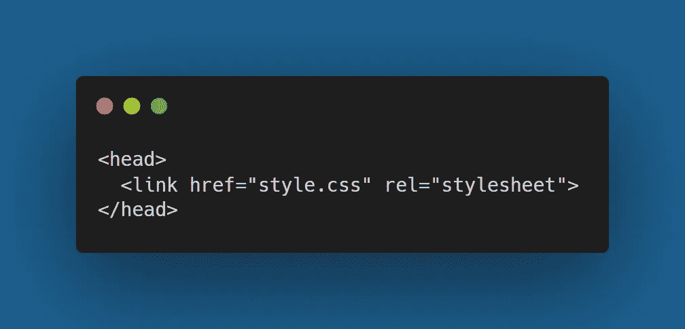
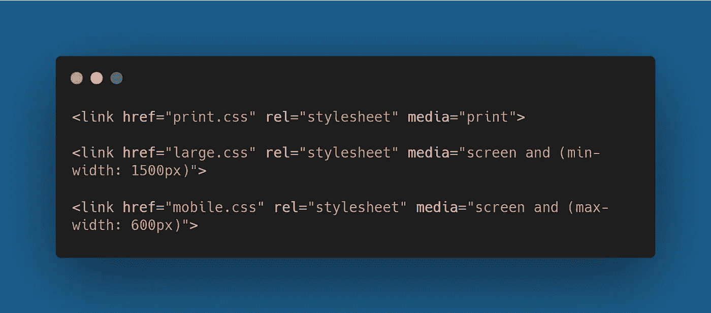
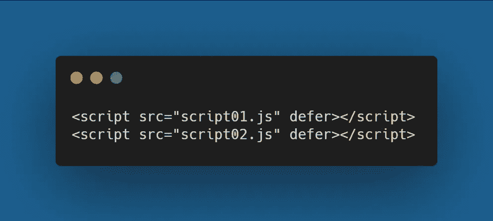
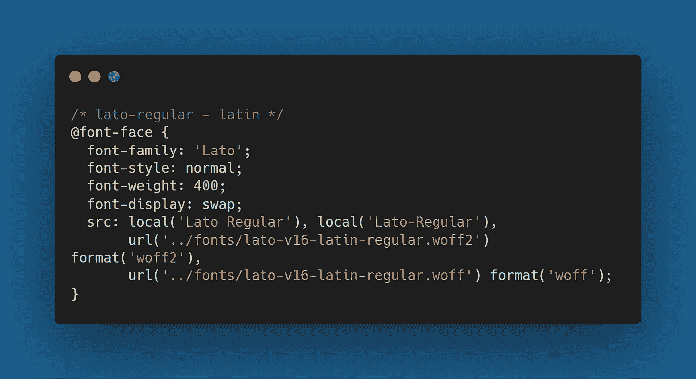

# 如何为更快的 Web 应用消除渲染阻塞资源

> 原文：<https://javascript.plainenglish.io/how-to-eliminate-render-blocking-resources-for-faster-web-apps-f6f72ffe9b12?source=collection_archive---------9----------------------->

## 构建快速加载的 Web 应用程序

在渲染网页的过程中，字体、 **HTML、**、 **CSS、**、 **JavaScript** 等静态文件成为一个重要的阻塞资源，在这些关键文件被处理完之前，它停止下载其余的资源。这导致了缓慢的 web 应用程序，因为整个渲染过程都处于暂停状态。

这些关键资源文件对您的 web 应用程序的性能有很大影响，有几种方法可以消除呈现阻塞资源，我们可以减少呈现阻塞资源的数量，或者我们可以缩短关键呈现路径和减少页面加载时间，以改善用户体验。

**有三种方法可以减少渲染阻塞资源的影响:**

*   通过推迟下载使它们成为非呈现资源。
*   减少 **HTTP** 请求的数量。
*   通过缩小来减少资源的大小- ***(页面加载的字节数较少)*** 。

# 渲染阻塞资源

每个 web 应用程序都会处理它在一个 **HTML** 页面的 **< head >** 部分中找到的所有内容，包括:

*   CSS 样式表。
*   在 th **< head >** 部分添加的 JavaScript 文件。
*   来自 **CDN** 或本地服务器的字体。
*   HTML 导入。

放置在**<>**部分底部的图像、媒体文件和<脚本> 标签都是非渲染资源。

为了消除这些资源，这里有一些开发人员用来优化和加速他们的 web 应用程序的最佳实践。

## 不要使用导入规则添加 CSS

*   使用 HTML 文件中添加的**<link rel = ' style sheet '>**标签将 CSS 添加到页面中。

***导入*** 规则可能会使项目更整洁，并且所有的 **CSS** 依赖项都在同一个地方，但是考虑到性能，这不是最好的选择。使用**导入**规则允许您从其他样式表导入 CSS，但是这种方法会导致浏览器处理 **CSS** 文件的速度更慢，因为它还必须下载导入的文件，并且在此之前您的渲染过程将被阻塞。

如果你需要添加一个以上的 CSS 文件到你的页面，你可以使用 **<链接>** 标签或者**使用缩小工具连接**文件。

**例如:**

## 对条件 CSS 使用媒体属性

默认情况下，每个浏览器都将 CSS 文件视为渲染阻塞资源，但是如果我们将 **media** 属性添加到 ***< link >*** 标签，那么我们就可以向浏览器指示条件 **CSS** 文件的存在。

因为条件 CSS 只适用于特定的条件，比如低于或高于视窗大小或在打印页面上。使用 media 属性，您可以为 CSS 文件定义特定的媒体条件。 ***(可以使用 CSS 文件中用于媒体查询的任何值)***

**例如:**

即使在这个实现之后，这些文件仍然被下载到所有设备上，如果条件评估为假，它们将成为非渲染阻塞资源。 **mobile.css** 样式表将在最大视窗宽度为 **600px** 的移动设备上呈现阻塞，在大于 **600px 的视窗上不呈现阻塞。**

此外，如果您有一个或多个媒体查询的现有 **CSS** 文件，您可以使用 **PostCSS** 插件提取所有媒体规则，并将其保存在一个单独的文件中。这种做法也被称为**代码分割**，我们也可以分割较大的 CSS 文件，只在需要时才加载每个文件，以缩短关键渲染路径，减少初始页面加载时间。

## 延迟和异步属性

**添加到文档的**<>**节中的 JavaScript** 文件总是被视为渲染阻塞资源，为了将它们从关键渲染路径中移除，我们可以将它们放置在 **<脚本>** 标签中，而不是 **< head >** 节中。使用这种技术，他们只在整个 **HTML** 之后下载。由于这些脚本的下载开始得较晚，他们加载的元素，如 **ads** 或任何**动态函数**可能比前端的其余部分加载得晚，这导致滞后的**ui**和较慢的连接。

为了解决这个问题，我们可以使用**<>**标签的**延迟**和**异步**属性，这两个属性都是布尔属性，这意味着它们无需任何进一步的配置即可触发。defer 属性指示浏览器在后台下载脚本，这样就不会阻止页面的呈现。

*延迟脚本执行一次，在****DOM content loaded****事件触发之前，DOM* *准备就绪。*

例如:

**script01.js** 将首先被执行，不管哪个脚本首先被加载，我们不能添加延迟到内联脚本，因为它只适用于用 **src** 属性指定脚本位置的外部脚本。

**async** 属性告诉浏览器脚本完全独立于页面。因此，它将作为非渲染阻塞资源在后台下载。然而**异步**脚本并不遵循文档顺序，所以它们会在下载完成后立即执行。

在上面的例子中，我们不能确定哪个脚本会先运行，因为这完全取决于哪个下载更快。注意**异步**脚本独立于文档，因此文档顺序不会对它们产生任何影响。

*   对于需要 DOM 的脚本，建议使用 **defer** 属性。
*   对于独立的第三方脚本，如广告、追踪器和分析脚本，建议使用 **async** 属性。

## 缩小和捆绑 CSS 和 JavaScript

您可以为使用相同加载规则的文件创建包，并分别缩小每个包。由于**缩小后的**文件更轻，捆绑后在关键渲染路径中生成的文件更少，初始页面渲染将更快完成。

***有很多工具可以用来缩小和捆绑:***

*   缩小。
*   CSS 迷你化器。
*   缩小代码。
*   PostCSS。

此外，像**web pack**&**Parcel**这样的构建工具带有内置的修改和代码分割功能。

## 正在本地加载自定义字体。

自定义字体是从文档的 **< head >** 部分调用的，它们也是渲染阻塞资源。这个问题可以通过在本地添加它们来解决，而不是从谷歌 CDN 这样的内容交付网络中获取。

谷歌字体为字体附带的所有字符集添加了 **@font-face rules** ，比如**拉丁文**、**西里尔文**、**中文**等等。假设我们在 **<链接>** 标签中添加的 CSS fils 包含了七种不同字符集的@font-face 规则，我们只需要其中的一种(例如-Latin)。

因此，如果你在本地添加字体，你也可以缩小字体相关的 CSS，并把它和你的 CSS 捆绑在一起。

例如，如果我们需要添加 **Lato 常规**字体:

确保在本地加载字体时，现代浏览器的压缩字体格式，如 **WOFF & WOFF2。**

*要在您的 web 应用中找到渲染阻塞文件，您可以使用性能工具，如* ***Lighthouse、web.dev、*** *和* ***GTmetrix。***