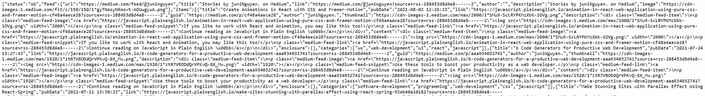

# 如何在你的网站中嵌入媒体和 YouTube RSS 源

> 原文：<https://javascript.plainenglish.io/how-to-embed-medium-rss-feed-and-youtube-rss-feed-in-your-websites-d8c37f923d77?source=collection_archive---------12----------------------->

## 如果你运用这种技巧，你会爱上你的网站。


Photo by [Markus Winkler](https://unsplash.com/@markuswinkler?utm_source=unsplash&utm_medium=referral&utm_content=creditCopyText) on [Unsplash](https://unsplash.com/s/photos/article?utm_source=unsplash&utm_medium=referral&utm_content=creditCopyText)

如果你正在考虑建立自己的登陆页面或个人作品集，向全世界展示你所有的作品(你在 Medium 或 YouTube 频道上的博客帖子)。然后，您可能会问如何在我的网站 中嵌入一个中型 RSS 源或 YouTube RSS 源的问题 ***的解决方案。幸运的是，我在本教程中为你想出了这个解决方案。我很兴奋在这里分享它，希望你也会兴奋。好了，我们开始吧！***

我们将在本主题中探讨的内容:

*   **如何在网站中嵌入中型 RSS 提要**
*   **如何将 YouTube RSS 提要嵌入网站**

我在本教程中使用的技术:

*   ReactJS(您可以随意使用另一个前端库/框架)
*   RSS to JSON 将 RSS URL 链接转换为 JSON 数据，以便可以获取，然后您可以将结果嵌入到您的站点中。(你可以在这里阅读他们的文档)
*   Material UI(这只是我个人对 React App 中 UI 设计的偏好，你可以根据需要使用另一个前端库)
*   可选:react-share 依赖包将你的博客文章或视频分享到社交媒体上(我在这个演示中使用了脸书)

**1。如何在网站中嵌入中型 RSS 提要**

首先，将 **mediumRSSFeed** 变量分配给它的字符串值(URL 链接),如下所示:

```
**const mediumRssFeed = “https://api.rss2json.com/v1/api.json?rss_url=https://medium.com/feed/@YOUR_MEDIUM_PROFILE_NAME_HERE”**
```

要检查此链接是否正确，您可以将此带有您的媒体配置文件名的 URL 链接复制到一个空白浏览器中，然后点击 Enter。如果您可以看到 JSON 对象，这意味着这个链接是正确的。应该是这样的:



screenshot of JSON data from Medium RSS feed

然后，获取您的文章数据如下:

```
*const MAX_ARTICLES = 10;**const [articles, setArticles] = useState();**useEffect(() => {**const loadArticles = async () => {**fetch(mediumRssFeed, { headers: { Accept: “application/json” } })**.then((res) => res.json())**.then((data) => data.items.filter((item) => item.title.length > 0))**.then((newArticles) => newArticles.slice(0, MAX_ARTICLES))**.then((articles) => setArticles(articles))**.catch((error) => console.log(error));**};**loadArticles();**}, [MAX_ARTICLES]);*
```

因为我在这个演示中使用了 React Hook，所以您可以看到我使用了 *useState()* 和 *useEffect()* 函数来获取这些数据。我设置了 *MAX_ARTICLES=10* 来限制我的页面上显示的文章数量，但是你可以根据自己的喜好设置不同的数量。对于超过 10 的 max-count，您必须注册/登录 **rss2json** 来获取 API 密钥，如他们所说的“*要返回的 feed 项目的计数，默认为* `*10.*` *(使用此参数需要* `*api_key*` *)。*”

然后， *map()* 函数将帮助返回 *articles、*数组中的每一项，如下所示:

```
{articles? articles.map((item) => (<aclassName="link"href={item.link}target="_blank"rel="nofollow noopener noreferrer"title={item.title}aria-label={item.link}key={item.link}><Card className={classes.root}><CardActionArea><CardMediaclassName={classes.media}image={item.thumbnail}title={item.title}/><CardContent><Typography gutterBottom variant="h5" component="h2">{item.title}</Typography><Typographyvariant="body2"color="textSecondary"component="p">{parseDate(item.pubDate)}</Typography></CardContent></CardActionArea><CardActions><FacebookShareButton url={item.link}><FacebookIcon size={32} round={true} /></FacebookShareButton><Button size="small" color="primary">Learn More</Button></CardActions></Card></a>)): "no article shown"}
```

在这个演示中，我为 *item.pubDate* 使用了助手函数 *parseDate()* 来格式化日期，以便于阅读。我在文件名 **util.js** 中添加了这个函数如下:

```
export const parseDate = (date) => {const year = date.substring(0, 4);const month = date.substring(5, 7);const day = date.substring(8, 10);switch (month) {case "01":return day + " January " + year;case "02":return day + " February " + year;case "03":return day + " March " + year;case "04":return day + " April " + year;case "05":return day + " May " + year;case "06":return day + " June " + year;case "07":return day + " July " + year;case "08":return day + " August " + year;case "09":return day + " September " + year;case "10":return day + " October " + year;case "11":return day + " November " + year;case "12":return day + " December " + year;default:return "No publication date";}};
```

您可以根据需要定制这种格式。

现在你的文章会像这样显示在你的页面上。点击这里查看[演示](https://397g5.csb.app/):

**2。如何在网站中嵌入 YouTube RSS 提要**

同样，我也使用了相同的技术进行演示。这里唯一不同的部分是 RSS 提要 URL 链接。该数据应该类似于下面的结构:

```
**const youtubeRssFeed= “https://api.rss2json.com/v1/api.json?rss_url=https://youtube.com/feeds/videos.xml?channel_id=YOUR_CHANNEL_ID_HERE”**
```

您也可以按照上面的方法检查它是否是正确的链接。然后你可以获取你的 YouTube 视频数据如下:

```
*const MAX_VIDEOS = 10;**const [videos, setVideos] = useState();**useEffect(() => {**const loadVideos = async () => {**fetch(youtubeRssFeed, { headers: { Accept: “application/json” } })**.then((res) => res.json())**.then((data) => data.items.filter((item) => item.title.length > 0))**.then((newVideos) => newVideos.slice(0, MAX_VIDEOS))**.then((videos) => setVideos(videos))**.catch((error) => console.log(error));**};**loadVideos();**}, [MAX_VIDEOS]);*
```

同样，我还设置了我的 *MAX_VIDEOS=10* 来限制页面上显示的视频数量。您可以根据自己的选择将其设置为另一个数字。对于超过 10 的 max-count，您必须注册/登录到 **rss2json** 以获取 API 密钥，因为他们说“*要返回的 feed 项目计数，默认为* `*10*` *”。(* `*api_key*` *需要使用此参数)。*

另外， *map()* 函数将帮助返回视频数组*、*中的每一项，如下所示:

```
{videos? videos.map((item) => (<aclassName="link"href={item.link}target="_blank"rel="nofollow noopener noreferrer"title={item.title}aria-label={item.link}key={item.link}><Card className={classes.root}><CardActionArea><CardMediaclassName={classes.media}image={item.thumbnail}title={item.title}/><CardContent><Typography gutterBottom variant="h5" component="h2">{item.title}</Typography><Typographyvariant="body2"color="textSecondary"component="p">{parseDate(item.pubDate)}</Typography></CardContent></CardActionArea><CardActions><FacebookShareButton url={item.link}><FacebookIcon size={32} round={true} /></FacebookShareButton><Button size="small" color="primary">Learn More</Button></CardActions></Card></a>))
```

现在，你的 YouTube 视频被嵌入并显示类似于这个[演示](https://vf789.csb.app/):

欣赏你的作品，享受吧！

这个简短的教程到此为止。我希望你觉得这很有用。如果你在这方面需要进一步的帮助，请告诉我。感谢您的阅读，祝您愉快！

*更多内容请看*[***plain English . io***](http://plainenglish.io/)