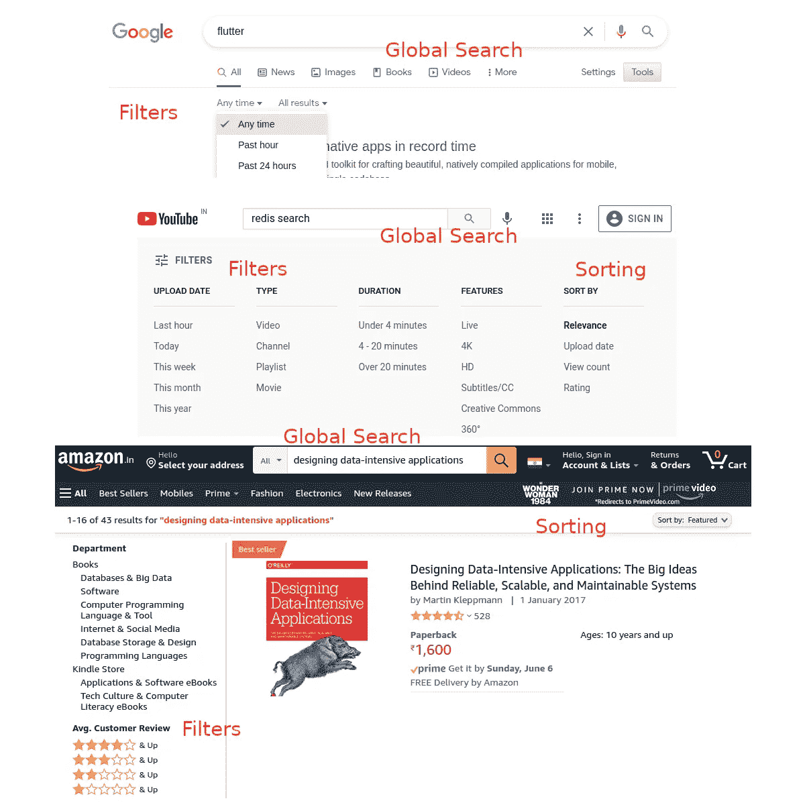
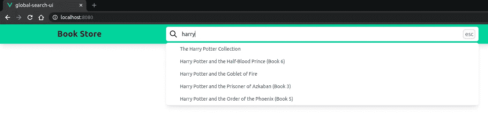

# 如何像专业人士一样启用全局搜索

> 原文：<https://javascript.plainenglish.io/how-to-enable-global-search-like-a-pro-34524323af6f?source=collection_archive---------8----------------------->


Photo by [Ian Usher](https://unsplash.com/@iusher?utm_source=unsplash&utm_medium=referral&utm_content=creditCopyText) on [Unsplash](https://unsplash.com/s/photos/drones?utm_source=unsplash&utm_medium=referral&utm_content=creditCopyText)

全球搜索在 web 应用程序中已经变得无处不在。全局搜索的典型功能有:

*   进行**全文搜索**并产生结果
*   提供**过滤器**用于精确包含或排除
*   允许**根据特定属性对结果进行排序**

从最终用户的角度来看，全局搜索应该是这样的:



Global Search Samples

搜索可以发生在

*   非结构化数据，如网页内容、电子邮件、评论/评论等。
*   具有特定数据模型的结构化数据，如“带有标题、描述和其他字段的产品”等。

选择何种技术进行全文搜索取决于几个因素:

*   数据卷宗
*   准确结果与快速响应之间的权衡
*   现有堆栈与选择新堆栈的余地
*   多语言支持等。

传统上，RDBMS 只提供广泛的过滤和排序功能。搜索功能最多仅限于一些通配符搜索。现代 RDBMS 通过提供**全文搜索功能**弥补了这一差距。

*   [PostgreSQL](https://www.postgresql.org/docs/current/textsearch.html)
*   [MySQL](https://dev.mysql.com/doc/refman/8.0/en/fulltext-search.html) 等等

除了数据库，还有许多专用的搜索引擎

*   弹性搜索(Lucene)——基于磁盘
*   Redis 搜索—基于内存的搜索等等

> [Redis Search 与 Elasticsearch 在性能方面的比较](https://redislabs.com/blog/search-benchmarking-redisearch-vs-elasticsearch/)

本博客选择了基于 Redis Search、Node.js 和 Vue.js 的端到端解决方案。

[**再搜索**](https://oss.redislabs.com/redisearch/Quick_Start/)

RedisLabs 共享的培训报告中提供了运行 Redis Search (docker)服务器的说明。还包括书籍的样本数据集。

[](https://github.com/redislabs-training/ru203) [## redis labs-培训/ru203

### 这个库包含 Redis 大学课程 RU203 的示例数据和设置说明:查询、索引…

github.com](https://github.com/redislabs-training/ru203) 

下面提供了启动服务器和加载示例的步骤摘要:

```
**// Start the Redis Server (Docker)**
docker run -it --rm --name redis-search -p 6379:6379  redislabs/redisearch:2.0.5**// Clone the git repo and then load the sample data**
gh repo clone redislabs-training/ru203
docker exec -i redis-search redis-cli < commands.redis > output.txt**// Start the redis-cli**
docker exec -it redis-search redis-cli**// Create the books index**
FT.CREATE books-idx ON HASH PREFIX 1 ru203:book:details: SCHEMA isbn TAG SORTABLE title TEXT WEIGHT 2.0 SORTABLE subtitle TEXT SORTABLE thumbnail TAG NOINDEX description TEXT SORTABLE published_year NUMERIC SORTABLE average_rating NUMERIC SORTABLE authors TEXT SORTABLE categories TAG SEPARATOR ";" author_ids TAG SEPARATOR ";"
```

重新搜索命令

*   **搜索**关键词“狗或猫”
*   **按“类别”过滤**
*   **根据“average_rating”按降序对结果进行排序**
*   **选择**仅“标题”字段

```
FT.SEARCH books-idx "dogs|cats @categories:{Juvenile Fiction}" RETURN 1 title SORTBY average_rating DESC LIMIT 0 5
```

可以使用 **redis-modules-sdk** 客户端库在 Node.js 中执行相同的命令:

RediSearch Client Code

**Express API 服务器**

托管一个简单的 API 应用服务器，它公开了 RediSearch 客户端模块。

API app server

**全局搜索 Vue 组件**

Vue 组件是使用 Tailwind CSS 创建的。示例应用程序中包含的功能有:

*   带有搜索组件的导航栏
*   输入栏接受带有去抖功能的搜索关键词
*   具有取消功能的 API 请求，以避免[激烈竞争](https://medium.com/js-dojo/api-client-patterns-every-front-end-developer-need-to-know-b0957e05b134)



Vue Global Search — tailwindcss

该应用程序的代码提供[在这里](https://github.com/PrasadJayakumar/global-search)。代码简单明了。

**结论**

“全球搜索”的概念很重要。框架、语言和全文搜索技术栈都可以用您喜欢的来替换。快乐编码。

*更多内容请看*[*plain English . io*](http://plainenglish.io/)