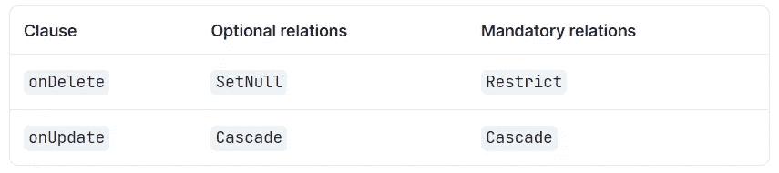

# 如何用 Prisma 实施参照完整性

> 原文：<https://javascript.plainenglish.io/how-to-enforce-referential-integrity-with-prisma-1d921b8ff296?source=collection_archive---------8----------------------->

这是 Prisma 系列介绍文章的第四部分。如果你还没有看过以前的文章，你可以在下面找到它们。

*   [使用 Prisma 简化后端开发](/simplifying-backend-development-with-prisma-564200f31943)
*   [深入探究 Prisma 模式](/diving-into-prisma-schema-b278e92dff8b)
*   [用 Prisma 进行数据建模](/data-modeling-with-prisma-5c4c37f31d8c)


Photo by [FLY:D](https://unsplash.com/@flyd2069?utm_source=unsplash&utm_medium=referral&utm_content=creditCopyText) on [Unsplash](https://unsplash.com/?utm_source=unsplash&utm_medium=referral&utm_content=creditCopyText)

在前面的部分中，虽然我们创建了表和记录之间的关系，但是我们没有考虑这些关系之间的行为。我们没有考虑[参照完整性](https://en.wikipedia.org/wiki/Referential_integrity)。我们需要确保当这些相关父记录之一被更新或删除时，数据库引擎将如何反应。

在本文中，我们将看看如何通过 Prisma 模式实现这一点。

# 让我们在🤿潜水吧

现在想象一下，如果从用户表中删除一条用户记录，会发生什么情况。或者如果应用于 post 记录的标签被更新，需要发生什么。SQL 系统有适当处理这种情况的机制。

在 MySQL 中，可以在更新或删除时通过引用操作来执行这些操作。

## **上删除级联** & **上更新级联**

在删除父表记录时，如果在删除级联上设置为**将自动删除子表中的匹配行。**

**同样，for **ON UPDATE CASCADE** 告诉数据库，当父表中发生更新时，子表中的匹配记录必须用新值映射。**

## ****删除集合上的空值&更新集合上的空值****

**像**级联**一样，我们可以在删除和更新操作中使用 **SET NULL** 。当父记录被更新或删除时，子表(books)的外键列将被设置为空值。**

## ****限制&不动作****

**设置**限制**与删除时省略**或更新**子句时省略**效果相同。如果父实体有关联的子记录，它会拒绝应用删除或更新操作。****

****无动作**在不同的 SQL 数据库引擎中有一定的差异。但在 MySQL 中，几乎等同于**限制**。**无动作**如果子表中有相关的外键值，则拒绝父表的删除或更新操作。**

**那么我们如何用 Prisma 模式设置这些呢？**

**这就是 Prisma 模式中的[引用动作发挥作用的地方。](https://www.prisma.io/docs/concepts/components/prisma-schema/relations/referential-actions)**

**在我们搬进来之前，首先我们需要更新我们的 Prisma 版本。因为引用动作是从 Prisma v.2.26.0 开始定义的。**

**我将把它更新到最新的版本(3.0.2 ),在这个版本中引用行为是普遍可用的。你可以通过手工修改 ***package.json*** 中的版本或者直接点击，**

```
npm install prisma@latest --save-dev
```

**这将把 Prisma CLI 版本更新到最新版本。**

**同样，您也需要更新 Prisma 客户端版本。**

```
npm install @prisma/client@latest
```

> **如果您在更新 Prisma 版本时遇到错误，您可以清除 node_modules 目录和/或 npm_cache，然后重试。**

**现在可以在`[@relation](https://www.prisma.io/docs/reference/api-reference/prisma-schema-reference#relation)`属性中定义引用动作。**

**但是等等…在最初的几篇文章中，帖子记录是如何以级联方式被删除的？🤔**

**在 Prisma 2.25.0 之前，会发生以下默认引用操作。**

****

**Resource: [Default referential actions prior to v.2.25.0](https://www.prisma.io/docs/guides/upgrade-guides/upgrading-versions/upgrading-to-prisma-3/referential-actions#prisma-2x-default-referential-actions)**

**在最新的 Prisma 版本中，我们使用了以下默认设置。**

****

**Resource: [Default referential actions after v.2.26.0](https://www.prisma.io/docs/concepts/components/prisma-schema/relations/referential-actions/#referential-action-defaults)**

**为了让这些默认值反映在我们的数据库中，我们需要运行一个迁移或者执行一个`[prisma db push](https://www.prisma.io/docs/concepts/components/prisma-migrate/db-push)`。**

**让我们做一个迁移来跟踪数据库模式的变化。**

```
npx prisma migrate dev --name referential_default_update
```

**现在，如果您试图删除一个用户，将会抛出一个错误。让我们通过 Prisma Studio 来实现这一点。**

****

**This ensures that ON DELETE RESTRICT has taken effect between User & Post tables**

**现在，为了保持我们在删除相关用户记录后以级联方式删除或更新帖子记录的旧行为，我们需要如下更新帖子模型。**

**类似于在 1-m 关系中实施参照完整性，我们也可以将它应用到我们之前构建的显式 m-n 关系中。**

**随着这些变化，**

*   **如果您删除创建帖子的用户，相关的帖子记录将被删除**
*   **如果您删除一个标签或发布相关的标签分配，TagsOnPosts 表中的记录将被删除。**

> ***如果我们在标签&帖子之间使用了隐含的多对多关系，我们将无法使用引用动作。因为 m-n 关系中的引用操作必须应用于连接表。***

**其他可用的参考动作有:**

*   **`[Restrict](https://www.prisma.io/docs/concepts/components/prisma-schema/relations/referential-actions#restrict)`:如果应用 onDelete 防止删除。如果应用于更新，引用字段将无法更新。**
*   **`[NoAction](https://www.prisma.io/docs/concepts/components/prisma-schema/relations/referential-actions#noaction)`:与`[Restrict](https://www.prisma.io/docs/concepts/components/prisma-schema/relations/referential-actions#restrict).`相似，但不同之处在于使用的数据库不同。**
*   **`[SetNull](https://www.prisma.io/docs/concepts/components/prisma-schema/relations/referential-actions#setnull)`:如果应用于 Delete 或 onUpdate，引用的标量字段将被设置为空。**
*   **`[SetDefault](https://www.prisma.io/docs/concepts/components/prisma-schema/relations/referential-actions#setdefault)`:如果应用于 Delete 或 onUpdate，引用的标量字段将被设置为默认值。**

**根据应用程序域的用例，您将需要使用一个或几个这样的引用操作来提高存储数据的一致性和可靠性。**

***更多内容尽在*[***plain English . io***](http://plainenglish.io/)**