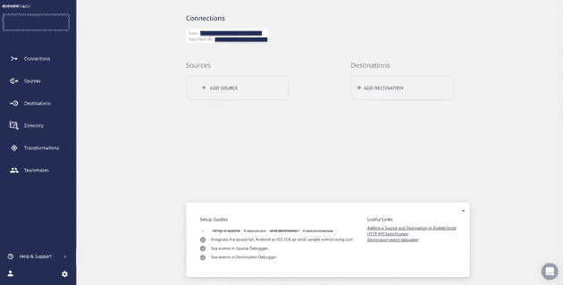
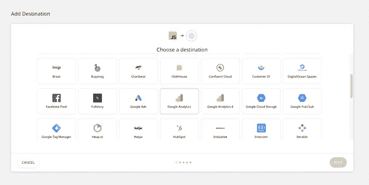
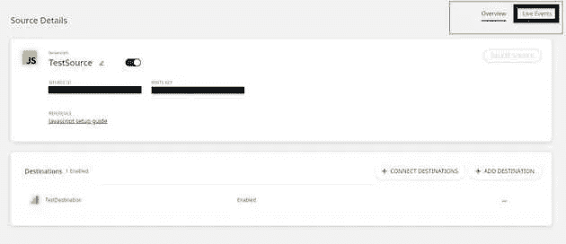

# 如何使用 RudderStack 将数据从你的 Eleventy 站点事件流传输到 Google Analytics

> 原文：<https://javascript.plainenglish.io/how-to-event-stream-data-from-your-eleventy-site-to-google-analytics-using-rudderstack-41e89db9b347?source=collection_archive---------31----------------------->


[RudderStack](https://rudderstack.com/) 是一个开源的客户数据管道，帮助您从 web、移动和服务器端来源跟踪您的客户事件，并将它们实时发送到您的整个客户数据堆栈。我们还开源了我们的主要 GitHub 库— [rudder-server](https://github.com/rudderlabs/rudder-server) 。

本文将使用我们的 [JavaScript SDK](https://github.com/rudderlabs/rudder-sdk-js) 引导您完成 Eleventy 站点与 RudderStack 的集成过程。它还将帮助您开始跟踪实时用户事件，并将它们发送到您的首选目的地。

通过以下三个简单的步骤在您的 Eleventy 站点上检测事件流:

1.将 Eleventy Site 与 RudderStack JavaScript SDK 集成并设置跟踪代码

2.在 RudderStack 中设置一个工具或仓库目的地，以实时发送所有事件数据

3.部署您的事件站点并验证事件流

# 先决条件

在开始之前，你需要确保你的 Eleventy 站点已经安装并设置好了。如果您还没有安装，请访问[官方十一安装文档](https://www.11ty.dev/)开始安装。

# 步骤 1:集成 Eleventy Site 和 RudderStack JavaScript SDK

# 在 RudderStack 中创建源

首先，打开您的 RudderStack 仪表板，设置一个 JavaScript 源来跟踪来自您的 Eleventy 站点的事件。按照下列说明设置信号源:

1.登录您的[方向舵仪表盘](https://app.rudderstack.com/)。如果你是 RudderStack 的新手，[在这里注册](https://app.rudderlabs.com/signup?type=freetrial)。

2.登录后，您将看到以下控制面板:



3.请注意**数据平面 URL** 。你需要这个 URL 来整合你的 Eleventy 站点和 RudderStack。


4.点击**添加信号源**选项创建一个信号源。您也可以点击左侧导航栏中的**目录**选项，选择**源**下的**事件流**，如图所示。接下来，选择 **JavaScript** 。


5.为 JavaScript 源添加一个名称，然后单击下一个的**。**


6.您的 JavaScript 源代码现在已经配置好了，可以跟踪事件了。注意与该信号源相关的**写入键**。您将需要它来设置与您的 Eleventy 站点的 RudderStack 集成。


# 将你的 Eleventy Site 与 RudderStack 整合

将 RudderStack JavaScript 代码与您的 Eleventy 站点集成，并按照下面给出的步骤设置跟踪代码:

1.打开您的 index.html 文件，在 标记中插入以下代码行:

```
<script> 
rudderanalytics=window.rudderanalytics=[];for(var methods=["load","page","track","identify","alias","group","ready","reset","getAnonymousId","setAnonymousId"],i=0;i<methods.length;i++){var method=methods[i];rudderanalytics[method]=function(a){return function(){rudderanalytics.push([a].concat(Array.prototype.slice.call(arguments)))}}(method)}rudderanalytics.load("1pBSDA8DDqVgLRzxN5JWyKJQoNN","https://hosted.rudderlabs.com"),
rudderanalytics.page();
rudderanalytics.track(
  "Test Event in 11ty",
  {
    revenue:  30,
    currency:  'INR' ,
    user_actual_id:  12345
  }, 
  () => {console.log("Track call");}
);
</script>
<script src="https://cdn.rudderlabs.com/rudder-analytics.min.js"></script>
```

**重要提示:**关于修改这些文件的更多信息，你可以参考我们的[舵栈十一站点仓库](https://github.com/rudderlabs/rudder-analytics-eleventy)中的十一站点样本。

# 步骤 2:在 RudderStack 中创建一个目的地工具，用于路由 11 个站点事件

RudderStack 支持超过 80 个第三方工具和平台，你可以安全地发送你的跟踪事件。在这一部分，我们将把 11 个站点事件路由到 [Google Analytics](https://docs.rudderstack.com/destinations/google-analytics-ga) 。要在 RudderStack 中添加 Google Analytics 作为目的地，请遵循以下步骤:

1.在您的方向舵仪表盘左侧导航栏中，点击**目的地**，然后选择**添加目的地**，如图所示:

**注意**:如果您已经在 RudderStack 中配置了一个目的地，并且想要将您的事件数据发送到该平台，您可以使用**连接目的地**选项。


2.接下来，选择**谷歌分析**作为你的目的地。



3.给目的地添加一个名字，点击下的**，如图所示:**


4.现在，连接我们之前在步骤 1 中已经配置好的 **JavaScript** 源。


5.在**连接设置**页面，使用您的 Google Analytics **跟踪 ID** 和其他可选设置配置您的 Google Analytics 目的地，如下所示。然后，点击下一个的**。**


6.您还可以在将事件发送到 Google Analytics 之前对其进行转换。有关该特性的更多信息，请查看我们关于**用户转换**的[文档](https://docs.rudderstack.com/adding-a-new-user-transformation-in-rudderstack)。

7.干得好！您的 Google Analytics 现已配置为目的地。您应该在仪表板中看到以下源-目标连接:


# (可选)步骤 2:为 11 个站点事件创建一个仓库目标

**重要提示**:在 RudderStack 中将数据仓库配置为目的地之前，您需要在您的数据仓库中建立一个新项目。此外，您需要创建一个具有相关权限的新 RudderStack 用户角色。

遵循我们的[文档](https://docs.rudderstack.com/data-warehouse-integrations)来获得如何为您的首选数据仓库这样做的分步指导。

我们将为本教程配置一个 [Google BigQuery 仓库目的地](https://rudderstack.com/integration/bigquery/on),以路由来自您的第十一站点的所有事件。您可以按照我们的文档中的[为服务帐户设置一个具有所需权限的 BigQuery 项目。](https://docs.rudderstack.com/data-warehouse-integrations/google-bigquery)

一旦您设置了项目并分配了所需的用户权限，请遵循以下说明:

1.从目的地目录中，选择 **Google BigQuery** :


2.为您的目的地指定一个名称，然后单击下一步的**。**


3.连接到 **JavaScript 源**,您将从那里跟踪您的 11 个站点事件。然后，点击下一个的**。**


4.指定**连接凭证**。添加 **BigQuery 项目 ID** 和**暂存桶名称**。你可以参考这些[说明来获取这些信息。](https://docs.rudderstack.com/data-warehouse-integrations/google-bigquery#setting-up-google-bigquery)


5.最后复制私有 **JSON 文件**的内容。你可以参考我们的[文档](https://docs.rudderstack.com/data-warehouse-integrations/google-bigquery#setting-up-the-service-account-for-rudderstack)来获得更多关于如何做的信息。

仅此而已！现在，您已经成功地在 RudderStack 中将 BigQuery 设置为仓库目的地。

# 步骤 3:部署您的事件站点并验证事件流

现在您已经成功地配置了事件源和目的地，接下来您需要验证事件流是否正常工作。为此，部署您的 Eleventy Site 应用程序，并测试事件是否被 JavaScript 源跟踪，并被发送到您的 **Google Analytics 目的地**。

请遵循以下步骤:

1.在您的终端或 cmd 中，导航到包含您的第 11 个站点的文件夹。

2.要部署 app，执行`npx` `@11ty/eleventy --serve`命令，如图所示:


3.通过访问 cmd 中提到的服务器地址或浏览器上的 [http://localhost:8080](http://192.168.0.122:8080/) 打开您的 Eleventy 站点。


4.接下来，验证`rudder-analytics.js` (RudderStack 的 JavaScript SDK)是否已经正确加载。为此，进入浏览器的**开发者工具**，导航至**网络标签**。

以下截图突出显示了 Google Chrome 的这一选项:


5.通过点击 RudderStack 仪表板页面上您的 JavaScript 源的**实时事件**选项卡，检查 RudderStack 是否可以跟踪不同的页面视图和点击:

**注意**:部署应用程序后，有时会有一段延迟，之后事件才会开始发送，并显示在您的仪表盘和目的地中。别担心。捕获并发送所有事件；请注意，他们可能需要几分钟才能出现。



6.太棒了。方向舵堆栈已成功跟踪并捕获事件:


7.接下来，检查事件是否被发送到您的 Google Analytics 目的地。转到您的谷歌分析仪表板，导航到**实时**——* *事件* *选项。


正如您所看到的，在 Eleventy 站点上有一个活动用户，并且跟踪事件也是可见的。这意味着事件被成功跟踪和交付。同样，您也将在您的 Google BigQuery 仓库中收到该事件。

# 摘要

网络分析是收集和分析网站用户行为数据的过程。它帮助公司了解用户如何与他们的网站交互，以便优化性能和创造更好的最终用户体验。RudderStack 使公司能够安全地执行 web 分析。

总之，在本文中，我们介绍了如何使用 Rudderstack 通过使用 RudderStack JS SDK 检测站点并设置跟踪代码来从 Eleventy 站点捕获实时事件数据。我们还详细介绍了如何将 Google Analytics 作为目的地集成到 RudderStack 中，以便将实时事件数据从您的 Eleventy 站点发送到 Google Analytics 平台。

这篇博客最初发表于:
[https://rudder stack . com/guides/how-to-event-stream-data-from-your-eleventy-site-to-Google-analytics-using-rudder stack](https://rudderstack.com/guides/how-to-event-stream-data-from-your-eleventy-site-to-google-analytics-using-rudderstack)