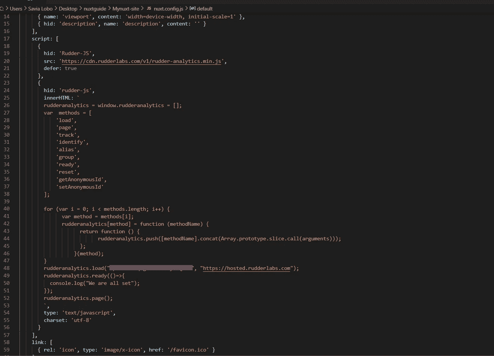
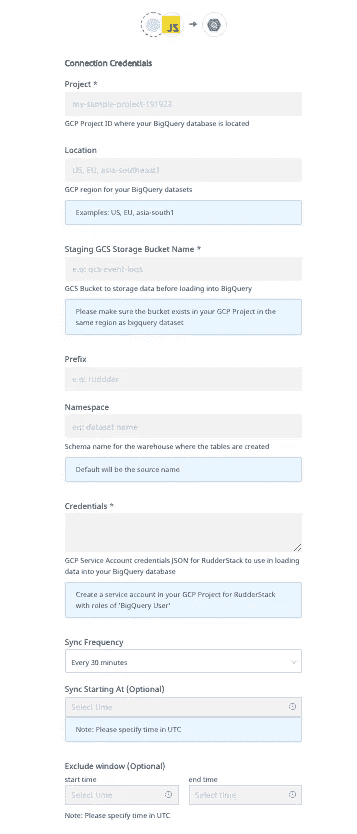

# 如何使用 RudderStack 从 Nuxt.js 应用程序中获取事件流数据

> 原文：<https://javascript.plainenglish.io/how-to-event-stream-data-from-your-nuxt-js-app-using-rudderstack-5668c78cd297?source=collection_archive---------24----------------------->

[**RudderStack**](https://rudderstack.com/) 是一个开源的**客户数据管道**，使您能够跟踪来自 web、移动和服务器端来源的事件，并将它们实时发送到您的整个客户数据堆栈。我们还开源了我们的主要 GitHub 库— [rudder-server](https://github.com/rudderlabs/rudder-server) 。

这篇博客是一个指南，将帮助你使用我们的 [JavaScript SDK](https://github.com/rudderlabs/rudder-sdk-js) 轻松地将你的 [Nuxt.js](https://nuxtjs.org/) 应用与 RudderStack 集成。这种集成允许您跟踪实时用户事件，并将它们发送到您的首选目的地。

您可以使用以下三个关键步骤在 Nuxt.js 应用程序上检测事件流:

1.  将 Nuxt.js 应用程序与 RudderStack JavaScript SDK 集成，并设置跟踪代码
2.  在 RudderStack 中设置一个工具或仓库目的地，以实时发送所有事件数据
3.  部署您的 Nuxt.js 应用程序并验证事件流

# 先决条件

我们假设您已经安装并设置了 Nuxt.js 应用程序。如果您还没有，请访问[官方 Nuxt.js 文档](https://nuxtjs.org/docs/2.x/get-started/installation/)开始。

# 步骤 1:将 Nuxt.js 应用程序与 RudderStack JavaScript SDK 集成

# 在 RudderStack 中创建源

首先，您需要在 RudderStack 仪表板中设置一个 JavaScript 源，用于跟踪来自 Nuxt.js 应用程序的事件。按照以下步骤设置信号源:

1.登录你的[方向舵仪表盘](https://app.rudderstack.com/)。(如果你是方向舵堆栈的新手，[在这里注册](https://app.rudderlabs.com/signup?type=freetrial))

2.成功登录后，您应该会看到以下控制面板:

3.记下**数据平面 URL** 。您将需要这个 URL 来将您的 Nuxt.js 应用程序与 RudderStack 集成。

4.接下来，通过简单地点击**添加源**按钮来创建一个源。也可以点击左侧导航栏中的**目录**选项，选择**源**下的**事件流**，如图所示。然后，选择 **JavaScript** 。

5.为您的信号源指定一个名称，然后点击下一个的**。**

6.您的 JavaScript 源代码现在已经配置好了，可以跟踪事件了。**注意与该信号源相关的写入键**。您将需要它来设置 RudderStack 与您的 Nuxt.js 应用程序的集成。

# 整合你的 Nuxt。带有方向舵堆栈的 Js 应用程序

将 RudderStack 与您的 Nuxt.js 应用程序集成，并按照下面给出的步骤设置跟踪代码:

修改应用程序文件夹中的`nuxt.config.js`文件，以包含以下脚本:

`gist:Veenap/3626e9bac218dde5a66fc2583eb31bd1`

**重要提示:**你可以参考我们的示例 Nuxt.js 应用程序，它位于我们的 [RudderStack Nuxt.js 存储库](https://github.com/rudderlabs/rudder-analytics-nuxt)中，以获得关于修改这些文件的更多信息。

# 步骤 2:在 RudderStack 中创建一个目的地工具来路由 Nuxt。Js 应用程序事件

RudderStack 支持超过 80 种第三方工具和平台，您可以安全地向其发送您跟踪的事件。在本教程中，我们将把 Nuxt.js 应用程序事件路由到 [Google Analytics](https://docs.rudderstack.com/destinations/google-analytics-ga) 。要在 RudderStack 中添加 Google Analytics 作为目的地，请遵循以下步骤:

1.在您的方向舵仪表盘的左侧导航栏中，点击**目的地**并选择**添加目的地**。由于我们已经配置了一个源，您只需点击源，然后点击**添加目的地**选项，如图所示:

**注意**:如果您已经在 RudderStack 中配置了一个目的地，并且想要将您的事件数据发送到那个平台，那么您可以使用 Connect Destinations 选项。

2.接下来，选择**谷歌分析**作为你的目的地。

3.为您的目的地添加一个名称，然后点击下一个的**，如图所示:**

4.现在，连接我们已经为本教程配置好的 **JavaScript** 源。

5.在**连接设置**中，使用您的 Google Analytics **跟踪 ID** 和其他可选设置配置您的 Google Analytics 目的地，如下所示。然后，点击下一个的**。**

6.您还可以在将事件发送到 Google Analytics 之前对其进行转换。有关该特性的更多信息，请查看我们关于**用户转换**的[文档](https://docs.rudderstack.com/adding-a-new-user-transformation-in-rudderstack)。

7.瞧啊。Google Analytics 现在被配置为目的地。现在，您应该会在仪表板中看到以下源-目标连接:

# (可选)步骤 2:在 RudderStack 中为您的 Nuxt 创建一个仓库目的地。Js 应用程序事件

**重要:** *在 RudderStack 中将数据仓库配置为目的地之前，您需要在您的数据仓库中建立一个新项目。此外，您需要创建一个具有相关权限的新 RudderStack 用户角色。*

*关注我们的* [*文档*](https://docs.rudderstack.com/data-warehouse-integrations) *以获得关于如何为您的首选数据仓库做这件事的详细分步说明。*

我们将为本教程设置一个[**Google big query warehouse destination**](https://rudderstack.com/integration/bigquery/on)来路由来自我们的 Nuxt.js 应用程序的所有事件。您可以按照[我们的文档](https://docs.rudderstack.com/data-warehouse-integrations/google-bigquery)建立一个具有服务帐户所需权限的 BigQuery 项目。

一旦设置了项目并分配了所需的用户权限，请按照下列步骤操作:

1.从目的地目录中，选择 **Google BigQuery** :

2.为您的目的地添加一个名字，然后点击下一个的**。**

3.连接到 **JavaScript 源**，我们将从那里跟踪我们的 Nuxt.js 应用程序事件。然后，单击下一步。

4.指定**连接凭证**。输入 **BigQuery 项目 ID** 和**暂存桶名称**。您可以参考这些[指令](https://docs.rudderstack.com/data-warehouse-integrations/google-bigquery#setting-up-google-bigquery)来获取这些信息。

5.最后，复制私有 **JSON 文件**的内容。在我们的[文档](https://docs.rudderstack.com/data-warehouse-integrations/google-bigquery#setting-up-the-service-account-for-rudderstack)中找到更多关于如何做到这一点的信息。

仅此而已！您已经成功地在 RudderStack 中将 BigQuery 设置为仓库目的地。

# 步骤 3:部署 Nuxt。Js 应用程序和验证事件流

我们已经成功配置了事件源和目的地。让我们验证我们的事件流是否正常工作。为此，让我们部署我们的 Nuxt.js 应用程序，并测试事件是否被 **JavaScript** **源**跟踪，并被传送到我们的 **Google Analytics** **目的地**。

按照以下步骤查找:

1.在您的终端或 cmd 上，导航到包含 Nuxt.js 应用程序的文件夹。

2.要部署应用程序，运行`npm run dev`命令，如图所示:

3.通过访问浏览器上的 URL[http://localhost:3000](http://localhost:3000/)打开 Nuxt.js 应用程序。

4.要验证`rudder-analytics.js` (RudderStack 的 JavaScript SDK)是否已正确加载，请转到您浏览器的**开发者工具**并导航到**网络**选项卡。以下截图突出显示了 Google Chrome 的这一选项:

5.通过点击 RudderStack 仪表板页面上您的 JavaScript 源的**实时事件**选项卡，检查 RudderStack 是否可以跟踪不同的浏览量和点击量:

**注意**:部署应用程序后，有时会有一段延迟，事件才会开始发送，并在您的仪表盘和目的地中显示出来。别担心。捕获并发送所有事件；请注意，他们可能需要几分钟才能出现。

6.太棒了。方向舵堆栈已成功跟踪并捕获事件:

7.接下来，让我们检查事件是否被发送到我们的 Google Analytics 目的地。进入你的谷歌分析仪表板，导航到**实时** — **事件**选项。

我们可以在我们的 Nuxt.js 应用程序上看到一个活跃用户，跟踪事件也是可见的。这表明该事件已被成功跟踪和交付。类似地，您也应该在您的 Google BigQuery 仓库中接收事件。

# 摘要

监控应用内数据对于了解应用的真实性能和用户行为至关重要。您从这种监控中获得的洞察力使您能够根据客户的需求更新您的应用。不断调整你的应用程序以保持可爱是一个成功应用程序的重要特征。RudderStack 帮助您安全地实现这一目标。

在本教程中，我们学习了如何使用 RudderStack 在 Nuxt.js 应用程序上检测实时事件数据。我们将 Nuxt.js 应用程序与 RudderStack JS SDK 集成在一起，并学习了如何设置跟踪代码。我们还在 RudderStack 中设置 Google Analytics 作为目的地，实时路由所有事件流，并验证事件流的成功交付。

## 免费注册并开始发送数据

测试我们的事件流、ELT 和反向 ETL 管道。使用我们的 HTTP 源在不到 5 分钟的时间内发送数据，或者在您的网站或应用程序中安装我们 12 个 SDK 中的一个。[开始使用](https://app.rudderlabs.com/signup?type=freetrial)

本博客最初发表于:
[https://ruder stack . com/guides/how-to-event-stream-data-from-your-nuxtjs-app-using-rudder stack](https://rudderstack.com/guides/how-to-event-stream-data-from-your-nuxtjs-app-using-rudderstack)

*更多内容请看*[***plain English . io***](http://plainenglish.io)