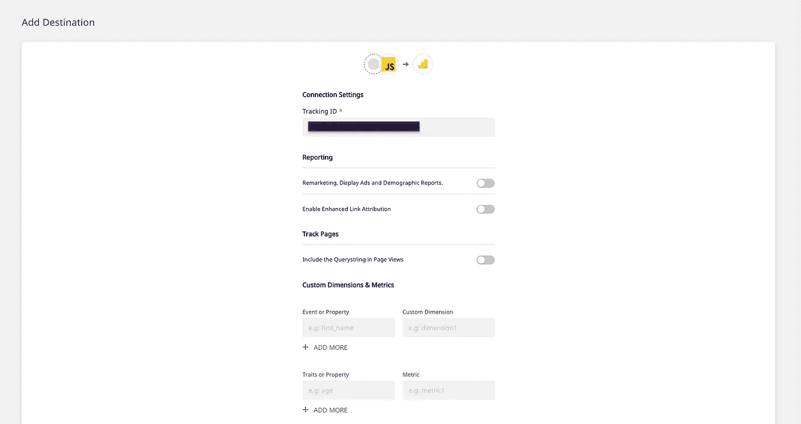

# 如何使用开源 RudderStack 从 Gatsby 网站获取事件流

> 原文：<https://javascript.plainenglish.io/how-to-event-stream-from-your-gatsby-website-using-open-source-rudderstack-ad667e252ec7?source=collection_archive---------20----------------------->

[**RudderStack**](https://rudderstack.com/) 是一个开源的**客户数据管道**，允许您跟踪并发送来自 web、移动和服务器端来源的实时事件到您的整个客户数据堆栈。我们的主存储库—[**rudder-server**](https://github.com/rudderlabs/rudder-server)—在 GitHub 上是开源的。

借助 RudderStack 的开源 [**Gatsby 插件**](https://github.com/rudderlabs/gatsby-plugin-rudderstack) ，你可以轻松地将你的 Gatsby 站点与 RudderStack 整合，并从中实时跟踪和捕捉客户事件。

要使用 RudderStack 在 Gatsby 网站上检测实时事件流，我们需要遵循以下四个步骤:

1.  使用 Gatsby 插件在你的 Gatsby 网站上安装 RudderStack
2.  (可选)为您的网站设置方向舵堆栈跟踪代码
3.  在 RudderStack 中为您的 Gatsby 站点的事件数据创建一个工具/仓库目的地
4.  部署您的 Gatsby 站点并验证事件流

# 先决条件

这篇文章假设你已经安装并建立了你的 Gatsby 网站。如果你还没有这样做，我们建议按照 [**盖茨比官方文档**](https://www.gatsbyjs.com/docs/tutorial/part-zero/) 开始。

# 第 1 步:使用 Gatsby 插件，用 RudderStack 装备您的 Gatsby 网站

# 在 RudderStack 中创建源

在用 RudderStack 装备 Gatsby 站点之前，您需要在 RudderStack 仪表板中设置一个 JavaScript 源，它将跟踪和捕获来自您的网站的事件。为此，请按照下列步骤操作:

*   登录你的[方向舵仪表盘](https://app.rudderstack.com/)。如果您没有帐户，请注册。
*   登录后，您应该会看到以下控制面板:

**RudderStack Dashboard**

*   注意**数据平面 URL** ，这是用 RudderStack 检测 Gatsby 站点所需要的。

**Data Plane URL**

*   下一步是创建一个源。为此，点击**添加信号源**按钮。也可以选择左侧导航栏上的**目录**选项，选择**源**下的**事件流**。

对于 Gatsby 插件，我们将设置一个简单的 **JavaScript** 源。

**Adding a Source**

*   给你的信号源命名，点击**下一个**。

**Name the Source**

*   您的事件源现已配置完毕。注意与该源相关的**写键**。这也是配置 RudderStack-Gatsby 集成所必需的。

**Note the Write Key**

# 用 RudderStack 装备您的 Gatsby 站点

为了用 RudderStack 装备您的 Gatsby 网站，我们将利用 RudderStack 的开源 Gatsby 插件。请遵循以下步骤:

*   导航到根目录，其中包含您站点的资产和资源。
*   根据您选择的软件包管理器，键入以下命令:

**对于 NPM** : `$ npm install --save gatsby-plugin-rudderstack`

**供纱** : `$ yarn add gatsby-plugin-rudderstack`

**NPM Install**

*   要设置这个插件，您需要使用从上一节获得的源**写键**和**数据平面 URL** 来配置您的 **gatsby-config.js** 文件。
*   配置选项如下所示:

`plugins: [
{
resolve: `gatsby-plugin-rudderstack`,
options: {
prodKey: `RUDDERSTACK_PRODUCTION_WRITE_KEY`,
devKey: `RUDDERSTACK_DEV_WRITE_KEY`,
trackPage: false,
trackPageDelay: 50,
dataPlaneUrl: `https://override-rudderstack-endpoint`,
controlPlaneUrl: `https://override-control-plane-url`,
delayLoad: false,
delayLoadTime: 1000,
manualLoad: false,
}
}
];`

有关上述每个参数的详细信息，请查看我们的 [**文档**](https://docs.rudderstack.com/how-to-guides/how-to-integrate-rudderstack-with-a-gatsby-website#the-configuration-options) 。

# 重要注意事项

*   如果您使用的是生产环境，则将源写入键分配给`prodKey`参数。否则，将其分配给`devKey`参数。
*   如果您使用自托管控制平面来管理您的事件流配置，请输入`controlPlaneUrl`的 URL。在这篇文章中，我们使用了 RudderStack 托管的免费控制平面，不需要任何设置。它还拥有比开源控制平面更多的功能，例如**实时事件**——允许您查看从事件源捕获的实时事件。

# (可选)步骤 2:为您的网站设置方向舵堆栈跟踪代码

**注**:本节描述如何使用下面的 JavaScript 代码片段手动跟踪页面浏览量。这样做的先决条件是您已经在您的 **gatsby-config.js** 文件中将`trackPage`设置为`false`。(上一节中的步骤 4，**用 ruder stack**检测您的 Gatsby 站点)。

如果你想自动跟踪浏览量，在你的 **gatsby-config.js** 文件中设置`trackPage`为`true`。关于自动跟踪页面浏览量的更多细节，请参考我们的 [**文档**](https://docs.rudderstack.com/how-to-guides/how-to-integrate-rudderstack-with-a-gatsby-website#tracking-pageviews) 。

接下来，我们将为 RudderStack 设置代码来跟踪 Gatsby 站点的页面浏览量。这意味着 RudderStack 将在用户每次访问/查看您网站上的页面时捕获每个页面查看活动。

为此，请按照下列步骤操作:

*   转到您的本地站点存储库并导航到**node _ modules**—**Gatsby-plugin-rudder stack**文件夹。
*   找到并打开 **gatsby-browser.js** 文件。
*   将以下代码添加到该文件的末尾:

`// gatsby-browser.js
exports.onRouteUpdate = () => {
window.rudderanalytics && window.rudderanalytics.page();
};`

*   保存文件。

# 步骤 3:在 RudderStack 中为您的 Gatsby 站点的事件数据创建一个工具目的地

RudderStack 支持 80 多种工具，您可以将事件数据可靠地发送到这些工具。对于本教程，我们将在 RudderStack 中配置一个 **Google Analytics** 目的地。要在 RudderStack 中配置此目的地，请执行以下步骤:

*   选择仪表板左侧导航栏中的**目的地**选项，并点击**添加目的地**按钮。由于您已经配置了信号源，您也可以点击**添加目的地**按钮，如下所示:

**注意**:如果您之前已经在 RudderStack 中配置了一个目的地，并且想要将您的事件数据发送到那个平台，使用**连接目的地**选项连接到您的源。

**Add a Destination**

*   从目的地列表中选择**谷歌分析**。

**Select Google Analytics**

*   为您的目的地指定一个名称，然后点击下一个的**。**

**Name your Destination**

*   选择来源。我们将选择已经为本教程配置的 **JavaScript** 源。

**Choose the Source**

*   添加相关的**连接设置**。最重要的是，你需要输入谷歌分析**跟踪 ID** 。您也可以如下图所示配置其他可选设置，然后点击**下一步**。

**Add the Connection Settings**

*   RudderStack 为您提供了在将事件发送到目的地之前转换事件的选项。在我们的 [**文档**](https://docs.rudderstack.com/adding-a-new-user-transformation-in-rudderstack) 中获取更多关于 RudderStack 的用户转换特性的信息。
*   您的目的地现已配置完毕。现在，您应该会在仪表板中看到以下源-目标连接:

**Source-Destination Connection**

# (可选)步骤 3:在 RudderStack 中为您的 Gatsby 站点的事件数据创建一个仓库目的地

**重要提示**:在将数据仓库配置为 RudderStack 目的地之前，您需要在您的仓库中建立一个新项目。此外，您将需要创建一个具有相关权限的新 RudderStack 用户角色。按照我们的 [**文档**](https://docs.rudderstack.com/data-warehouse-integrations) 获取关于如何为您选择的数据仓库执行此操作的详细、逐步说明。

在本教程中，我们将设置一个 Google BigQuery 仓库目的地，以路由来自 Gatsby 网站的所有事件。如上所述，按照 [**我们的文档**](https://docs.rudderstack.com/data-warehouse-integrations/google-bigquery) 建立一个具有服务账户所需权限的 BigQuery 项目。

一旦设置了项目和所需的用户权限，请按照下列步骤操作:

*   从目的地列表中选择 **Google BigQuery** ，如图所示:

**Select BigQuery**

*   为此目的地指定一个名称，并点击下一个的**。**

**Name the Destination**

*   选择要发送事件的来源。我们将为这个目的地选择与我们的 Gatsby 网站相关联的 **JavaScript** 源。

**Select JavaScript as the Source**

*   指定**连接凭证**。输入 **BigQuery 项目 ID** 和**暂存桶名称**。按照这些[说明](https://docs.rudderstack.com/data-warehouse-integrations/google-bigquery#setting-up-google-bigquery)获取这些信息。

**指定连接设置**

*   复制私有 JSON 文件的内容。在我们的[文档](https://docs.rudderstack.com/data-warehouse-integrations/google-bigquery#setting-up-the-service-account-for-rudderstack)中有更多关于如何做的信息。

就是这样！您已经成功地在 RudderStack 中将 BigQuery 设置为仓库目的地。

# 步骤 4:部署您的 Gatsby 站点并验证事件流

为了验证一切是否正常，让我们最后部署我们的网站并测试事件是否被传递到目的地。在这篇文章中，我们将测试 Google Analytics 目的地的事件流，这是我们在**步骤 3(在 RudderStack 中插入工具目的地)**中设置的。

请遵循以下步骤:

*   导航到本地站点的文件夹，如下所示:

**Local Site Folder**

*   如果您正在使用生产环境，运行命令`gatsby build`。如果您正在使用开发环境，运行命令`gatsby develop`。

**Gatsby Build**

*   因为我们使用的是生产环境，所以让我们使用`gatsby serve`来部署我们的站点。将提供一个本地主机 URL，然后我们可以使用它来访问我们的站点:

*   通过点击不同的帖子或页面浏览你的网站。
*   查看 RudderStack 是否可以通过访问源仪表板页面上的**实时事件**部分来跟踪不同的页面浏览量:

> ***注意:*** *在部署您的生产站点之后，在事件开始发送之前可能会有一个延迟。别担心。捕获并发送所有事件；请注意，在生产部署完成后，它们可能需要几分钟才能显示在实时事件查看器和您的下游目的地中。*

**Gatsby Serve**

*   RudderStack 可以成功跟踪并捕获页面视图事件，如下图所示:

**Pageview Events**

*   现在，让我们通过转到您的 Google Analytics 仪表板并导航到**实时** — **事件**来检查事件是否也被发送到 Google Analytics。

**Google Analytics Dashboard**

我们在 Gatsby 网站上看到一个活跃用户，这意味着页面视图事件被成功发送。类似地，您也应该能够看到在您的 Google BigQuery 仓库中接收到的事件。

# 免费注册并开始发送数据

测试我们的事件流、ELT 和反向 ETL 管道。使用我们的 HTTP 源在不到 5 分钟的时间内发送数据，或者在您的网站或应用程序中安装我们 12 个 SDK 中的一个。[入门 。](https://app.rudderlabs.com/signup?type=freetrial)

这篇博客最初发表于
[https://rudder stack . com/guides/how-to-event-stream-from-your-Gatsby-website-using-open-source-rudder stack](https://rudderstack.com/guides/how-to-event-stream-from-your-gatsby-website-using-open-source-rudderstack)

*更多内容尽在*[***plain English . io***](http://plainenglish.io)