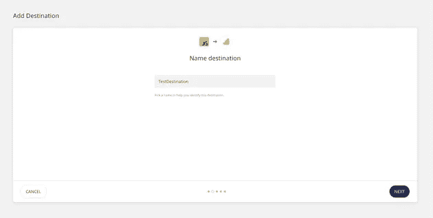
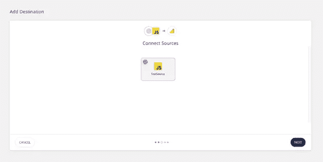
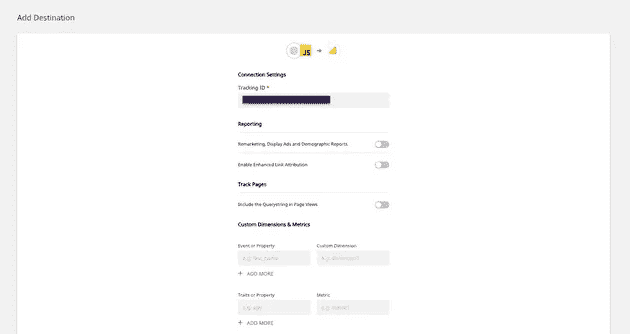
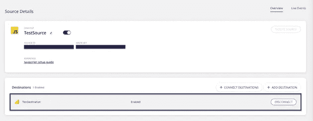
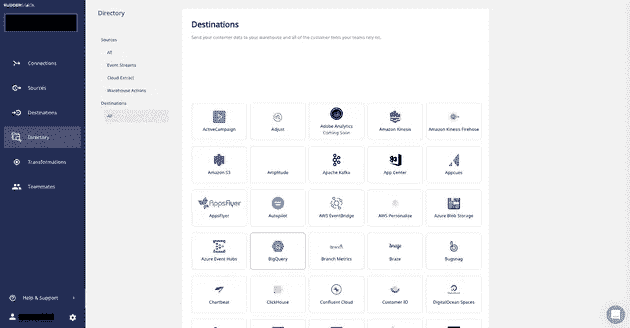
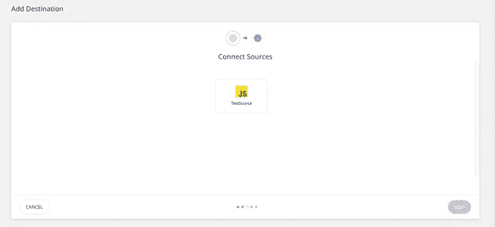

# 如何从您的下一个事件流？使用开源方向舵堆栈的 Js 应用程序

> 原文：<https://javascript.plainenglish.io/how-to-event-stream-from-your-next-js-app-using-open-source-rudderstack-a0e10885b002?source=collection_archive---------20----------------------->

[**RudderStack**](https://rudderstack.com/) 是一个开源的智能客户数据管道工具，让您可以实时跟踪、收集和发送来自 web、移动和服务器端的事件。你可以在 GitHub 上查看我们的开源主库——[rudder-server](https://github.com/rudderlabs/rudder-server)。

这篇博客将展示如何使用我们的 [JavaScript SDK](https://github.com/rudderlabs/rudder-sdk-js) 轻松地将您的 [Next.js](https://nextjs.org/) 应用程序与 RudderStack 集成。通过这种集成，您可以跟踪实时用户事件，并将它们发送到您的首选目的地。

您可以通过以下三个步骤使用 RudderStack 在 Next.js 应用程序上检测事件流:

1.  将您的 Next.js 应用程序与 RudderStack 的 JavaScript SDK 集成，并设置跟踪代码
2.  在 RudderStack 中设置一个工具或仓库目的地，以实时发送所有事件数据
3.  部署您的应用程序并验证事件流

# 先决条件

本文假设您已经安装并设置了 Next.js 应用程序。如果您还没有这样做，我们建议您按照[官方 Next.js 文档](https://nextjs.org/docs)开始。

# 第一步:整合你的 Next。带有 RudderStack 的 JavaScript SDK 的 Js 应用程序

# 在 RudderStack 中创建源

在开始之前，您需要在 RudderStack 仪表板中设置一个 JavaScript 源，然后您可以使用它来跟踪 Next.js 应用程序中的事件。按照以下步骤设置信号源:

1.登录到你的[方向舵仪表盘](https://app.rudderstack.com/)。如果你是 RudderStack 的新手，[在这里注册](https://app.rudderlabs.com/signup?type=freetrial)。

2.登录后，您应该会看到以下仪表板:

3.注意**数据平面 URL** 。您将需要这个 URL 来集成您的 Next.js 应用程序和 RudderStack。

4.接下来，创建一个源。为此，只需点击**添加源**按钮。您也可以点击左侧导航栏中的**目录**选项，选择**源**下的**事件流**，如图所示。然后，选择 **JavaScript** 。

5.为您的信号源命名后，点击下一个按钮**。**

6.您的 JavaScript 源代码现在已经配置好了，可以跟踪事件了。注意与这个源相关的**写键**。这也是设置 RudderStack 与 Next.js 应用程序的集成所必需的

# 整合你的下一个。带有方向舵堆栈的 Js 应用程序

要将 RudderStack 与您的 Next.js 应用程序集成并设置跟踪代码，请遵循以下步骤:

1.在你的 app 的 **pages** 文件夹中新建一个`_document.js`文件，如图所示:

2.在 index.js 文件(位于应用程序的 pages 文件夹中)中添加以下行，如下所示:

**重要提示:**您可以参考我们的示例 Next.js 应用程序，该应用程序位于我们的 [RudderStack Next.js 存储库](https://github.com/rudderlabs/rudder-analytics-next)中，以了解关于修改这些文件的更多信息。

# 步骤 2:在 RudderStack 中创建一个工具目的地，用于发送下一个工具。Js 应用程序事件

RudderStack 目前支持超过 80 个第三方工具和平台，你可以可靠地向其发送你的跟踪事件。对于本教程，我们将把 Next.js 应用程序事件路由到[**Google Analytics**](https://docs.rudderstack.com/destinations/google-analytics-ga)。要在 RudderStack 中将 Google Analytics 配置为目的地，请遵循以下步骤:

1.在仪表板左侧导航栏中，点击**目的地**，然后点击**添加目的地**。由于我们已经配置了一个源，您只需点击源并选择**添加目的地**选项，如图所示:

**注意**:如果你已经在 RudderStackand 中配置了一个目的地，并且想要发送你的事件数据到那个平台，使用**连接目的地**选项。

2.从目的地列表中，选择**谷歌分析**。

3.为您的目的地命名，然后点击下一个的**，如图所示:**

4.然后，选择我们已经为本教程配置的 **JavaScript** 源。

5.在**连接设置**中，使用您的 Google Analytics **跟踪 ID** 和其他可选设置配置您的 Google Analytics 目的地，如下所示。然后，点击下一个的**。**

6.您还可以在将事件发送到 Google Analytics 之前对其进行转换。有关此功能的更多信息，请查看我们的[文档](https://docs.rudderstack.com/adding-a-new-user-transformation-in-rudderstack)。

7.就是这样！Google Analytics 现在被配置为目的地。现在，您应该会在仪表板中看到以下源-目标连接:

# (可选)步骤 2:在 RudderStack 中为下一步创建一个仓库目的地。Js 应用程序事件

**重要提示**:在 RudderStack 中将数据仓库配置为目的地之前，您需要在您的数据仓库中建立一个新项目。此外，您需要创建一个具有相关权限的新 RudderStack 用户角色。

跟随我们的[文档](https://docs.rudderstack.com/data-warehouse-integrations)来获得详细的、一步一步的指导，告诉你如何为你选择的数据仓库这样做。

对于本教程，我们将设置一个 Google BigQuery 仓库目的地来路由来自 Next.js 应用程序的所有事件。如上所述，您可以通过遵循[我们的文档](https://docs.rudderstack.com/data-warehouse-integrations/google-bigquery)来建立一个具有服务帐户所需权限的 BigQuery 项目。

一旦设置了项目并分配了所需的用户权限，请按照下列步骤操作:

1.从目的地列表中，选择 **Google BigQuery** :

2.为此目的地命名。然后，点击下一个的**。**

3.选择 **JavaScript** 源，我们将从该源跟踪 Next.js 应用程序事件。然后，点击下一个的**。**

4.指定**连接凭证**。输入 **BigQuery 项目 ID** 和**暂存桶名称**。按照这些[指示](https://docs.rudderstack.com/data-warehouse-integrations/google-bigquery#setting-up-google-bigquery)获取这些信息。

5.最后，复制私有 JSON 文件的内容。在我们的[文档](https://docs.rudderstack.com/data-warehouse-integrations/google-bigquery#setting-up-the-service-account-for-rudderstack)中找到更多关于如何做到这一点的信息。

就是这样！您已经成功地在 RudderStack 中将 BigQuery 设置为仓库目的地。

# 第三步:部署下一个。Js 应用程序并验证事件流

现在我们已经成功地配置了事件源和目的地，是时候验证我们的事件流是否正常工作了。为此，让我们部署我们的 Next.js 应用程序，并测试事件是否被 **JavaScript** 源跟踪，并被发送到**Google Analytics**——我们的目的地。

为此，请按照下列步骤操作:

1.导航到包含 Next.js 应用程序的文件夹。

2.要部署应用程序，请运行命令`npm run dev`，如下所示:

3.通过在浏览器上访问 URL[http://localhost:3000](http://localhost:3000/)打开您的应用程序。刷新页面并单击各种链接来跟踪不同的事件:

4.为了验证`rudder-analytics.js` (RudderStack 的 JavaScript SDK)是否正确加载，你可以进入浏览器的开发者工具，导航到**网络**标签。以下截图突出显示了 Google Chrome 的这一选项:

5.通过访问 RudderStack 仪表板页面上您的 JavaScript 源代码的**实时事件**选项卡，查看 RudderStack 是否可以跟踪不同的浏览量和点击量:

**注意:**部署您的应用程序后，有时会有一段延迟，事件才会开始发送，并在您的仪表盘和目的地中显示出来。别担心。捕获并发送所有事件；请注意，他们可能需要几分钟才能出现。

6.RudderStack 已成功跟踪并捕获事件，如下所示:

7.现在，让我们检查事件是否被发送到我们的 Google Analytics 目的地。转到您的谷歌分析仪表板，导航到**实时** — **事件**选项。

我们在 Next.js 应用程序上看到一个活跃用户，跟踪事件也是可见的。这意味着事件被成功跟踪和交付。类似地，您也应该在您的 Google BigQuery 仓库中接收事件。

# 免费注册并开始发送数据

测试我们的事件流、ELT 和反向 ETL 管道。使用我们的 HTTP 源在不到 5 分钟的时间内发送数据，或者在您的网站或应用程序中安装我们 12 个 SDK 中的一个。[入门](https://app.rudderlabs.com/signup?type=freetrial)。

本博客最初发表于:
[https://rudder stack . com/guides/how-to-event-stream-from-your-nextjs-app-using-open-source-rudder stack](https://rudderstack.com/guides/how-to-event-stream-from-your-nextjs-app-using-open-source-rudderstack)

*更多内容请看*[*plain English . io*](http://plainenglish.io/)