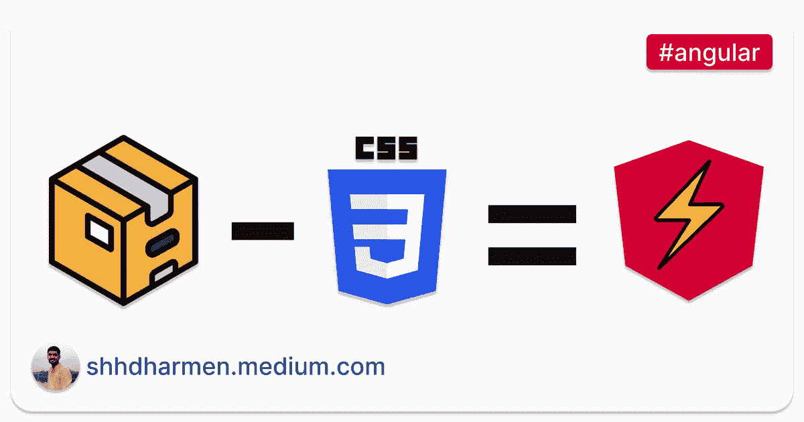
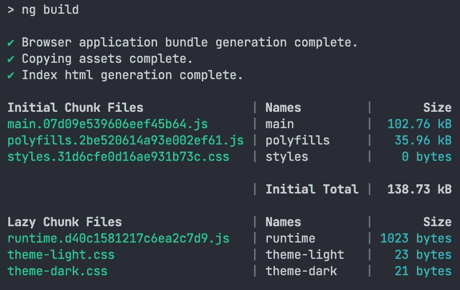

# 如何从 Bundle 中排除样式表，在 Angular 中惰性加载？

> 原文：<https://javascript.plainenglish.io/how-to-exclude-stylesheets-from-the-bundle-and-lazy-load-them-in-angular-ce159903f6d2?source=collection_archive---------8----------------------->

让我们学习如何只在需要的时候加载样式表，而不使它们成为应用程序包的一部分。

我们将以多主题支持为例来理解这一点。

# 多个主题文件

让我们假设除了主 *styles.css* 文件之外，还有 2 个主题文件:

1.  src/styles/themes/theme-light . CSS
2.  src/styles/themes/theme-dark . CSS

接下来，您可以在`angular.json`的样式选项中使用它们:

最后，您可以根据用户的选择或偏好来处理特定主题的加载。

一切都很好，但是你的两个主题文件都是你的应用程序包的一部分。

# 排除主题文件

让我们在 angular.json 中做一个小改动，从包中排除主题文件:

在此了解两个新选项:

1.  `**inject**`:设置为 false 将不包括捆绑包中“输入”路径的文件
2.  `**bundleName**`:将创建一个单独的包，包含来自“输入”路径的样式表

现在，如果您尝试构建项目，它将创建单独的文件，输出如下所示:

注意`theme-light.css`和`theme-dark.css`是**懒惰块文件**的一部分。惰性块文件加快了应用程序的加载时间，因为它们是按需加载的。

# 延迟加载主题文件

我们设法将它们从捆绑包中排除，并且它们是外部可用的。现在问题来了，如何加载这些主题文件？

加载它们的一种方法是直接使用带有链接标签的包:

您可能需要使用`base`标签来调整文档库 URL，以成功加载它们。

# 结论

我们了解到，我们可以通过简单地在工作区配置文件中设置`inject` false 来排除样式表，例如`angular.json`。为了按需加载它们，我们将使用`bundleName`选项。

从包中排除样式表的优点是减少了包的大小，这反过来会缩短应用程序的初始加载时间，最终用户体验会更好。

*最初发布于*[*http://indepth . d*ev](https://indepth.dev/tutorials/angular/lazy-load-stylesheets)*。*

*更多内容尽在* [***说白了***](http://plainenglish.io/)