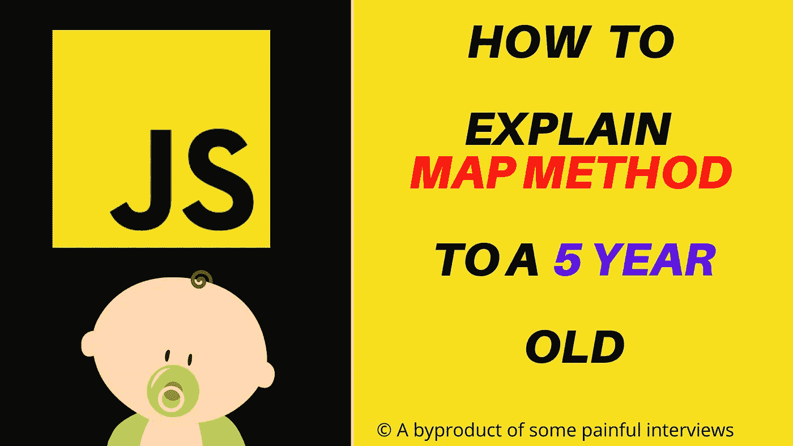
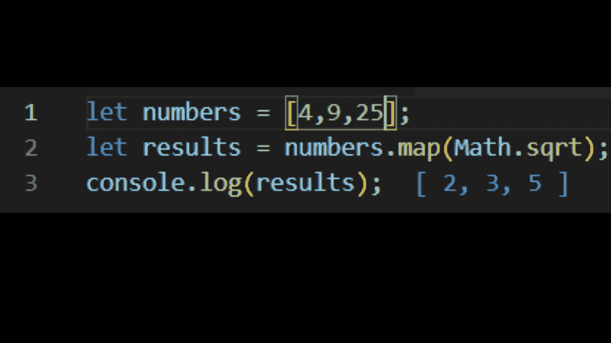
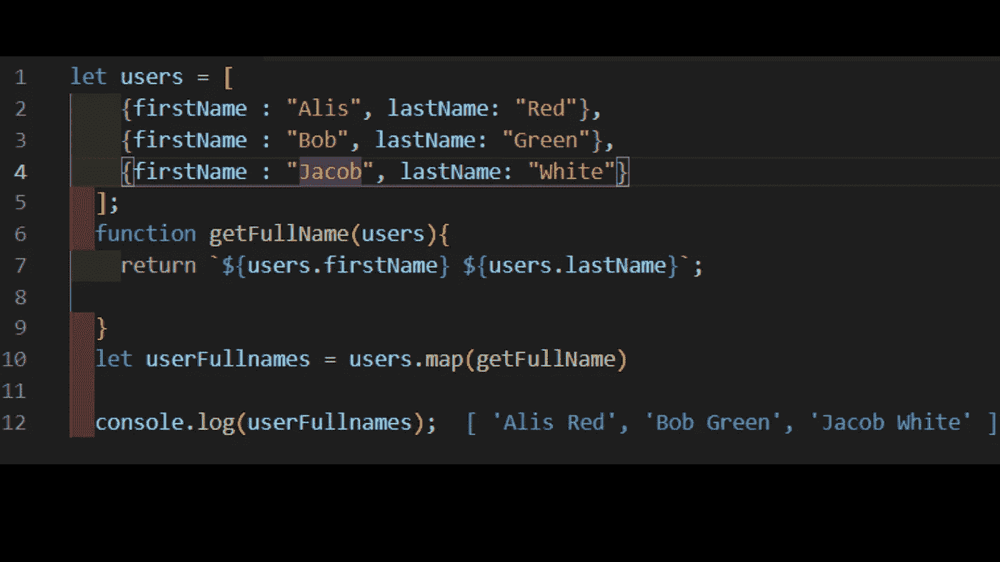
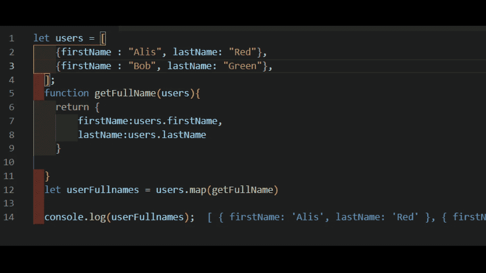
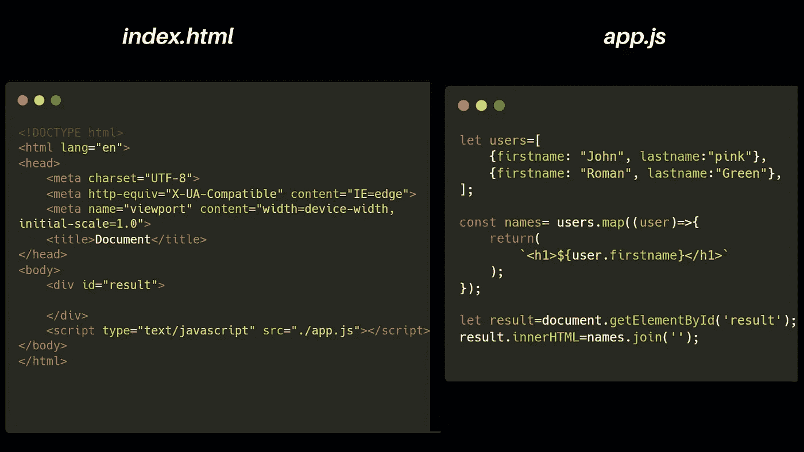
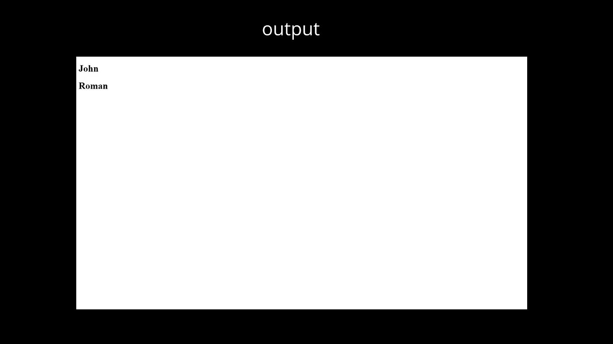

# 如何向 5 岁小孩解释 JavaScript 地图？

> 原文：<https://javascript.plainenglish.io/how-to-explain-javascript-map-to-a-5-year-old-90a5a490d9af?source=collection_archive---------3----------------------->

Map 确实是 JavaScript 中迭代数组的著名方法。

人们可以简单地使用内置的`Array.map()`方法，而不是使用循环来迭代数组。

## 现在如何向一个 5 岁的孩子解释？

**让我们假设**你买了两个冰淇淋甜筒，一个给你自己，另一个给你的朋友。你的朋友太激动了，他给了你他的蛋筒底部的巧克力😋)或者给你买了不同口味的冰淇淋(🍧).现在你可以得到你的整个冰淇淋蛋卷和巧克力底/新的。

映射方法与此有些类似:

→使用地图时，。它给你一个**全新的数组**。

→创建新数组时，使用原始数组的值。

→最重要的是，它**不会**修改旧数组的值。

## 让我们看一些非常简单的例子

`Array.map()`允许你迭代一个数组，使用函数或者回调函数修改它的元素，这些值被返回到一个新的数组中。

> 注意:输出就在“Console.log()”旁边，我已经使用 VSCode 扩展“Quokka.js”实现了这一点。

在这个例子中，map 方法将迭代“users”函数，而“getFullName”函数将连接名字和姓氏。

这里还有一个解释相同情况的例子。这里我们不是创建一个新的数组，而是创建一个新的对象数组。

正如您在下面的示例中可以清楚地看到的，我们正在创建一个名为“userFullnames”的数组，它是一个包含两个属性的对象数组，即“firstName”和“lastName”。

map 方法最重要的用例是用 HTML 或 JSX (React)包装数据。让我们看看这个使用 map 中回调函数的例子。

嗯，就这样吧！

# 感谢您的宝贵时间！

*更多内容请看*[***plain English . io***](http://plainenglish.io/)