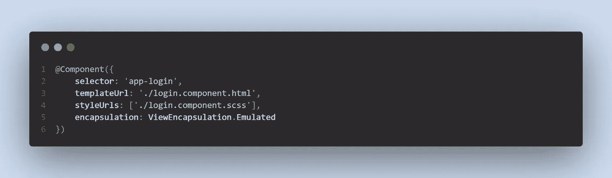
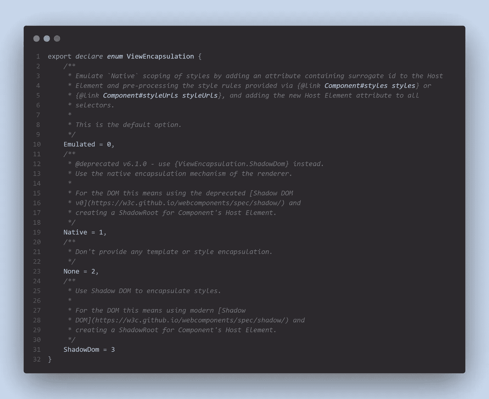
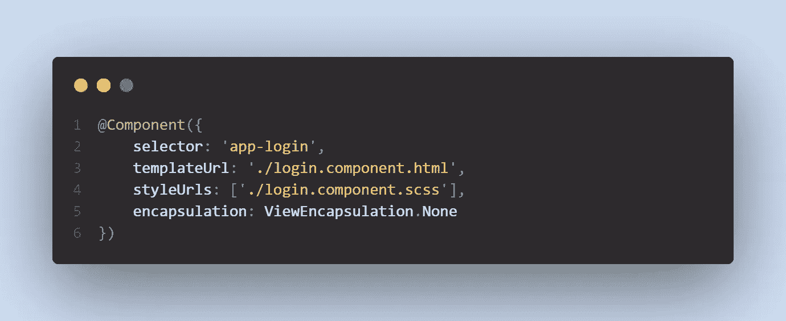
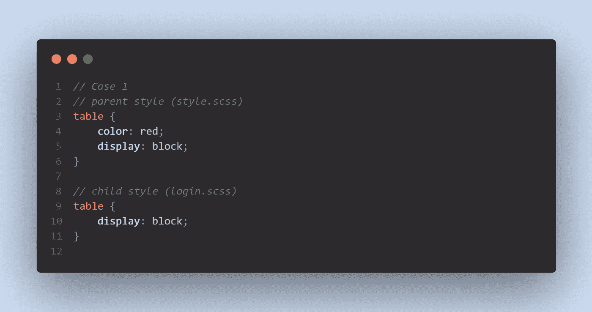
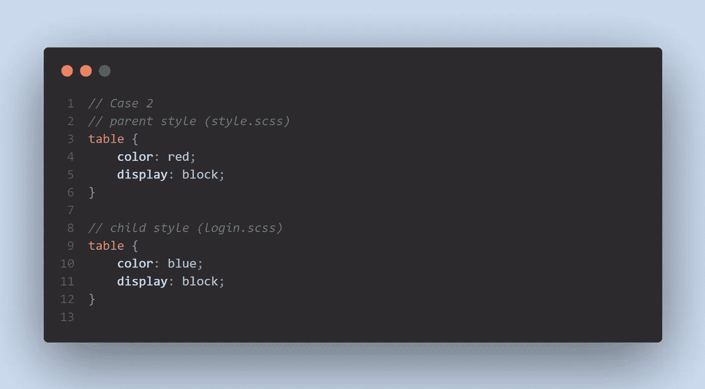

# 如何向孩子解释 Angular 中的视图封装

> 原文：<https://javascript.plainenglish.io/how-to-explain-viewencapsulation-in-angular-to-your-child-5e07ddfd4853?source=collection_archive---------11----------------------->

Photo by [Sergey Zolkin](https://unsplash.com/@szolkin?utm_source=medium&utm_medium=referral) on [Unsplash](https://unsplash.com?utm_source=medium&utm_medium=referral)

首先，我想简单介绍一下我自己。我是一名前端 web 开发人员，目前正在开发 Angular 框架。我只有大约十个月的工作经验。

我希望不时地分享我学到的东西，我相信通过分享，我可以学到更多。所以，如果我解释错了什么概念，请在下面留下评论纠正我。

Setting ViewEncapsulation Option by [Hue Sook Yan](https://medium.com/u/afacfa67d61e?source=post_page-----5e07ddfd4853--------------------------------)

***视图封装*** 是一种设置组件封装工作方式的方法。

我们可以通过设置 ViewEncapsulation 选项来控制特定组件的样式，如上图所示。

Definition of ViewEncapsulation by [Hue Sook Yan](https://medium.com/u/afacfa67d61e?source=post_page-----5e07ddfd4853--------------------------------)

基于 Google 在[官网](https://angular.io/guide/view-encapsulation#view-encapsulation)上提供的 Angular 中 ViewEncapsulation 的定义，它由三个选项组成:

1.仿真
2。无
3。阴影世界

*仿真*选项是 ViewEncapsulation 的默认选项，除非您对 ViewEncapsulation 选项的变量进行了更改，如下图所示:

Setting ViewEncapsulation Option as None by [Hue Sook Yan](https://medium.com/u/afacfa67d61e?source=post_page-----5e07ddfd4853--------------------------------)

在接下来的内容中，我将尝试用一种外行人的方式来描述这三个选项。

首先，我想使用 ***父*** *样式*来表示您想要设置 ViewEncapsulation 选项的组件的样式之外的主样式。 ***子*** *样式*是代表组件的样式。

例如，我想设置登录组件的 ViewEncapsulation。然后，登录组件是子组件，而组件外部是父组件。

简而言之:

***父*** *样式* =主样式退出登录组件。

***子*** *样式=* 登录组件的样式。

## 模仿

父母在影响孩子，但孩子却没有受到父母的影响。

父母的风格在影响孩子的风格。

如果父母的桌子是红色的，那么孩子的桌子也会是红色的，**除非** *孩子有他自己的风格* **。**

Case 1: Child Without Own Style by [Hue Sook Yan](https://medium.com/u/afacfa67d61e?source=post_page-----5e07ddfd4853--------------------------------)

在案例 1 中，如上图所示，孩子在指定他想要的桌子颜色时没有自己的风格。因此，父母的风格会影响孩子的风格，导致孩子的桌子是红色的。

Case 2: Child Has Own Style by [Hue Sook Yan](https://medium.com/u/afacfa67d61e?source=post_page-----5e07ddfd4853--------------------------------)

在上图的案例 2 中，孩子用自己的方式指定他想要的桌子颜色是蓝色。因此，孩子将有一个蓝色的颜色表，而父母将有一个红色的颜色表。

## 没有人

*父母和孩子相互影响。*

用非外行的话来说，登录组件的样式将被添加到全局样式中，因此它将影响整个项目。

Case 2: Child Has Own Style by [Hue Sook Yan](https://medium.com/u/afacfa67d61e?source=post_page-----5e07ddfd4853--------------------------------)

如前例 2:当选项为 ***【无】*** 时，子表有自己的样式，那么父表和子表都是红色或蓝色。这取决于每个组件的创建时间(？).

## 阴影世界

*父子互不影响。*

他们会有自己的风格。它的概念类似于 ShadowDom 的概念。

要理解 ShadowDom 的概念，请查看下面的参考资料:

1.[https://developers . Google . com/web/fundamentals/we B- components/shadow DOM？FB clid = iwar 3 pqt 3 l 0d 6 lo m3 rvxkcsswcsslr 6 rnn 68 axrtwbc 1 shh 7 vxy po 9 w2 ujr-c # what](https://developers.google.com/web/fundamentals/web-components/shadowdom?fbclid=IwAR3pqt3L0D6LOM3RvxKCSswcsSLr6rnN68aXRtWbC1Shh7VxYPO9w2uJr-c#what)
2。[https://blog . log rocket . com/understanding-shadow-DOM-v1-fa 9b 81 ebe 3 AC/](https://blog.logrocket.com/understanding-shadow-dom-v1-fa9b81ebe3ac/)
3 .[https://developer . Mozilla . org/en-US/docs/Web/Web _ Components/Using _ shadow _ DOM](https://developer.mozilla.org/en-US/docs/Web/Web_Components/Using_shadow_DOM)

Case 1: Child Without Own Style by [Hue Sook Yan](https://medium.com/u/afacfa67d61e?source=post_page-----5e07ddfd4853--------------------------------)

如前例 1:子表没有自己的样式当选项为 ***ShadowDom*** 时，父表颜色为红色，而子表颜色为默认颜色，因为子表没有在表颜色中指定自己的样式。

因此，它们互不影响。

## **总结整个故事:**

***视图封装*** 是一种设置组件封装工作方式的方法。

1.*视图封装。* ***仿效*** —父影响子，子不影响父。
2。*视图封装。* ***无***—父影响子，反之亦然。
3。*查看封装。****shadow DOM***—父不影响子，反之亦然。

这些都是我写的，如果我解释错了什么，请在下面的评论中纠正我。

最后，为什么要做陌生人？通过 [LinkedIn](https://www.linkedin.com/in/syhue/) 联系我。

*更多内容请看*[***plain English . io***](http://plainenglish.io/)