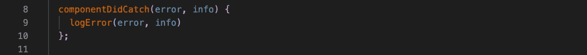
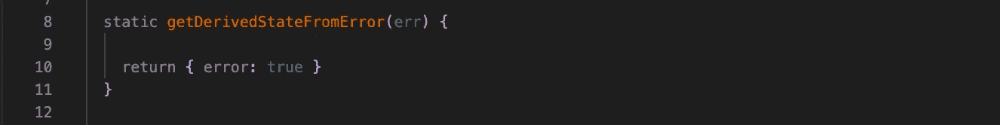
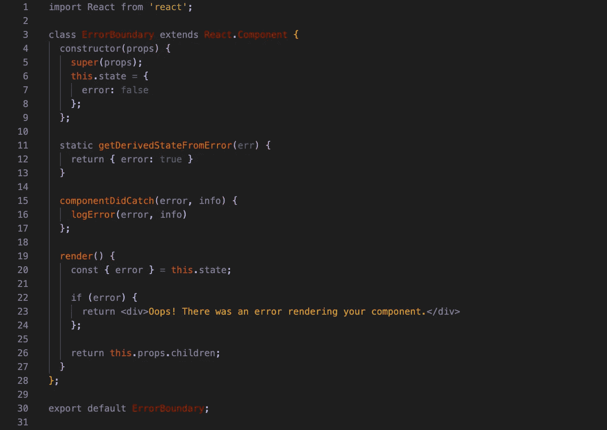
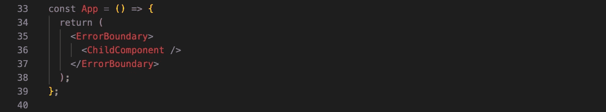
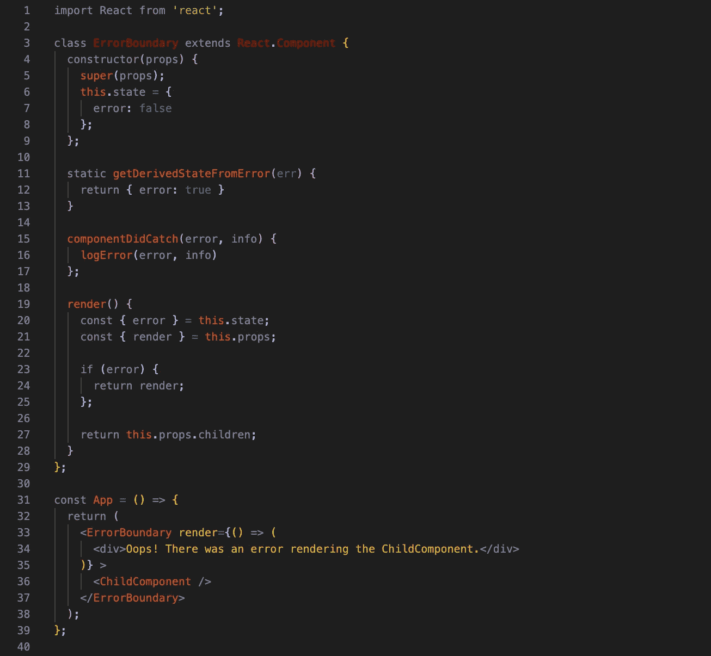

# 如何在风格上失败:React 中的错误界限

> 原文：<https://javascript.plainenglish.io/how-to-fail-with-style-error-boundaries-in-react-402d8a8f53de?source=collection_archive---------10----------------------->

Photo by [Heather Barnes](https://unsplash.com/@heatherbarnes?utm_source=unsplash&utm_medium=referral&utm_content=creditCopyText) on [Unsplash](https://unsplash.com/?utm_source=unsplash&utm_medium=referral&utm_content=creditCopyText)

在构建用户界面的过程中，处理意外行为与处理预期行为同样重要。即使有世界上所有的测试，有人，在某个地方，*会*(意外地)找出如何破解你的应用。即使是最可靠的网络也会在某个时候出现故障。

虽然预测和回避每一种可能性是不可能的，但我们可以承认广义上它会发生。

对这些事件的优雅处理对于积极的用户体验是必不可少的。

# 未处理的 JavaScript 错误

Photo by [Kyle Glenn](https://unsplash.com/@kylejglenn?utm_source=unsplash&utm_medium=referral&utm_content=creditCopyText) on [Unsplash](https://unsplash.com/s/photos/unknown?utm_source=unsplash&utm_medium=referral&utm_content=creditCopyText)

如果任其自生自灭，JavaScript 基本上可以将你的整个应用从一个简单、可怕的`cannot read property <property_name> of undefined`中分离出来。好消息是，每年我们都有更多的工具来帮助避免这些错误。例如，引入可选链接有助于避免这个问题。坏消息是，如果不加处理，这些工具最多也只会让你的应用处于不稳定状态。

# 反应误差边界

Photo by [Markus Spiske](https://unsplash.com/@markusspiske?utm_source=unsplash&utm_medium=referral&utm_content=creditCopyText) on [Unsplash](https://unsplash.com/s/photos/restricted?utm_source=unsplash&utm_medium=referral&utm_content=creditCopyText)

幸运的是，React 保护了我们。React 16 引入了错误边界的概念。正如[文档](https://reactjs.org/docs/error-boundaries.html)所解释的:

> 错误边界是 React 组件，**捕捉子组件树中任何地方的 JavaScript 错误，记录这些错误，并显示一个回退 UI** ，而不是崩溃的组件树。

本质上，错误边界允许您将错误的负面影响限制在发生错误的特定组件中。不过，需要注意的是，错误边界**不会捕捉事件处理程序内部发生的错误。**即使有这样的限制，解决方案也比整个 DOM 变成一个带有堆栈跟踪的错误消息更好，对吗？

*快速注释* : *在撰写本文时，还没有我们将使用的生命周期方法的钩子等价物，所以我们将引用经典的* `*React.Component*` *而不是功能组件。*

# 建立边界

错误边界不是添加到现有组件中的代码，而是用于包装其他组件的单独组件。误差边界分量有四个主要特征:

1.  在状态中维护布尔错误状态
2.  使用`componentDidCatch()`
3.  `static getDerivedStateFromError()`的使用
4.  要呈现的自定义回退用户界面

不要求您同时使用`componentDidCatch()`和`static getDerivedStateFromError()`，但是它们的用途完全不同，因此我们将在这里同时介绍它们。

## componentDidCatch()

> 这个生命周期是在子代组件抛出错误后调用的。

以上来自 [React 文档](https://reactjs.org/docs/react-component.html#componentdidcatch)。`componentDidCatch()`的操作类似于你可能熟悉的标准`catch`模块。它在子体内部抛出错误时被触发，并允许您对实际的错误信息做一些事情，比如记录它。

该方法接受两个参数，即错误对象和堆栈跟踪，这两个参数都有助于调试。

## 静态 getDerivedStateFromError()

> 这个生命周期是在子代组件抛出错误后调用的。它接收作为参数抛出的错误，并应该返回值以更新状态。

以上也是由[官方文件](https://reactjs.org/docs/react-component.html#static-getderivedstatefromerror)提供的。`componentDidCatch()`是开发者的朋友，但`static getDerivedStateFromError()`是用户的朋友。这种生命周期方法是我们创建优雅处理的地方，而且非常简单。

在这个生命周期方法中，我们所要做的就是将维护的错误状态设置为`true`。

## 误差边界组件

ErrorBoundary 组件将包括错误的状态以及上述两种生命周期方法，并将有条件地呈现回退 UI 或错误边界组件的子组件。让我们把这些放在一起:

# 实现边界

Photo by [Nynne Schrøder](https://unsplash.com/@nynnes?utm_source=unsplash&utm_medium=referral&utm_content=creditCopyText) on [Unsplash](https://unsplash.com/s/photos/wrapped?utm_source=unsplash&utm_medium=referral&utm_content=creditCopyText)

您的错误边界组件现在可以用来整齐地包装您想要在其上创建边界的其他组件:

或者，您可以利用[渲染道具](https://reactjs.org/docs/render-props.html)使您的`ErrorBoundary`组件更加动态，并根据被包装的组件接受不同的回退 UI:

决定包装哪些组件很大程度上取决于应用程序。在某些情况下，您可能希望包装较低级别的单个组件，导致在出现错误时，部分 UI 被回退 UI 所替换。在其他情况下，您可能希望包装更高级别的组件，并为正在访问的页面使用更通用的回退 UI。

在这两种情况下，边界将捕获来自包装组件的所有后代的错误。一种方法并不比另一种更好，您选择哪种方法在很大程度上取决于上下文、组件树中的依赖关系、逻辑、优先级、用户体验和个人偏好。

你可以使用 React 的 [CodePen](https://codepen.io/gaearon/pen/wqvxGa?editors=0010) 来寻找错误边界，并查看[文档](https://reactjs.org/docs/error-boundaries.html)来了解更多信息。