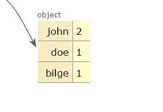

# 寻找数组中最频繁元素的最简单方法

> 原文：<https://javascript.plainenglish.io/how-to-find-the-most-frequent-element-in-an-array-in-javascript-c85119dc78d2?source=collection_archive---------4----------------------->


Photo by [Caspar Camille Rubin](https://unsplash.com/@casparrubin?utm_source=unsplash&utm_medium=referral&utm_content=creditCopyText) on [Unsplash](https://unsplash.com/s/photos/javascript?utm_source=unsplash&utm_medium=referral&utm_content=creditCopyText)

首先，在浏览时，我找不到最有效和最短的解决方案来找到数组中最频繁的元素，但我只找到了许多长的解决方案，但最好的方法是**不要使用嵌套的 for 循环。**因为在大 O 符号中，它是一个`O(n2)`复杂度，意味着它是无效的。

找到数组中最频繁出现的元素的最好方法是使用 reduce 函数并创建一个 hashmap。这就是你需要的全部代码:

```
function getMostFrequent(arr) {
   const hashmap = arr.reduce( (acc, val) => {
    acc[val] = (acc[val] || 0 ) + 1
    return acc
 },{})
return Object.keys(hashmap).reduce((a, b) => hashmap[a] > hashmap[b] ? a : b)
}
```

我所做的是，用 reduce 创建一个散列表。如果我们有一个类似于`[‘john’, ‘doe’, ’john’, ’bilge’]`的数组，我们的散列表将会是这样的:



因为我们在第一个 reduce 函数中使用 acc 创建了一个对象，注意**`**acc**`**的初始值是{}** 。**

**然后我们检查数组的每个值:这个值已经在`acc`中了吗？**

**如果没有，在对象中放一个键值对。(元素的第一次出现)**

**如果是，增加它的值。**

**一旦我们有了包含元素及其在数组中的出现次数的 hashmap，那么我们只需要得到具有最大值的键。**

**为此，我们只需找到数组中的最大值，然后像这样用 reduce 函数返回它的键。**

```
Object.keys(hashmap).reduce((a, b) => hashmap[a] > hashmap[b] ? a : b)
```

****注意:**正如您可能注意到的，这将只返回**一个具有最高值的键**，如果您有两个具有最高值的元素，并且您想要返回它的数组，那么您需要更改第二个 reduce 函数。**

****如果数组中不只有一个最大值，并且想要返回一个最大值数组，可以使用:****

```
return Object.keys(hashmap).filter(x => {
             return hashmap[x] == Math.max.apply(null, 
             Object.values(hashmap))
       })
```

**请注意，这将返回最频繁出现的元素的数组，即使有一个。它会过滤掉没有最大值的元素并返回。**

## **结论**

**我们做到了！如何找到数组中最常见的元素？我希望您发现这很有用！**