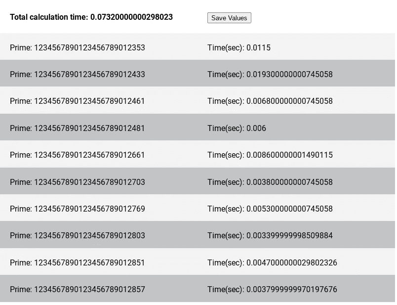

# 如何在 JavaScript 中找到非常大的质数

> 原文：<https://javascript.plainenglish.io/how-to-find-very-large-prime-numbers-in-javascript-5a563ba2f3bb?source=collection_archive---------8----------------------->

Photo by [Markus Winkler](https://unsplash.com/@markuswinkler?utm_source=medium&utm_medium=referral) on [Unsplash](https://unsplash.com?utm_source=medium&utm_medium=referral)

米勒-拉宾质数测试(T2)是一个可靠的质数测试，尽管它只能确定一个数是质数的概率(T4)。然而，概率是相对的:我可能在掷骰子的时候连续掷出 100 个 7，但是概率非常低。

上面的维基百科链接很好地进入了米勒-拉宾的数学领域。基本特征是可以用随机的*基数、*或 *k* 值重复进行测试。每次使用不同的 *k* 值执行测试都会降低假素数通过测试的几率。报告假素数的概率上限是 4 的-k 次方

# 代码中的测试

您可以找到许多为各种语言实现 Miller-Rabin 的示例代码。我想要一个使用新的本机 [BigInt](https://developer.mozilla.org/en-US/docs/Web/JavaScript/Reference/Global_Objects/BigInt) 值的 JavaScript 版本。我在网上找到的唯一代码要么使用整数，要么使用自定义大整数表示的旧库。

最终，我确定[这个站点](https://www.geeksforgeeks.org/primality-test-set-3-miller-rabin/)有最接近我想要的 JavaScript 代码(除了其他语言实现)。然而，它使用的是整数值，所以我必须将其转换为使用 BigInt 值。这包括以下步骤:

1.  将所有整数文字转换为使用“n”表示法；例如 2 变成 2n。
2.  确保没有混合的整数/BigInt 运算
3.  JavaScript 的数学库不支持 BigInt 解决它

我已经对下面的代码(JML-)做了必要的修改。

# `To test the test`

原代码有一个质数生成器< 100\. That’s all well and good, but I want to generate BIG primes! I built a React app to do just that. Now I can generate 25-digit primes in milliseconds.

I tried to see if I could factor these “probable” primes on this [网站](https://www.numberempire.com/numberfactorizer.php)。果然，没有任何因素——他们是真正的文章。瞧啊。

*更多内容看* [***说白了***](http://plainenglish.io/)