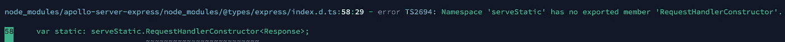

# 如何修复错误:命名空间“serveStatic”没有导出的成员“RequestHandlerConstructor”

> 原文：<https://javascript.plainenglish.io/how-to-fix-error-namespace-servestatic-has-no-exported-member-requesthandlerconstructor-8093110e8496?source=collection_archive---------11----------------------->


Photo by [Sarah Kilian](https://unsplash.com/@rojekilian?utm_source=medium&utm_medium=referral) on [Unsplash](https://unsplash.com?utm_source=medium&utm_medium=referral)



朋友们，你们好！我只想分享一点如何修复这个错误。看看这个。

如果您正在使用 GraphQL，尤其是使用 Apollo 作为驱动程序，您可能会遇到如下图所示的错误。你可以试试这篇文章中提到的解决方案，也许它会对你有用。

```
npm update [@types/express-serve-static-core](http://twitter.com/types/express-serve-static-core) --depth 2npm WARN [@nestjs](http://twitter.com/nestjs)-query/query-graphql@0.26.0 requires a peer of class-validator@^0.13.0 but none is installed. You must install peer dependencies yourself.
npm WARN [@nestjs/bull](http://twitter.com/nestjs/bull)@0.2.3 requires a peer of bull@^3.3 but none is installed. You must install peer dependencies yourself.
npm WARN acorn-jsx@5.2.0 requires a peer of acorn@^6.0.0 || ^7.0.0 but none is installed. You must install peer dependencies yourself.
npm WARN graphql-upload@8.1.0 requires a peer of graphql@0.13.1 - 14 but none is installed. You must install peer dependencies yourself.
npm WARN axios-cache-adapter@2.5.0 requires a peer of axios@0.18.1 but none is installed. You must install peer dependencies yourself.
npm WARN optional SKIPPING OPTIONAL DEPENDENCY: fsevents@2.1.3 (node_modules/fsevents):
npm WARN notsup SKIPPING OPTIONAL DEPENDENCY: Unsupported platform for fsevents@2.1.3: wanted {"os":"darwin","arch":"any"} (current: {"os":"linux","arch":"x64"})
npm WARN optional SKIPPING OPTIONAL DEPENDENCY: fsevents@2.3.2 (node_modules/chokidar/node_modules/fsevents):
npm WARN notsup SKIPPING OPTIONAL DEPENDENCY: Unsupported platform for fsevents@2.3.2: wanted {"os":"darwin","arch":"any"} (current: {"os":"linux","arch":"x64"})+ [@types/express-serve-static-core](http://twitter.com/types/express-serve-static-core)@4.17.21
added 315 packages from 116 contributors, removed 155 packages, updated 124 packages and audited 2487 packages in 20.706s101 packages are looking for funding
  run `npm fund` for detailsfound 3461 vulnerabilities (180 moderate, 3281 high)
  run `npm audit fix` to fix them, or `npm audit` for details
```

然后，也复制这个命令。

```
npm update [@types/serve-static](http://twitter.com/types/serve-static) --depth 2npm WARN [@nestjs](http://twitter.com/nestjs)-query/query-graphql@0.26.0 requires a peer of class-validator@^0.13.0 but none is installed. You must install peer dependencies yourself.
npm WARN [@nestjs/bull](http://twitter.com/nestjs/bull)@0.2.3 requires a peer of bull@^3.3 but none is installed. You must install peer dependencies yourself.
npm WARN [@nestjs/mapped-types](http://twitter.com/nestjs/mapped-types)@0.0.5 requires a peer of class-transformer@^0.2.3 but none is installed. You must install peer dependencies yourself.
npm WARN acorn-jsx@5.2.0 requires a peer of acorn@^6.0.0 || ^7.0.0 but none is installed. You must install peer dependencies yourself.
npm WARN apollo-graphql@0.4.5 requires a peer of graphql@^14.2.1 but none is installed. You must install peer dependencies yourself.
npm WARN graphql-upload@8.1.0 requires a peer of graphql@0.13.1 - 14 but none is installed. You must install peer dependencies yourself.
npm WARN axios-cache-adapter@2.5.0 requires a peer of axios@0.18.1 but none is installed. You must install peer dependencies yourself.
npm WARN optional SKIPPING OPTIONAL DEPENDENCY: fsevents@2.3.2 (node_modules/chokidar/node_modules/fsevents):
npm WARN notsup SKIPPING OPTIONAL DEPENDENCY: Unsupported platform for fsevents@2.3.2: wanted {"os":"darwin","arch":"any"} (current: {"os":"linux","arch":"x64"})
npm WARN optional SKIPPING OPTIONAL DEPENDENCY: fsevents@2.1.3 (node_modules/fsevents):
npm WARN notsup SKIPPING OPTIONAL DEPENDENCY: Unsupported platform for fsevents@2.1.3: wanted {"os":"darwin","arch":"any"} (current: {"os":"linux","arch":"x64"})+ [@types/serve-static](http://twitter.com/types/serve-static)@1.13.9
updated 2 packages and audited 2487 packages in 13.621s101 packages are looking for funding
  run `npm fund` for detailsfound 3461 vulnerabilities (180 moderate, 3281 high)
  run `npm audit fix` to fix them, or `npm audit` for details
```

希望这篇短文能帮助你解决你的问题。谢谢你。

# 警惕！

如果你们来自印度尼西亚，想要支持我写更多的东西，希望你们能从钱包里拿出一点来。你可以通过一些方式分享你的天赋，

## 萨韦里亚

https://saweria.co/pandhuwibowo


## 特拉克特尔

【https://trakteer.id/goodpeopletogivemoney 


*朋友们好，为了支持我，让我还能写出其他有趣的文章，你们可以在*[*@ beneteen*](http://twitter.com/beneteen)*或*[*【beneteen.com*](https://beneteen.com/)购买原创、自制产品(仅限本土品牌)

# 参考

[](http://tutorialspots.com/how-to-fix-error-namespace-servestatic-has-no-exported-member-requesthandlerconstructor-6483.html) [## 如何修复错误:命名空间“serveStatic”没有导出的成员“RequestHandlerConstructor”

### D:\TS-doc\nest>typedoc - mode 文件输出..doc/@ nestjs/core packages/core-readme packages/core/readme . MD-target…

tutorialspots.com](http://tutorialspots.com/how-to-fix-error-namespace-servestatic-has-no-exported-member-requesthandlerconstructor-6483.html) [](https://github.com/DefinitelyTyped/DefinitelyTyped/issues/49595) [## [@types/express]命名空间“serveStatic”没有导出成员“RequestHandlerConstructor”问题…

### 此时您不能执行该操作。您已使用另一个标签页或窗口登录。您已在另一个选项卡中注销，或者…

github.com](https://github.com/DefinitelyTyped/DefinitelyTyped/issues/49595) 

*更多内容请看*[***plain English . io***](http://plainenglish.io/)