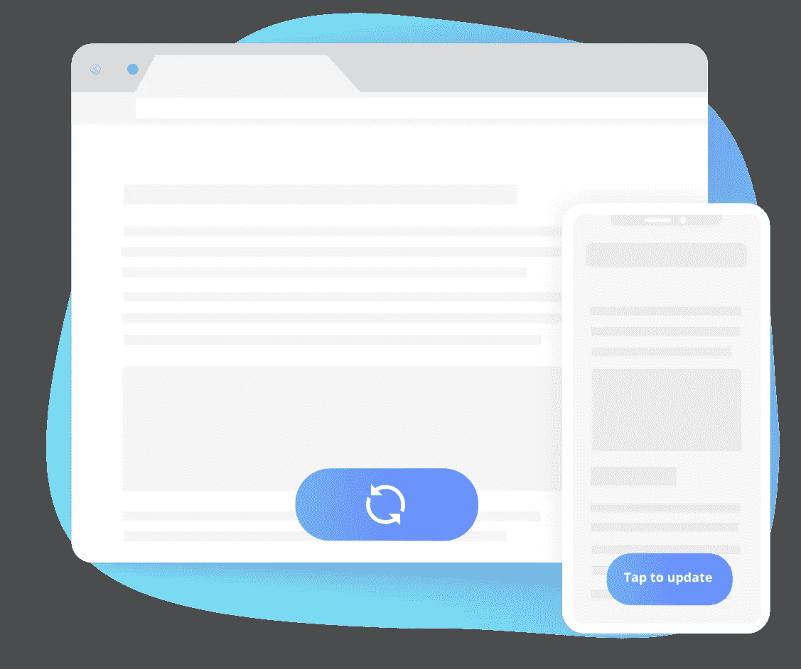
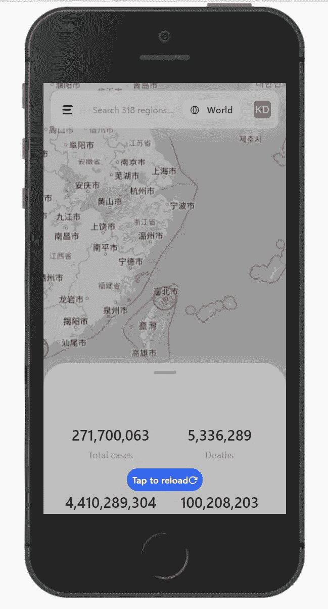

# 如何强制 PWA 刷新其内容

> 原文：<https://javascript.plainenglish.io/how-to-force-a-pwa-to-refresh-its-content-fef2c6ff3591?source=collection_archive---------2----------------------->

在 [Progressier](https://progressier.com?ref=medium20211217) 上，我们最常被问到的一个问题与客户端缓存有关。如何确保 PWA 始终显示最新的数据和资产，同时充分利用缓存？

虽然 PWA 看起来和感觉上经常像一个本地应用程序，但从技术角度来看，它真的像其他任何网站一样工作。当用户打开一个页面时，它会加载资产(图像、脚本、样式表……)和数据(用户数据、产品数据……)。这些资源是从网络上获取的，然后由浏览器使用。

进入 [HTTP 缓存](https://developer.mozilla.org/en-US/docs/Web/HTTP/Caching)机制。为了让加载网站更快，浏览器会缓存这些资源。在初始加载时，图像将来自您的服务器。在接下来的加载中，它可能来自缓存。因此，如果你同时更新它，浏览器可能会显示该图像的旧版本。你如何防止这种情况发生？

# 版本控制技巧

版本控制可能是强制浏览器从服务器加载资源的最简单的方法。更新资源时，在代码中请求的任何位置向资源的 URL 添加一个参数。例如，编辑您的客户端代码来请求`domain.com/data.json?**version=2**`而不是`domain.com/data.json?**version=1**`。

浏览器会看到这两个 URL，并认为它们是完全不同的资产。所以当页面明确请求后者时，它不会使用前者的缓存版本。一个好的做法是在构建过程中将版本号(或者任何其他查询字符串)附加到关键资源上，这样您就不必在每次进行更改时都手动这么做。

# 缓存控制头

当服务器成功响应 HTTP 请求时，它会返回资源本身(一个 JavaScript 文件、一个图像、一个 CSV 文件……)，但它还会发送标头——告诉浏览器允许或不允许对资源做什么的参数。

这些头中的一个是[高速缓存控制](https://developer.mozilla.org/en-US/docs/Web/HTTP/Headers/Cache-Control)头。它的存在是为了告诉浏览器如何缓存(或不缓存)和重新验证(或不验证)特定的资源。

如果您控制响应请求的服务器，您可以设置不同的`Cache-Control`头，并告诉浏览器应该如何处理每个特定的资源。例如，将`Cache-Control`头的值设置为`no-cache`，禁止浏览器缓存资源。

当然，这种方法只适用于你自己的资源——而不是第三方脚本、CSS 库、Google 字体或托管在其他地方的图片。

# 网络优先战略

说实话， [HTTP 缓存](https://developer.mozilla.org/en-US/docs/Web/HTTP/Caching)机制有点过时了。有了它，你真正能告诉浏览器的就是一个资源是否应该被缓存以及缓存到什么时候。

还有另一种缓存机制叫做[缓存 API](https://app.intercom.com/) 。而且在[服务人员](https://developer.mozilla.org/en-US/docs/Web/API/Service_Worker_API/Using_Service_Workers)都有。Progressier 为其缓存策略制定者使用该 API。您可以为每种类型的资源定义非常具体的规则，而无需编写任何代码。

Use Network First and target all resources to prevent caching altogether

使用*网络优先*策略，资源将总是从网络独占获取(因此，如果网络由于某种原因不可用，例如，如果用户或服务器离线，将会引发错误)。

当然，大多数时候，您会希望更具体地将该策略应用于任务关键的资源，并对不太重要的资源使用更缓存友好的策略(例如[Stale-While-Revalidat](https://intercom.help/progressier/en/articles/5703064-what-s-a-caching-strategy)e)。

# 假的重新加载按钮

对于前三种方法，您实际上是在告诉浏览器，当加载页面时，应该从缓存还是从网络中检索特定的资源。

但是一旦安装，打开一个 PWA 可能并不总是触发一个新的页面重新加载。你可以从主屏幕启动 PWA，做你必须做的事情，然后启动另一个应用程序，第二天再回到 PWA。

如果你在此期间没有关闭应用程序或关闭手机，它不会重新加载页面，而是让你从你离开的地方继续你的会话。如果您(应用程序所有者)同时更新了资源，那么用户可能仍在使用陈旧的资源。你怎么能强迫 PWA 更新它的内容呢？

当我们在 2020 年 1 月推出冠状病毒应用程序时，用户对数据新鲜度的要求非常高。我们每 15 分钟自动更新一次数据，所以不让用户看到陈旧的数据是绝对重要的(否则我们会收到大量愤怒的电子邮件！).

但是，我们没有等待实际的更新，而是使用了一个简单的技巧:当用户在页面上花费了超过半个小时时，我们会向他们提供一个选项来重新加载页面(他们没有其他选择，只能单击)并再次获取资源。它看起来像这样:

给人一种某事正在发生的错觉是一个强有力的 UX 概念。在我们的例子中，目的有两个:让应用程序看起来像是不断更新的(实际上是这样——只是不是以与那个假的重新加载按钮同步的方式),避免显示陈旧的数据。

# 结论

所以你走吧。三种不同的缓存方法，以确保您的 PWA 保持更新和一个小 UX 技巧。

版本控制技巧可能是实现这一点的最简单的方法——不管您是否拥有所请求的资源，它都是通用的。

如果这在构建过程中不太可行，您可以使用 Cache-Control 头(针对您拥有的资源)或 Service Worker 方法来精确定义缓存行为。

你怎么想呢?你用其他方法来更新你的 PWA 吗？

*更多内容看* [***说白了. io***](http://plainenglish.io/) ***。*** *报名参加我们的* [***免费每周简讯点击这里***](http://newsletter.plainenglish.io/) ***。***