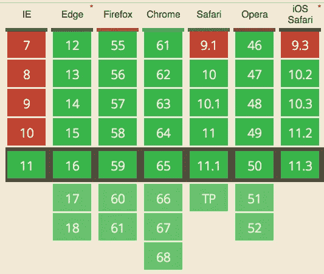

# 如何在 JavaScript 中将数字格式化为货币

> 原文：<https://javascript.plainenglish.io/how-to-format-a-number-as-currency-in-javascript-ca1b55e8829a?source=collection_archive---------19----------------------->

将数字格式化为货币的过程可能是一项繁琐的任务。这看起来像是一个小任务，但是考虑到国际化和不同的格式标准等因素，行数和边界情况会不断增加。幸运的是，ES2015 引入了一个国际化 API，可以使将数字格式化为货币的过程变得非常简单。

# 编写我们自己的格式化函数

我们肯定可以为此创建一个 hacky 函数，对吗？

```
let formatCurrency = (val, currency) => {
    let val;    
    switch (currency) {
        case 'USD':
            val = `$ ${val}`;
            break;
        case 'EUR':
            val = `€ ${val}`;
            break;
        default:
            throw new Error('Unknown currency format');
    }
    return val;
}
```

但是如果我们想要处理诸如$ 100 是好的，但是 1000 应该被显示为$ 1000 呢？让我们使用一些正则表达式的魔法？

```
let formatCurrency = (val, currency) => {
  let currencyVal = val.toFixed(2).replace(/\d(?=(\d{3})+\.)/g, '$&,'); 
  switch (currency) {
        case 'USD':
            val = `$ ${currencyVal}`;
            break;
        case 'EUR':
            val = `€ ${currencyVal}`;
            break;
        default:
            throw new Error('Unknown currency format');
    }
    return val;
}

console.log(formatCurrency(1000,'USD'));
// "$ 1,000.00"
```

这种方法面临的挑战是:

*   有一堆货币(~300)
*   有些货币使用“.”作为千位之间的分隔符，而不是'，'
*   这些货币使用'，'作为阶梯分隔符
    "$ 1000.05 "在德国欧元中是"€ 1.000，05 "
*   一些货币在自定义位置有千位分隔符
    1000000 将是₹10,00,000.00″，而不是 1，000，000.00 美元

诸如此类。我们不想测试所有货币和所有浏览器。

# 使用区域设置字符串格式化(更好的方法)

在 ES2015 和国际化 API 之前，我们仍然可以利用区域设置和字符串格式将数字格式化为货币。区域设置是允许开发人员指定区域特定属性的参数集合，例如:

*   货币格式
*   日期时间格式
*   工作日格式
*   数字格式
*   测量单位

```
const cashBalance = 10000; // 🤑

console.log(
  cashBalance.toLocaleString('en-US',
    {style: 'currency', currency: 'USD'}
  )
); // '$10,000.00'
```

这很好，并且是 ECMAScript 国际化 API 出现之前推荐的方法。但是一些(旧的)浏览器使用系统区域设置，而不是作为参数指定的区域设置。另外，因为 toLocaleString 通常是一种字符串操作方法，所以它不是一个性能选项。因此国际机场。引入了 NumberFormat 规范，这是 JavaScript 中将数字格式化为货币的首选方式。

# 使用 Intl 将数字格式化为货币。数字格式

```
new Intl.NumberFormat([locales[, options]])
```

第一个参数是表示语言和区域设置的 locale 字符串。它由语言代码和国家代码组成。

英语+美国
德语+德国
英语+印度

options 参数有很多选项。但我们将坚持这个帖子的风格，货币和最小分数位数。

因为这篇文章是关于货币的，我们将使用风格作为货币。其他可能的值包括小数和百分比。

你可以查看这些链接，了解更多关于[语言代码](https://www.w3schools.com/tags/ref_language_codes.asp)、[国家代码](https://www.w3schools.com/tags/ref_country_codes.asp)和[货币列表](https://www.currency-iso.org/en/home/tables/table-a1.html)的信息。

最小分数位数表示格式化时要包含的最小小数位数。

将所有这些放在一起:

```
const usDollar = new Intl.NumberFormat('en-US', {
  style: 'currency',
  currency: 'USD',
  minimumFractionDigits: 2
})

const rupeeIndian = Intl.NumberFormat("en-IN", {
    style: "currency",
    currency: "INR",
    minimumFractionDigits: 2
});

const euroGerman = Intl.NumberFormat("de-DE", {
    style: "currency",
    currency: "EUR",
    minimumFractionDigits: 2
});

const price = 1000000.0535;

console.log(usDollar.format(price)); // $1,000,000.05

console.log(rupeeIndian.format(price)); // ₹10,00,000.05

console.log(euroGerman.format(price)); // 1.000.000,05 €
```

下面是浏览器兼容性，如果您想自己看看是否应该使用国际化 API:



关于如何使用 ECMAScript 将一个数字格式化为货币，您只需要知道这些。如果你有任何问题，欢迎在下面留言。

*原载于 2021 年 3 月 5 日*[*【https://www.wisdomgeek.com】*](https://www.wisdomgeek.com/development/web-development/javascript/how-to-format-a-number-as-currency-using-es2015/)*。*