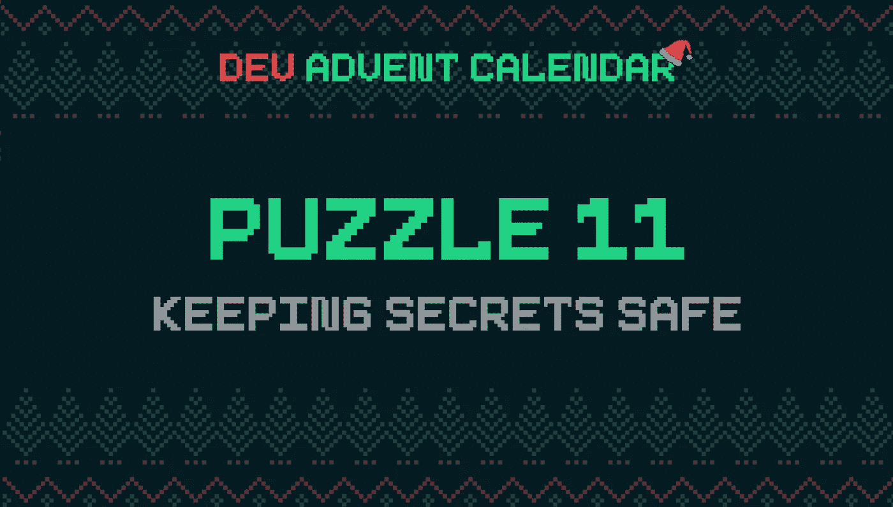

# 如何使用 JavaScript 生成随机密码

> 原文：<https://javascript.plainenglish.io/how-to-generate-a-random-password-using-javascript-cbeb4b72ec12?source=collection_archive---------2----------------------->

Photo by [Twitter @ethmessages](https://unsplash.com/@moneyphotos?utm_source=unsplash&utm_medium=referral&utm_content=creditCopyText) on [Unsplash](https://unsplash.com/@moneyphotos?utm_source=unsplash&utm_medium=referral&utm_content=creditCopyText)

北极有安全问题。第一个[圣诞老人丢失消息码](https://el3um4s.medium.com/how-to-convert-from-binary-to-text-in-javascript-and-viceversa-b617d9044436)。然后掌管钥匙的精灵总是用同一个。该换锁了。但这一次，我们将使用密码，而不是钥匙。根据安全等级的不同，长度和难度也不同。

# 谜题:保护秘密安全🔑

[开发降临节日历的第 11 天🎅](https://github.com/devadvent/puzzle-11):今天的问题是关于创建密码。我们需要使用不同的字符集生成不同的密码。

启动功能是这样的:

`length`是一个数字:是密码的长度。`options`取而代之的是一个包含 4 个属性的对象:

为了简化，问题测试总是认为`options`对象中的每个属性都是真的。同样，也没有必要将所有属性传递给函数。

`generatePassword`函数返回一个随机字符串。每个选项属性必须有一个字符。

我从接球失误开始。我需要验证`options`的论点不是空的。为此，我使用了 [Object.keys()](https://developer.mozilla.org/en-US/docs/Web/JavaScript/Reference/Global_Objects/Object/keys) 方法。此方法返回一个数组，该数组包含对象的各种属性的名称。只需检查它的长度就可以了解是否有属性:

我使用相同的变量来验证所需的长度是否正确:

下一步是确保每种类型至少有一个字符被选中。为此，我必须决定如何生成密码。我认为一个好的方法是单独创建每个字符，并保存到一个数组中。然后我会把数组和所有字符混合在一起，用 [Array.prototype.join()](https://developer.mozilla.org/en-US/docs/Web/JavaScript/Reference/Global_Objects/Array/join) 方法把它变成一个字符串。

然而，为了管理字符集，我使用了一个单独的对象。这样，将来我可以增加或减少可用的属性:

我创建了一个助手函数来从字符串中随机选取一个字母。

仍然需要理解如何滚动对象的各种属性。我需要决定使用哪些字符集。为此，我在语句中使用[来表示……通过组合这三个部分，我可以确保在密码中选择的每个集合都有一个字符:](https://developer.mozilla.org/en-US/docs/Web/JavaScript/Reference/Statements/for...in)

对于剩余的字符，我重用了`randomChar()`函数。但是将所有可用的字符作为参数传递。所以我添加了一个`characters`变量，并开始在`password`中输入随机的字母:

最后，我创建一个辅助函数来混合数组:

这是我对这个难题的解决方案:

今天到此为止。

感谢阅读！敬请关注更多内容。

***不要错过我的下一篇文章—报名参加我的*** [***中邮箱列表***](https://medium.com/subscribe/@el3um4s)

 [## 通过我的推荐链接加入 Medium—Samuele

### 阅读萨缪尔的每一个故事(以及媒体上成千上万的其他作家)。不是中等会员？在这里加入一块…

el3um4s.medium.com](https://el3um4s.medium.com/membership) 

*原载于 2021 年 12 月 12 日*[*https://blog.stranianelli.com*](https://blog.stranianelli.com/how-to-generate-paswword-with-javascript/)*。*

*更多内容看* [***说白了就是***](http://plainenglish.io/) ***。*** *报名参加我们的* [***免费每周简讯这里***](http://newsletter.plainenglish.io/) ***。***