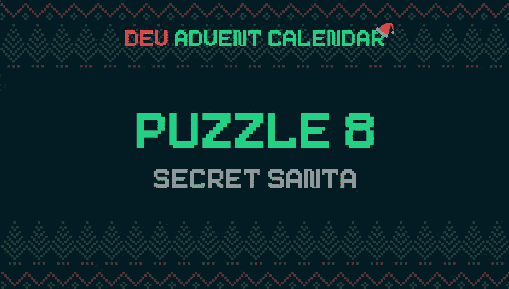

# 如何在 JavaScript 中从数组生成数组对

> 原文：<https://javascript.plainenglish.io/how-to-generate-an-array-of-pairs-from-an-array-in-javascript-edbbb5cdd8da?source=collection_archive---------4----------------------->

Photo by [Bonnie Kittle](https://unsplash.com/@bonniekdesign?utm_source=unsplash&utm_medium=referral&utm_content=creditCopyText) on [Unsplash](https://unsplash.com/s/photos/pairs?utm_source=unsplash&utm_medium=referral&utm_content=creditCopyText)

经历了过去几天的麻烦，精灵们应该休息一下了。所以他们决定组织一个秘密圣诞老人。在意大利没有这样的翻译:精灵必须向我解释。作为回报，他们问我如何解决配对的问题。以下是我的解决方案。

# 谜题:神秘的圣诞老人🤫

我没有幻觉:我说的是 [Dev 降临节日历上的第 8 个问题🎅](https://github.com/devadvent/puzzle-8)。今天的挑战是将数组中的每个元素与另一个元素匹配。我无法将一个元素与其自身匹配，每对元素必须是不同的。

在我的代码之前，给那些不熟悉神秘圣诞老人传统的人一个简短的插入语:

> *“秘密圣诞老人”的概念是这样的:每个参与者都被分配到一个所谓的“秘密圣诞老人”，这个人必须为那个人得到一份贴心的礼物。通常这是面对面的:所有的名字被扔进一个帽子里，每个参与者抽取一个。你画的这张纸是你要送礼物给的人。*

# 我的解决方案

使用数组方法可以快速解决这个难题。但是让我们按顺序来。有 3 个要求需要满足，我从第一个开始。

首先，如果有两个精灵同名，我会得到一个错误。在这种情况下，测验的文本已经包含了一个提示:

所以我只需要写一个简单的条件:

第二个和第三个条件可以一起解决。我必须给每个名字一个神秘的圣诞老人。一个精灵不能成为他自己的秘密圣诞老人。

为了解决这个问题，我首先混合了帽子，不好意思，是带有参与者名字的数组:

然后，我决定根据它们在数组中的位置将不同的名称成对出现。实际上，我是这样创建配对的:

使用这种技术，我确信每个精灵都会有不同的同伴。

我的解决方案的完整代码很简单:

好了，今天的问题解决了。

但是有一件事我想说。它帮助我跟踪问题和解决方案。把这些作品翻译成英文对我也有帮助。一方面，它允许我用一种不属于我的语言练习，这种语言是我自己学的。另一方面，翻译概念帮助我简化我的文章，并验证我认为我理解了什么。

好吧，那又怎样？所以我很高兴看到来自[的马克·谢勒](https://medium.com/@dreamora)关于一个误导性标题的报道:

 [## 如何在 JavaScript 中从列表中获取唯一值

### 最后，小精灵们把他们的商业野心放在一边，回到他们的工作上:帮助圣诞老人给…

javascript.plainenglish.io](/how-to-get-unique-values-from-a-list-in-javascript-301675602985) 

我很难找到一个英文标题。但我很高兴有人读我写的东西。我很高兴你花时间来报告我的错误。谢谢！

感谢阅读！敬请关注更多内容。

***不要错过我的下一篇文章—报名参加我的*** [***中邮箱列表***](https://medium.com/subscribe/@el3um4s)

 [## 通过我的推荐链接加入 Medium—Samuele

### 阅读萨缪尔的每一个故事(以及媒体上成千上万的其他作家)。不是中等会员？在这里加入一块…

el3um4s.medium.com](https://el3um4s.medium.com/membership) 

*原载于 2021 年 12 月 9 日 https://blog.stranianelli.com***。**

**更多内容请看**[***说白了. io***](http://plainenglish.io/) ***。*** *报名参加我们的* [***免费每周简讯这里***](http://newsletter.plainenglish.io/) ***。*****