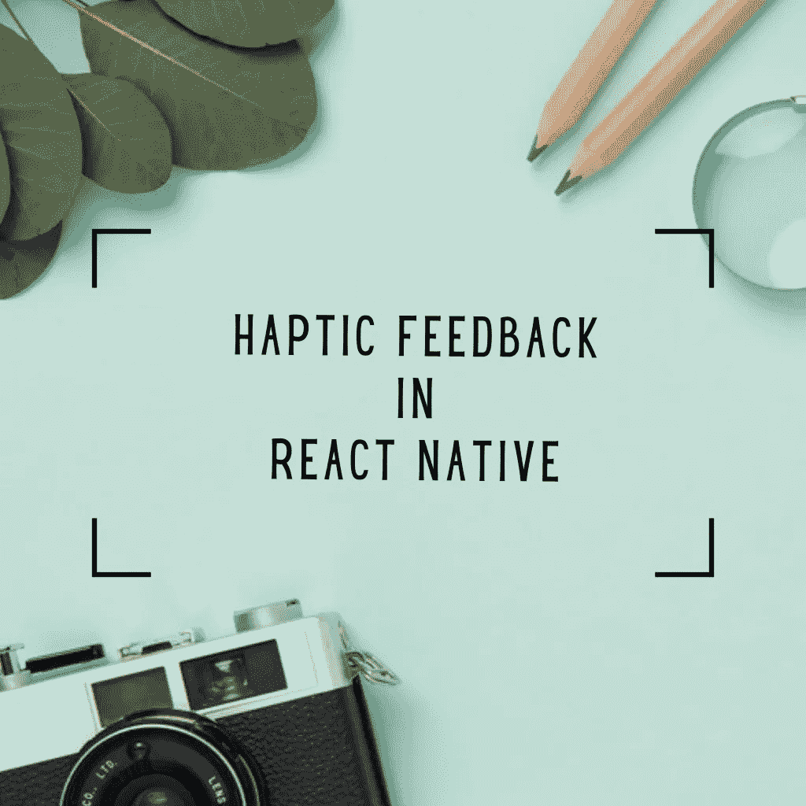
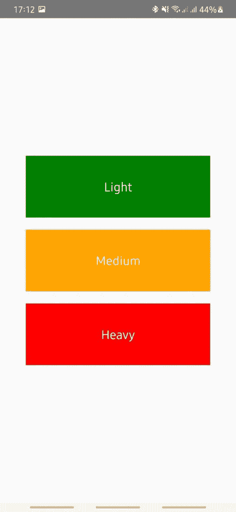
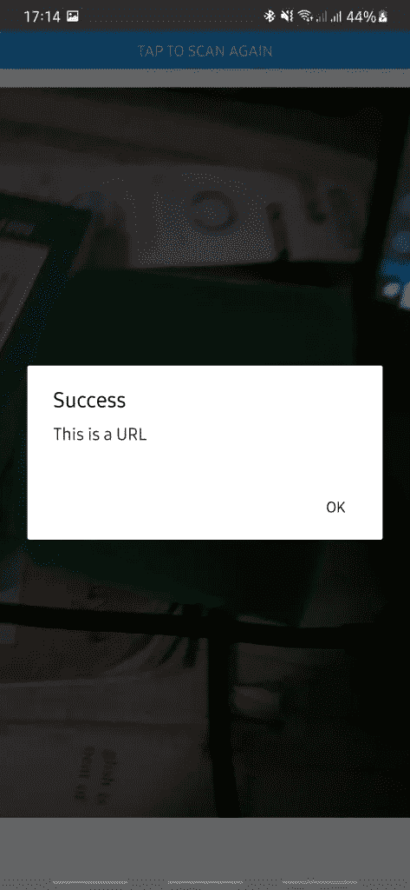

# 如何在 React Native 中生成触觉反馈

> 原文：<https://javascript.plainenglish.io/how-to-generate-haptic-feedback-in-react-native-d040fa3fa9c4?source=collection_archive---------13----------------------->

## 感知性能在移动应用中至关重要。我们需要让我们的应用程序快速、简洁，否则，用户不会使用它们。



添加动画和触觉反馈等功能使移动应用程序感觉更具性能。在本文中，我们将讨论 React Native 中的触觉反馈——它是什么，以及我们如何在移动应用中实现它。

触觉触摸反馈是在游戏、游戏机或智能手机上应用触摸时产生的工程反馈。你知道当你最喜欢的视频游戏中的角色死去或者球击中了国际足联的横梁时的震动。

看看大型应用程序，如脸书、Instagram 或 Twitter，注意当你采取重要行动如喜欢或关注时，触觉反馈在你手中的感觉有多好。

我们即将在本 React 原生教程中探索的触觉反馈库由 [Expo](https://expo.io/) 提供，名为 ***expo-haptics*** 。在探索了这个库之后，我们将继续构建一个小的应用程序来应用我们所学的东西。

# 装置

创建一个新的世博项目

```
expo init haptic_feedback_example
```

安装

```
*expo install expo-haptics*
```

*现在让我们来探索这些方法及其最可能的用例，这种依赖关系提供了三种方法:*

***a . haptics . selection async()**:这个函数没有参数。该功能被触发后，该呼叫会产生约 1 秒钟的振动。该功能可以在动画完成时应用。动画可以由用户启动，也可以通过编程启动。*

***b . haptics . notification async(type):**该函数采用一个参数 *type* ，可以是下列之一:*

*   **触觉学。通知反馈类型.成功**
*   **触觉学。NotificationFeedbackType . Warning**
*   **触觉学。错误**

*该功能可以在验证后给出反馈时使用。Snapchat 的普通用户在扫描 Snapchat 二维码后，对手机上的这种振动很熟悉。*

***c . haptics . impact async(style):**该函数也只接受一个参数，该参数通常是三个值之一，具体取决于所需反馈的强度:*

*   **触觉学。ImpactFeedbackStyle.Light**
*   **触觉学。ImpactFeedbackStyle.Medium**
*   **触觉学。ImpactFeedbackStyle.Heavy**

*该功能在调用时产生比*选择同步*更快的反馈，并可用于在用户按下按钮时提供即时触觉反馈。蛋糕上的配料是你可以调节振动的强度。*

# *React Native 中触觉反馈*

## ***例 1***

*我们已经创建了 React 本地项目，所以让我们构建一个简单的项目，测试 *impactAsync* 方法，并探索不同的触觉反馈风格:*

```
*/**
 * Sample React Native App
 * https://github.com/facebook/react-native
 *
 * @format
 * @flow strict-local
 */

import React from 'react';
import {StyleSheet, TouchableOpacity, View, Text} from 'react-native';
import * as Haptics from 'expo-haptics';

const HapticFeedbackExample = () => {
  function impactAsync(style) {
    switch (style) {
      case 'light':
        Haptics.impactAsync(Haptics.ImpactFeedbackStyle.Light);
        break;
      case 'medium':
        Haptics.impactAsync(Haptics.ImpactFeedbackStyle.Medium);
        break;
      default:
        Haptics.impactAsync(Haptics.ImpactFeedbackStyle.Heavy);
        break;
    }
  }

  return (
    <View>
      <TouchableOpacity onPress={() => impactAsync('light')}>
        <Text style={styles.light}>Light</Text>
      </TouchableOpacity>
      <TouchableOpacity onPress={() => impactAsync('medium')}>
        <Text style={styles.medium}>Medium</Text>
      </TouchableOpacity>
      <TouchableOpacity onPress={() => impactAsync('heavy')}>
        <Text style={styles.heavy}>Heavy</Text>
      </TouchableOpacity>
    </View>
  );
};

const styles = StyleSheet.create({
  container: {
    flex: 1,
    alignItems: 'center',
    justifyContent: 'center',
  },
  light: {
    color: '#ffffff',
    fontSize: 20,
    width: 300,
    height: 100,
    backgroundColor: 'green',
    marginVertical: 10,
  },
  medium: {
    color: '#ffffff',
    fontSize: 20,
    width: 300,
    height: 100,
    backgroundColor: 'orange',
    marginVertical: 10,
  },
  heavy: {
    color: '#ffffff',
    fontSize: 20,
    width: 300,
    height: 100,
    backgroundColor: 'red',
    marginVertical: 10,
  },
});*
```

*我们在上面的 React 原生代码库中做什么？*

*我们创建三个按钮来代表 *impactAsync* 的三种风格。这张简单的屏幕截图显示了不同的按钮及其不同的风格和强度:*

**

*运行项目并开始交替点击三个按钮。仔细观察，你会注意到强度的细微差别，从轻到中到重。*

## ***例二***

*让我们构建一个小型 QR 扫描仪来验证一个解析的 QR 码是否是一个有效的 URL。*

*为此，我们必须添加由世博会提供的*世博会条形码扫描仪*。*

```
*expo install expo-barcode-scanner*
```

*让我们编写代码来扫描随机条形码，并验证它是否是有效的 URL:*

```
*import React, {useState, useEffect} from 'react';
import {Text, View, StyleSheet, Button, Alert} from 'react-native';
import {BarCodeScanner} from 'expo-barcode-scanner';
import * as Haptics from 'expo-haptics';

export default function App() {
  const [isPermitted, setPermitted] = useState(null);
  const [scanned, setScanned] = useState(false);

  useEffect(() => {
    (async () => {
      const {status} = await BarCodeScanner.requestPermissionsAsync();
      setPermitted(status === 'granted');
    })();
  }, []);

  const handleBarCodeScanned = ({type, data}) => {
    setScanned(true);
    is_url(data);
  };

  function is_url(str) {
    const regexp = /^(?:(?:https?|ftp):\/\/)?(?:(?!(?:10|127)(?:\.\d{1,3}){3})(?!(?:169\.254|192\.168)(?:\.\d{1,3}){2})(?!172\.(?:1[6-9]|2\d|3[0-1])(?:\.\d{1,3}){2})(?:[1-9]\d?|1\d\d|2[01]\d|22[0-3])(?:\.(?:1?\d{1,2}|2[0-4]\d|25[0-5])){2}(?:\.(?:[1-9]\d?|1\d\d|2[0-4]\d|25[0-4]))|(?:(?:[a-z\u00a1-\uffff0-9]-*)*[a-z\u00a1-\uffff0-9]+)(?:\.(?:[a-z\u00a1-\uffff0-9]-*)*[a-z\u00a1-\uffff0-9]+)*(?:\.(?:[a-z\u00a1-\uffff]{2,})))(?::\d{2,5})?(?:\/\S*)?$/;
    hapticNotify(regexp.test(str));
  }

  const hapticNotify = (success) => {
    switch (success) {
      case true:
        Haptics.notificationAsync(Haptics.NotificationFeedbackType.Success);
        Alert.alert('Success', 'This is a URL');
        break;
      default:
        Haptics.notificationAsync(Haptics.NotificationFeedbackType.Error);
        Alert.alert('Error', 'This is not a URL!!');
        break;
    }
  };

  if (isPermitted === null) {
    return <Text>Requesting for camera permission</Text>;
  }
  if (isPermitted === false) {
    return <Text>No access to camera</Text>;
  }

  return (
    <View style={styles.container}>
      <BarCodeScanner
        onBarCodeScanned={scanned ? undefined : handleBarCodeScanned}
        style={StyleSheet.absoluteFillObject}
      />
      {scanned && (
        <Button title={'Tap to Scan Again'} onPress={() => setScanned(false)} />
      )}
    </View>
  );
}

const styles = StyleSheet.create({
  container: {
    flex: 1,
  },
});*
```

*我们在上面的代码库中做什么？*

*在扫描条形码之前，我们必须先获得许可，然后验证扫描结果，以确认它是否是一个 URL:*

**

*我们基于扫描的条形码 URL 是否有效来应用不同的触觉反馈风格。您会注意到扫描有效的 URL 条形码和无效的 URL 条形码之间的触觉反馈的差异。*

# *关于 React Native 中触觉反馈的结论*

*我们已经浏览了 ***expo-haptics*** 库及其可能的用例。我们通过构建几个小应用程序来应用这些用例，并获得这些交互行为的实际感受，进而应用我们所学的知识。*

*在 React 本地应用中添加触觉反馈非常简单，因为有一些库可以让这项任务变得简单。然而，为了提供高质量的移动应用程序，您需要仔细选择何时触发这些触觉反馈交互。滥用这些振动会激怒你的用户，也会很快耗尽他们的手机电池，所以要明智地选择。*

*关于移动性能的更多想法，请查看我们关于如何[提升移动应用性能的文章](https://www.instamobile.io/mobile-design/perceived-performance-mobile-apps/)。*

**原载于 2021 年 2 月 10 日*[*https://www . insta mobile . io*](https://www.instamobile.io/react-native-tutorials/haptic-feedback-react-native/)*。**