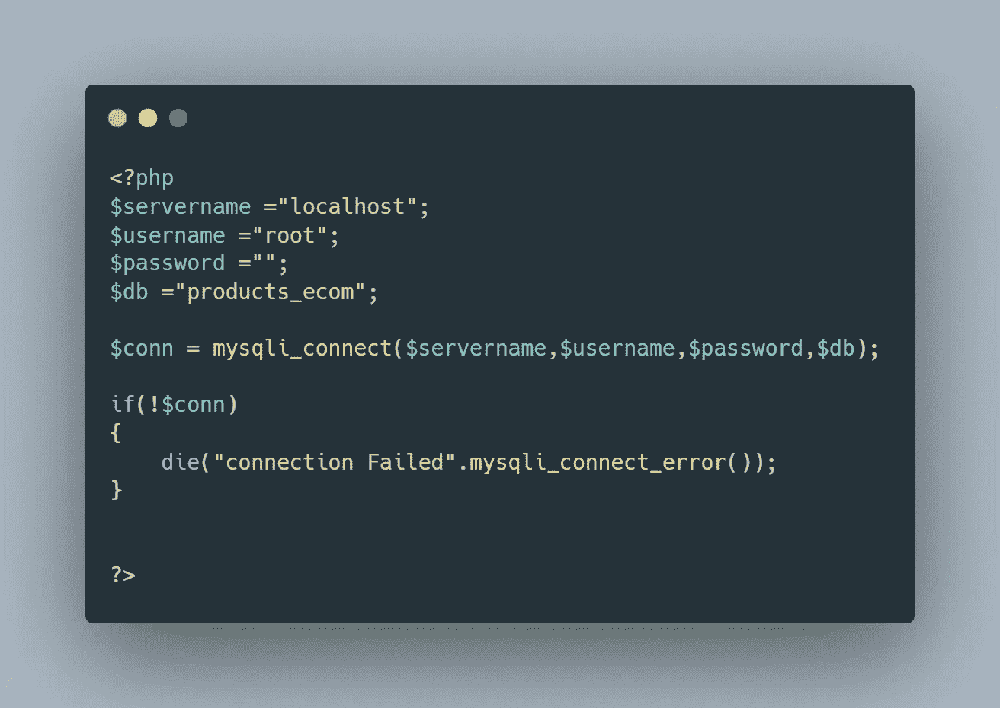
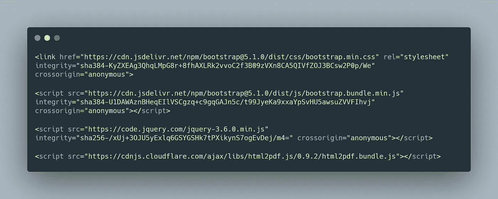
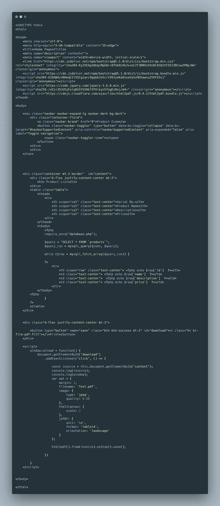
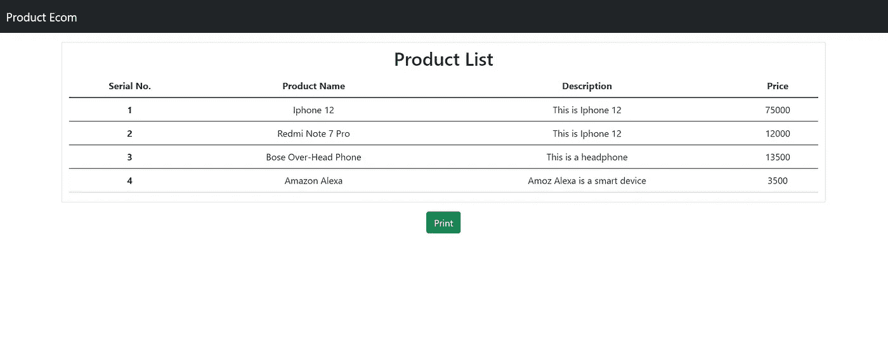

# 如何使用 JsPDF 插件和 PHP 生成 PDF 文件

> 原文：<https://javascript.plainenglish.io/how-to-generate-pdf-file-using-jspdf-plugin-and-php-2386d1874a36?source=collection_archive---------0----------------------->

Photo by [Kevin Ku](https://unsplash.com/@ikukevk?utm_source=medium&utm_medium=referral) on [Unsplash](https://unsplash.com?utm_source=medium&utm_medium=referral)

在本教程中，我们将使用来自数据库的数据生成一个 PDF 文件。我在 MySQL 数据库上使用核心 PHP 和 jQuery。

我希望你对 PHP，MySQL 数据库和 jQuery 有所了解。在做任何进一步的事情之前，启动 Xampp 服务器并创建一个包含您喜欢的表的数据库。

在这里，我有一个数据库表，其中有一些产品的细节。首先，我需要在我的网页上显示所有产品的列表，然后生成一个 PDF 文件。pdf 文件将包含所有产品列表。

# 项目结构:

我们只需要创建两个 PHP 文件，一个用于数据库连接，另一个用于所有的 HTML 和 JavaScript 代码。我的文件名如下:

1.  database.php
2.  index.php

# 文件:

1.  **database.php**:在这个文件中，写下你的数据库的所有连接查询。按照代码格式将数据库连接到您的应用程序。

2.**index.php**:我在用 Bootstrap 设计桌子。您可以使用自定义 CSS 来设计比这好得多的内容。👍

主要脚本标签:

下面是 index.php 的最终代码:

当按下打印按钮时，将自动下载 PDF 文件。

下面是 PDF 生成的最终代码。在`opt={}`中，您可以在创建 PDF 时自定义属性。

如果您正确地遵循了教程，最终结果应该是这样的。👇👇

非常感谢你一直读到最后。如果你需要帮助，可以联系我。编码快乐！✌✌✌✌✌

> **联系我:**
> 
> **Web:**[https://ankandas.netlify.app/](https://ankandas.netlify.app/)
> **insta gram:**[https://www.instagram.com/](https://www.instagram.com/ankan_designer/)*ankan _ designer/*
> **GitHub:**[https://github.com/](https://github.com/Ankan982)*ankan 982*

*更多内容请看*[***plain English . io***](http://plainenglish.io/)