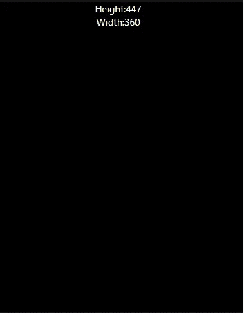

# 如何在 React Native 中获取设备的尺寸

> 原文：<https://javascript.plainenglish.io/how-to-get-a-devices-dimensions-in-react-native-bcc2a5c26663?source=collection_archive---------10----------------------->

## 如何让你的应用适应多种设备尺寸？

Photo by [Azamat E](https://unsplash.com/@esen_aza?utm_source=medium&utm_medium=referral) on [Unsplash](https://unsplash.com?utm_source=medium&utm_medium=referral)

在 React Native 中构建移动应用程序时，适应不同的设备大小非常重要。这是让你的应用程序更易访问的一个重要部分，将允许它被更多的受众使用。

在这篇文章中，我将向你展示如何使用 React Native 提供的`useWindowDimensions`钩子来获取当前的设备尺寸。

# 创建 React 本机应用程序

为了展示如何获取设备的尺寸，我们将创建一个基本的 React 本机应用程序。

这个应用程序唯一的工作就是获取设备当前的宽度和高度并显示出来。

***注:*** *如果你不确定如何创建一个新的 React 原生 app，可以按照本文* [*这里*](https://reactnative.dev/docs/environment-setup)

# 添加样板代码

创建新的 react 本机应用程序后，复制并粘贴以下样板代码:

Boilerplate Code

启动 React 本机应用程序后，您应该会看到以下内容:

What your React Native App Should Show

# 使用 useWindowDimensions 挂钩

使用`useWindowDimensions`挂钩的好处是，当屏幕尺寸改变时，宽度和高度值会自动更新。

这意味着，如果在运行时，您的设备的宽度或高度发生变化，例如，如果设备被旋转，这些值将被更新，而不需要任何额外的代码。

下面的代码显示了如何在我们的应用程序中使用`useWindowDimensions`:

添加下面的代码后，你的应用程序应该会自动显示你的设备的宽度和高度。

***注意:*** *如果显示的数值和我的不一样，不用担心；这意味着应用程序正在正常工作。不同的设备具有不同的宽度和高度，因此* ***的值应该*** *不同。*

My Device’s Width and Height Displayed

# 结论

感谢您阅读完我的文章**“如何在 React Native 中获取设备尺寸”**。希望到现在为止，您已经更好地理解了如何在 React Native 中获取设备的参数。如果你有任何问题，请随意提问，我会尽快回答。

我希望你有美好的一天。如果你刚接触媒体，你可以点击这里的[链接](https://bookeraziz.medium.com/membership)加入。

 [## 你绝对需要了解的 8 个 React 原生库

### 当谈到使用 React Native 创建应用程序时，找到正确的库可以使开发过程变得更加…

javascript.plainenglish.io](/8-react-native-libraries-you-absolutely-need-to-know-about-28f6038d0b76)  [## 如何使用 Moment.js 创建数字时钟

### 仅使用普通 JavaScript 和 Moment.js 库在浏览器中创建时钟的指南。

javascript.plainenglish.io](/how-to-create-a-digital-clock-using-moment-js-8cd40c7b0899) 

*更多内容看* [***说白了. io***](http://plainenglish.io/) ***。*** *报名参加我们的* [***免费每周简讯点击这里***](http://newsletter.plainenglish.io/) ***。***