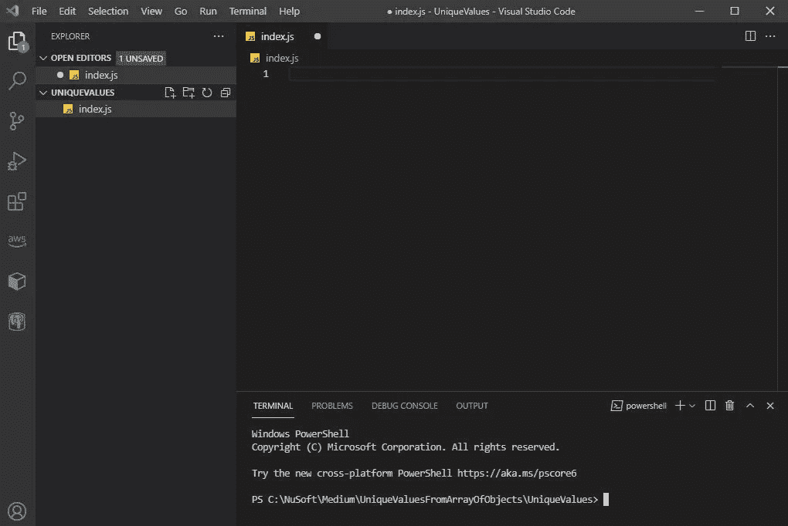
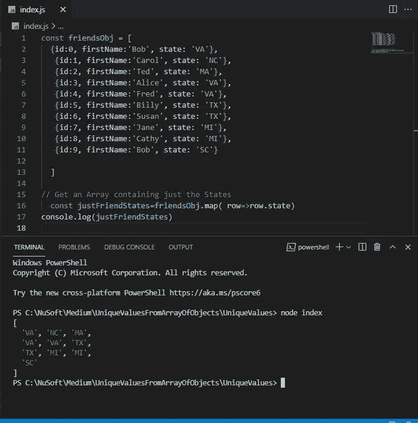

# 从 JavaScript 对象数组中获取唯一值

> 原文：<https://javascript.plainenglish.io/how-to-get-a-list-of-unique-values-from-a-javascript-array-of-objects-2e38f6cfd14?source=collection_archive---------5----------------------->

## 使用 JavaScript 对象

## 使用带有 Spread 运算符和 JavaScript 数组方法的 JavaScript 集。map()和。排序()


Photo by [Noah Näf](https://unsplash.com/@noahdavis?utm_source=medium&utm_medium=referral) on [Unsplash](https://unsplash.com?utm_source=medium&utm_medium=referral)

# 要解决的问题

如果你看看下面的**样本数据**，你会看到我们正在处理的数据和我们想要达到的目标(**预期结果**)。)

我们有一个 JavaScript 数组，其中包含我们每个朋友的对象。*问题是如何从这个对象中得到一个* ***唯一的*** *状态列表。*

## 用例

我最近不得不做一些类似的事情来动态填充一个状态选择列表，用户可以从中进行选择。选择列表只包括对象所在的状态。用例不涉及朋友，但你得到了想法。我能够创建一个惟一值的数组，并用它来填充选择列表。

# 我们将做什么

我们将使用下面的数据，各州的朋友数组，并最终得到我们的朋友居住的州的唯一列表。

## 抽样资料

```
[
  {id:0, firstName:'Bob', state: 'VA'},
   {id:1, firstName:'Carol', state: 'NC'},
   {id:2, firstName:'Ted', state: 'MA'},
   {id:3, firstName:'Alice', state: 'VA'},
   {id:4, firstName:'Fred', state: 'VA'},
   {id:5, firstName:'Billy', state: 'TX'},
   {id:6, firstName:'Susan', state: 'TX'},
   {id:7, firstName:'Jane', state: 'MI'},
   {id:8, firstName:'Cathy', state: 'MI'},
   {id:9, firstName:'Bob', state: 'SC'}

  ]
```

## 期望结果

唯一的州列表。可选排序。

```
[ 'MA', 'MI', 'NC', 'SC', 'TX', 'VA' ]
```

# 我们将使用的 JavaScript

我们将使用 JavaScript 数组方法，

*   [地图](https://developer.mozilla.org/en-US/docs/Web/JavaScript/Reference/Global_Objects/Array/map)()
*   [sort()](https://developer.mozilla.org/en-US/docs/Web/JavaScript/Reference/Global_Objects/Array/sort)

以及 JavaScript [设置](https://developer.mozilla.org/en-US/docs/Web/JavaScript/Reference/Global_Objects/Set)和[展开](https://developer.mozilla.org/en-US/docs/Web/JavaScript/Reference/Operators/Spread_syntax)操作符。

# 我们开始吧

## 设置

我将使用 [Visual Studio 代码](https://code.visualstudio.com/) (VSCode)，但你可以使用任何你想要的编辑器。

1.  创建一个用于创建项目的文件夹，并在 VSCode 中打开该文件夹。
2.  创建一个名为 **index.js** 的文件
3.  打开一个**终端**窗口，用于运行我们的代码。



VSCode with index.js to contain our code and a Terminal window to run it in.

4.现在，让我们从本文开头的示例数据中复制 friend 数组，并创建一个名为 **friendsObj** 的 JavaScript 对象，或者就复制这个。

```
const friendsObj = [
  {id:0, firstName:'Bob', state: 'VA'},
   {id:1, firstName:'Carol', state: 'NC'},
   {id:2, firstName:'Ted', state: 'MA'},
   {id:3, firstName:'Alice', state: 'VA'},
   {id:4, firstName:'Fred', state: 'VA'},
   {id:5, firstName:'Billy', state: 'TX'},
   {id:6, firstName:'Susan', state: 'TX'},
   {id:7, firstName:'Jane', state: 'MI'},
   {id:8, firstName:'Cathy', state: 'MI'},
   {id:9, firstName:'Bob', state: 'SC'}
  ]
```

## 只获取每个朋友的状态

第一步是使用数组方法。map()来帮助我们获得每个朋友所在的州。这些不会是唯一的。

## Array.map()

> `**map()**`方法**创建一个新的数组**,其中填充了调用数组中每个元素的函数的结果。

我们将使用的语法是箭头函数`map((element) => { ... } )`

我们将基于我们提供的函数创建一个新的(状态)数组。我们将提供的功能将告诉地图，*我们只想要国家。*因为我们的函数中只有一条代码语句，所以我们不需要上面语法中的{}，也不需要在行的两边加上()，因为只有一个参数。

1.将下面的代码添加到 index.js，**在**friend obj 下面。

```
// Get an Array containing just the States
const justFriendStates=friendsObj.map( row=>row.state)
```

friendsObj 数组的每一行都是一个 friend 对象，并将依次存储在 row 参数中。row 参数包含整个 friend 对象。我们只需要状态键的值。新数组将是所有状态的数组，包括副本，数组中的每个友元对象一个。

2.添加 console.log，保存后在终端窗口键入**节点索引**运行代码。

```
// Get an Array containing just the States
const justFriendStates=friendsObj.map( row=>row.state)
console.log(justFriendStates)
```

终端窗口中的输出应该是，

```
[
  'VA', 'NC', 'MA',
  'VA', 'VA', 'TX',
  'TX', 'MI', 'MI',
  'SC'
]
```

每个朋友的状态。



Array of states for each friend.

## 获取州的唯一列表

下一步是使用 JavaScript [Set](https://developer.mozilla.org/en-US/docs/Web/JavaScript/Reference/Global_Objects/Set) 。

## JavaScript 集

> `**Set**`对象允许您存储任何类型的**唯一**值，无论是[原始值](https://developer.mozilla.org/en-US/docs/Glossary/Primitive)还是对象引用。

描述中需要注意的关键词是**唯一**。

创建新集合的语法是，

```
new Set([*iterable*]);
```

**Iterable** 是 JavaScript 可以迭代或移动的对象；例如阵列。

## 不要做什么

我们不想做的事情就是这么简单，

```
const uniqueStates = [new Set(justFriendStates)]
```

这将创建一个包含一个项目的**数组。一个项目是一组 6 个项目。我们需要一个数组，其中的项是状态。这给出的是一个集合的数组。唯一的状态被锁定在集合中。如果你想尝试它，你会得到以下。**

```
[ Set(6) { 'VA', 'NC', 'MA', 'TX', 'MI', 'SC' } ]  // Don't want this
```

我们需要“传播”集合的值。**我们将使用** [**展开**](https://developer.mozilla.org/en-US/docs/Web/JavaScript/Reference/Operators/Spread_syntax) **…运算符。**

> **扩展语法**允许在需要零个或多个参数(用于函数调用)或元素(用于数组文字)的地方扩展一个可迭代对象，例如一个数组表达式或字符串，或者在需要零个或多个键值对(用于对象文字)的地方扩展一个对象表达式。

1.  在最后一行(console.log)后添加以下代码，保存后在终端窗口中键入**节点索引**以运行代码。

```
const uniqueStates = [...new Set(justFriendStates)]
console.log(uniqueStates)
```

终端窗口中的输出应该显示，

```
[ 'VA', 'NC', 'MA', 'TX', 'MI', 'SC' ]
```

***和我们玩完了！*** 除非你想对各州进行排序(可选。)

## 对状态列表进行排序

下一步是使用 JavaScript 数组方法。排序()。这个很简单。只是大头针。将()排序到数组的末尾。

```
const uniqueStates = [...new Set(justFriendStates)]**.sort()**
console.log(uniqueStates)
```

**输出**

```
[ 'MA', 'MI', 'NC', 'SC', 'TX', 'VA' ]
```

## **完整代码**

```
const friendsObj = [
  {id:0, firstName:'Bob', state: 'VA'},
   {id:1, firstName:'Carol', state: 'NC'},
   {id:2, firstName:'Ted', state: 'MA'},
   {id:3, firstName:'Alice', state: 'VA'},
   {id:4, firstName:'Fred', state: 'VA'},
   {id:5, firstName:'Billy', state: 'TX'},
   {id:6, firstName:'Susan', state: 'TX'},
   {id:7, firstName:'Jane', state: 'MI'},
   {id:8, firstName:'Cathy', state: 'MI'},
   {id:9, firstName:'Bob', state: 'SC'}

  ]// Get an Array containing just the states
    const justFriendStates=friendsObj.map( row=>row.state)
    console.log(justFriendStates)
    // Create unique list of states and sort
    const uniqueStates = [...new Set(justFriendStates)].sort()
    console.log(uniqueStates)
```

# 结论

我们使用了一些 JavaScript 技术来操作 JavaScript 对象数组，以获得特定键的*唯一值列表。*

最重要的是使用 Array.map()方法以及非常有用的 Set 对象和 Spread 操作符。

我鼓励你尝试一下，看看你还能做什么其他类型的操作，还有什么其他方法可以用来达到同样的结果(可能性:[)。reduce()，](https://developer.mozilla.org/en-US/docs/Web/JavaScript/Reference/Global_Objects/Array/Reduce) [Object.values()](https://developer.mozilla.org/en-US/docs/Web/JavaScript/Reference/Global_Objects/Object/values) ，..？)

**感谢您花时间阅读和编写代码！**

*想看就看，加入 Medium 帮我继续写*

[](https://bobtomlin-70659.medium.com/membership) [## 通过我的推荐链接加入灵媒——重力井(罗布·汤姆林)

### 作为一个媒体会员，你的会员费的一部分会给你阅读的作家，你可以完全接触到每一个故事…

bobtomlin-70659.medium.com](https://bobtomlin-70659.medium.com/membership) 

## 相关文章

[](/using-asynchronous-operations-with-javascripts-array-map-method-1971e8093228) [## 通过 JavaScript 的 Array.map()方法使用异步操作

### 这是关于信守承诺。

javascript.plainenglish.io](/using-asynchronous-operations-with-javascripts-array-map-method-1971e8093228) 

关于 JavaScript 集合的更多信息。

[](/using-javascript-sets-37752330682d) [## 使用 JavaScript 集

### 一些有趣的用法、观察和陷阱

javascript.plainenglish.io](/using-javascript-sets-37752330682d) 

多维数组

[](/javascript-multi-dimensional-arrays-7186e8edd03) [## JavaScript 多维数组

### 真相大白了

javascript.plainenglish.io](/javascript-multi-dimensional-arrays-7186e8edd03) 

由于 JavaScript 对象与 Json 密切相关，您可能会觉得这些很有趣:

[](https://levelup.gitconnected.com/how-to-query-a-json-array-of-objects-as-a-recordset-in-postgresql-a81acec9fbc5) [## 如何在 PostgreSQL 中将 JSONB 对象数组作为记录集进行查询

### 使用 jsonb_to_recordset()函数将对象数组转换为行

levelup.gitconnected.com](https://levelup.gitconnected.com/how-to-query-a-json-array-of-objects-as-a-recordset-in-postgresql-a81acec9fbc5) [](https://levelup.gitconnected.com/working-with-a-jsonb-array-of-objects-in-postgresql-d2b7e7f4db87) [## 在 PostgreSQL 中使用 JSONB 对象数组

### 从数组中获取、添加和移除 JSON 对象

levelup.gitconnected.com](https://levelup.gitconnected.com/working-with-a-jsonb-array-of-objects-in-postgresql-d2b7e7f4db87) 

*更多内容请看*[***plain English . io***](http://plainenglish.io)