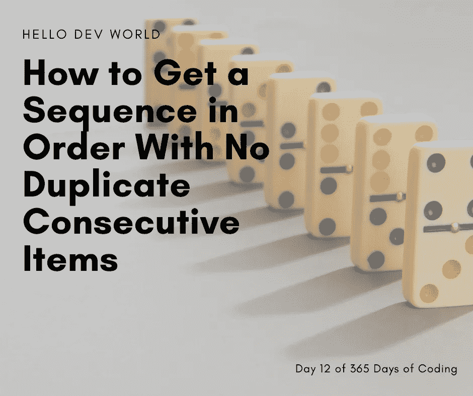

# 如何得到一个没有重复连续项目的有序序列

> 原文：<https://javascript.plainenglish.io/how-to-get-a-sequence-in-order-with-no-duplicate-consecutive-items-9c2f433d7e90?source=collection_archive---------8----------------------->



这是一个请求。实现函数 uniqueInOrder，该函数将一个序列作为参数，并返回一个项目列表，该列表不包含任何相邻的具有相同值的元素，并保留元素的原始顺序。

我发现这实际上是另一个 Codewars 挑战。你可以在这里找到挑战[](https://www.codewars.com/kata/54e6533c92449cc251001667/javascript)**。**

***免责声明:**解决这个问题的方法有很多。这些是我写的或者我觉得聪明的一些答案，解释了它们为什么/如何工作*

***TLDR:** 在帖子底部解释最佳解决方案，在每个部分底部解释实际解决方案*

# *问题是*

*创建一个函数，该函数接受一个字符串或数组，并返回一个项目列表，其中不包含任何相邻的具有相同值的元素，并保留元素的原始顺序。*

***示例:***

```
*uniqueInOrder('AAAABBBCCDAABBB') // ['A', 'B', 'C', 'D', 'A', 'B']
      uniqueInOrder('ABBCcAD') // ['A', 'B', 'C', 'c', 'A', 'D'] 
      uniqueInOrder([1,2,2,3,3]) // [1,2,3] 
      uniqueInOrder(['hello', 'Hello', 'Hello', 'Hello', 'dev', 'dev', 'world', 'World', 'dev', 'world']) // ['hello', 'Hello', 'dev', 'world', 'World', 'dev', 'world']
      uniqueInOrder([1, 1, 2, 2, 3, 3, 1, 1, 1]) // [1,2,3,1]*
```

# *解决办法*

*   *解决方案 1*
*   *为最终数组创建变量*
*   *循环输入*
*   *如果当前项与最后一项不匹配，则将它推到最后一个数组上，否则继续循环*
*   *循环后返回最后一个数组*
*   *解决方案 2*
*   *将输入扩展到数组中(如果是字符串)*
*   *通过检查之前的索引是否与当前项目相同来进行筛选*

# *解决方案 1。可读性更强*

*创建一个接受和输入的函数*

```
*function uniqueInOrder(input) {
    //create a variable for a final array
    //loop through input 
    //if the current item doesn’t match the last one push it onto the final array otherwise continue the loop
    //after the loop return the final array 
}*
```

*创建一个变量，让我们把所有的东西都放进去，这个变量就是我们最后返回的数组。*

```
*function uniqueInOrder(input) {
    let finalArray = []
    //loop through input 
    //if the current item doesn’t match the last one push it onto the final array otherwise continue the loop
    //after the loop return the final array 
}*
```

*使用 for 循环遍历传递给函数的数组。*

```
*function uniqueInOrder(input) {
    let finalArray = []
    for (let i = 0; i < input.length; i++) {
    //if the current item doesn’t match the last one push it onto the final array otherwise continue the loop
    }
    //after the loop return the final array 
}*
```

*为了查看我们是否在刚才的项目上，我们将检查 finalArray。因为我们在遍历时会将所有内容都推送到那个数组，所以如果数组中的最后一项与当前项相同，那么它就是一个重复的连续项。否则它不是，我们想添加它。您会注意到我们正在检查 finalArray.length -1，因为我们正在检查索引，而索引是 0 索引的，这意味着它们从 0 而不是 1 开始。为了得到最后一个索引，我们需要从长度中减去 1，因为索引总是比长度低 1(长度不是 0 索引)。如果它不是重复的，我们将把该项推到最后一个数组上。这将把该项放在最终数组的末尾。*

```
*function uniqueInOrder(input) {
    let finalArray = []
    for (let i = 0; i < input.length; i++) {
        if (input[i] != finalArray[finalArray.length - 1]) {
            finalArray.push(input[i])
        }   
    }
    //after the loop return the final array 
}*
```

*现在我们只需要返回最后一个数组，我们已经把所有的东西都放进去了*

```
*function uniqueInOrder(input) {
    let finalArray = []
    for (let i = 0; i < input.length; i++) {
        if (input[i] != finalArray[finalArray.length - 1]) {
            finalArray.push(input[i])
        }   
    }
    return finalArray
}*
```

# *解决方案 2。代码行更少，性能更高*

*我们将再次创建一个接受和输入的函数*

```
*function uniqueInOrder(input){
    //spread input into an array (in case it is a string)
    //filter by checking if the index before it was the same as the current item
}*
```

*我们将把输入扩散到一个数组中，如果我们得到一个字符串，它将被转换成一个数组，这样我们就可以对它进行 T2 过滤。*

```
*function uniqueInOrder(input){
    [...input]
}*
```

*然后，我们将通过检查当前项之前的索引是否与其相同来过滤数组。如果是，它会过滤掉。*

```
*function uniqueInOrder(input){
    return [...input].filter((item, index) => item !== input[index - 1])
}*
```

# *结论*

*尽管解决方案 2 的性能更好，但我认为解决方案 1 更容易阅读。尽管解决方案 2 并不难理解。如果你对在 [jsbench](https://jsbench.me/) 上测试的性能感兴趣，这里是我使用上述测试案例的结果。*

**

*我希望你玩得开心！请在评论区留下您的回购链接。也让我知道你是喜欢多日挑战还是真的讨厌它们！如果你有任何你希望看到完成的挑战，也请在下面的评论中留下，你可能会看到它出现！如果您希望每天早上通过电子邮件收到挑战，并在发布解决方案时收到通知，请在此订阅。*

**原贴于*[*hellodevworld.com*](https://hellodevworld.com/365-days-of-coding/how-to-get-a-sequence-in-order-with-no-duplicate-consecutive-items)*