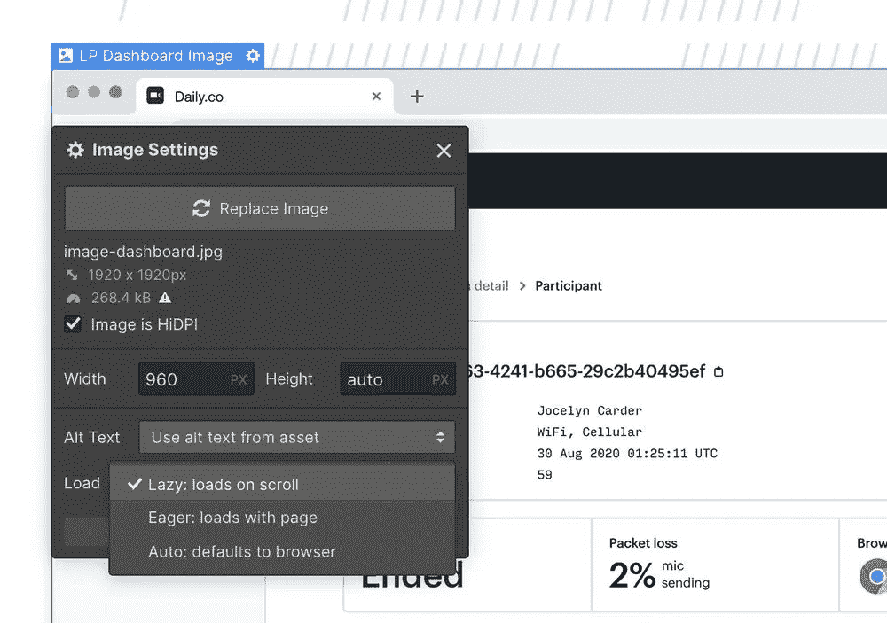
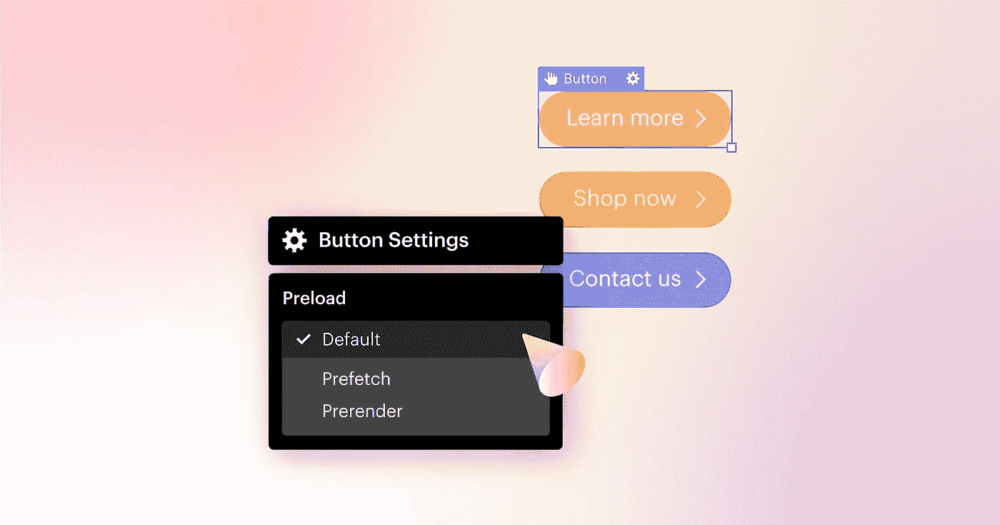
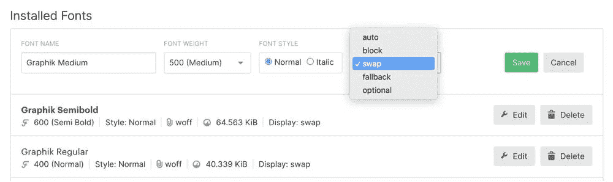

# 作为一名 Web 开发人员，如何更好地进行 SEO

> 原文：<https://javascript.plainenglish.io/how-to-get-better-at-seo-as-a-web-developer-b7732428fee2?source=collection_archive---------16----------------------->

## 因出色的页面体验和改进的排名而受到称赞

今天，你将学习如何与你的同事成为朋友，你知道的——那个每月给你发送需要解决的技术问题报告的人？总是想知道发生了什么？当你在没有通知他们的情况下批量迁移了网站的一部分，现在又删除了他们过去三个月的工作成果，你不高兴吗？

嗯，是的。这位朋友很可能在某个角落哭泣，因为谷歌宣布在接下来的两个月内将有三项重大算法变化。其中一个也和你有关。

# **页面体验对谷歌越来越重要**

核心网站的更新关注的是页面体验。它将奖励在三个方面表现良好的网站——网站速度、响应能力和视觉稳定性。

最初，谷歌将使用三个指标来分配排名:

*   最大内容绘画(LCP) —衡量页面整体加载速度的指标。
*   第一输入延迟(FID)——页面对用户交互的响应。
*   累积布局偏移(CLS)—URL 加载时的稳定性。

# **作为一名网络开发者，你为什么要关心这个？**

不管你喜不喜欢，SEO、web 开发人员和网站管理员都一起帮助通知和实现站点改进。虽然他们的专业领域和日常工作是分开的，但他们的工作经常被集体评估。

我来解释一下原因。一个伟大的网站很容易成为爬行问题、技术缺陷和缺乏页面优化的牺牲品。所以——发射后没人看见。对生意不利。

同样，即使是最明智的搜索引擎优化建议也可能会被搁置很久而没有实施。对生意也不好。

在这两种情况下，一个团队的伟大工作由于缺乏与另一个团队的合作而黯然失色。最终，团队和业务都会受损。

让我们一起工作吧。

以下是方法。

有五大方面可以改善网站的页面体验:

*   图像优化
*   服务器优化
*   资源优化
*   JavaScript 和 CSS 优化
*   视觉稳定性

在其中一个方面进行优化可能有助于优化另一个方面——例如，作为图像优化的一部分，实现图像的延迟加载也有助于视觉稳定性。

我会给你建议如何修复每一个，以及在最流行的 CMS 上使用的设置的例子。

# 图像优化

## 1.实现延迟加载

延迟屏幕外图像(或延迟加载)指的是延迟加载不在访问者视野中的图像，直到需要它们的时候。这包括延迟加载出现在页面折叠下方的图像。

你可以通过 WordPress 和 Webflow 的设置来做到这一点。

此外，你可以安装一个延迟加载的 WordPress 插件,它提供了延迟任何屏幕外图像或者切换到提供该功能的主题的能力。

这里有一些在 Webflow 中这样做的图片

How to implement lazy loading of images on Webflow.

## 2.优化现有图像和媒体的大小。

提供大小合适的图像，以节省蜂窝数据并缩短加载时间。

你可以通过调整大图片的大小或者[压缩图片](https://web.dev/use-imagemin-to-compress-images)来实现。

WordPress 网站应该直接通过[媒体库](https://wordpress.org/support/article/media-library-screen/)上传图片，以确保所需的图片尺寸可用，然后从媒体库插入图片或使用图片小工具来确保使用最佳的图片尺寸(包括响应断点的尺寸)。

除非尺寸足够使用，否则避免使用全尺寸图像。你也可以实现一个图像优化插件，在保持质量的同时压缩你的图像。

[用视频替换动画 GIFs】。](https://web.dev/replace-gifs-with-videos)

## 3.实施面向未来的映像优化最佳实践

以下是您可以开始实施的一些方法:

*   [使用图像 cdn](https://web.dev/image-cdns/)
*   [提供响应图像](https://web.dev/serve-responsive-images)
*   [提供尺寸正确的图像](https://web.dev/serve-images-with-correct-dimensions)
*   [使用 WebP 图像](https://web.dev/serve-images-webp) s

# 服务器优化

服务器响应时间(SRT)是 web 浏览器接收响应所需的时间。TTFB 测量 HTTP 客户端发出请求和收到第一个字节数据之间的时间长度。

## 4.配置服务器设置

查看您的 web 服务器的文档，了解是否可以对 web 服务器配置进行任何调整，从而提高其性能。

## 5.优化资源以降低服务器响应时间。

优化您的图像，[整合您的资源](http://rigor.com/blog/2016/08/eliminating-render-blocking-javascript)，并启用压缩，因为在降低 SRT 时建议使用较小的文件。

除非精心管理，否则像 WordPress 这样的内容管理系统(CMS)会导致网站不断膨胀。

# 资源优化

## 6.优化页面上的资源。

调查用于优化 web 文件资源消耗的页面模板，如 JavaScript、CSS、字体和页面文本。

# JavaScript 和 CSS 优化

## 7.移除未使用的 JS 和 CSS

调查网站模板，使用不同的网站子域，并删除未使用的 JS/CSS，尽可能缩小 JS。

通过删除未使用的 JavaScript，您可以减少网络活动消耗的字节。

你可以通过 Chrome DevTools 中的[覆盖率标签](https://developers.google.com/web/tools/chrome-devtools/coverage)来发现这一点，它给出了未使用代码的逐行分解。

这篇由 web.dev 撰写的[文章就可以支持你完成这项任务的工具给出了惊人的特定于堆栈的建议。](https://web.dev/unused-javascript/)

## 8.缩小 JS 和 CSS

> [缩小](https://www.imperva.com/learn/performance/minification/)是将网页和脚本文件中的代码和标记最小化的过程

这减少了站点上的加载时间和带宽使用。因此，它有助于提高速度和可访问性。

为了缩小 JS、CSS 和 HTML 文件，需要删除注释和多余的空格，以及压缩变量名，以便最小化代码和减小文件大小。

例如，Webflow 通常大量使用 JavaScript，这有时会成为一个问题，因为它会妨碍爬虫访问站点的所有部分。这可能导致的其他爬行问题在这里解释[。](https://www.deepcrawl.com/knowledge/ebooks/javascript-seo-guide/main-issues-to-watch-out-for/)

有多种工具可以自动完成这项工作， [JavaScript Minifier](https://javascript-minifier.com/) 、 [JSCompress](https://jscompress.com/) 和 [Minify](https://www.minifier.org/) 只是其中的几个。

# 视觉稳定性

## 9.对资源使用高度和宽度属性

所有图像、广告、视频和 iframes 都应该定义了<height>和<width>属性。这将确保页面加载这些资源时具有适当的间距，而不是在添加其他内容时移动它们。</width></height>

## 10.预加载重要链接

打开默认预加载重要链接设置。

预加载关键请求指示浏览器尽快下载你的关键资源。在 WordPress 中，预加载通常用于字体、图像、CSS 和 JavaScript 文件。

这是通过按钮设置在 Webflow 中的交钥匙解决方案。

在 WordPress 中，你可以通过 [speed plugins](https://onlinemediamasters.com/wordpress-speed-optimization-plugins/) 来做到这一点，它可以让你预加载链接(也称为“即时页面”)，当用户悬停在一个链接上时，它会在后台下载一个页面。

你[也可以](https://onlinemediamasters.com/preload-key-requests-wordpress/)通过代码或者使用像 Perfmatters 或者 Pre* Party 资源提示这样的插件来预载关键请求。WP Rocket 可以预加载字体和链接，但不允许你手动添加文件。

Pre-load importnat links in Webflow.

## 11.向下加载内容

从上到下排列页面加载的优先级，这样内容就不会被添加到上面，而将其他资源向下推——这在 cookie 横幅中很常见。

## 12.确保自定义字体不会导致 FOIT/FOUT

如果在页面加载的后期应用了自定义字体，这可能会导致文本在被替换时闪烁(FOUT)，或者在自定义字体呈现之前显示不可见的文本(FOIT)。理想情况下，任何自定义字体都将被预加载，以确保它们在添加到页面时应用于文本。

解决这个问题最简单的方法是安装后备字体。这通常是通过字体设置来完成的。

Font settings in Webflow — Install fallback fonts on Webflow

# 摘要

原来如此！

这是作为一名网络开发人员成为 SEO 朋友的 12 个步骤。尤其是在算法不断变化的夏季。但尤其与提高网站的 UX 相关，并向你的老板展示你是一个真正的团队成员！

下面是一个快速回顾:

1.  实现延迟加载
2.  优化现有图像和媒体的大小。
3.  实施面向未来的映像优化最佳实践
4.  配置服务器设置
5.  优化资源以降低服务器响应时间。
6.  优化页面上的资源
7.  移除未使用的 JS 和 CSS
8.  缩小 JS 和 CSS
9.  对资源使用高度和宽度属性
10.  预加载重要链接
11.  向下加载内容
12.  确保自定义字体不会导致 FOIT/FOUT

为了跟踪所有这些变化，请随意复制一份[进度跟踪电子表格](https://docs.google.com/spreadsheets/d/19x8EIITdnXCweHrSTb2cCrWmhZQhU3YE9kKIeHknVDg/edit?usp=sharing)。

完成后，与 SEO 分享，让他们高兴，并要求他们根据您实施更改的日期来监控任何流量更改。

*非常感谢您花时间阅读本指南！*

*看看三个插件，你可以用它们来毫不费力地做一些改变。*

 [## 3 个 WordPress 插件，用于即时影响你网站的核心网站活力表现

### 这些都可以，但有一个问题。

medium.com](https://medium.com/geekculture/3-wordpress-plugins-to-use-for-instant-impact-on-core-web-vitals-performance-of-your-site-75465812adbc) 

*更多内容请看*[***plain English . io***](http://plainenglish.io)