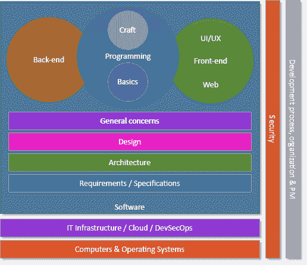

# 作为一名开发人员，如何入门并成长

> 原文：<https://javascript.plainenglish.io/how-to-get-started-in-it-and-grow-as-a-software-developer-a0004790d735?source=collection_archive---------9----------------------->

在这篇文章中，我将快速描述一条路径，您可以遵循这条路径从零开始发现/学习 IT 和软件开发。我还将讨论基于你自己的兴趣和目标，随着时间的推移你可以探索的不同职业道路。

这个内容是我的[开发概念系列](https://dev-concepts.dev)的第一卷的[的一部分。](https://gum.co/DevConcepts-Part-01-SoftwareCraft)

# 概观

让我们先来看一看 IT 和软件开发的不同子领域的简单概述，您可以在您的职业生涯中探索这些子领域。还有更多，但这些是最重要的:

如你所见，有很多。足够让你忙上一辈子，学习一辈子。上图更强调软件开发部分，这也是它比较大的原因。但是请放心，其他领域同样重要，至少同样广泛。事实上，你可以在 IT 的任何一个“子领域”中度过你的整个职业生涯，而且你仍然每天都在学习新的东西。

事实上，IT 非常复杂，种类繁多，每个子领域都包含各种工作类型。你可以成为专注于测试的安全专家，或者恶意软件专家、硬件黑客、云安全专家、IT 审计员等。或者你可以从事 IT 架构工作，成为软件架构师、基础架构架构师、解决方案架构师甚至企业架构师。大部分领域都一样，真的！这实际上是我最喜欢的事情之一。有那么多东西要学，要做，你将*永远不会*感到无聊。

一开始可能会感到畏惧，但不要害怕。你可以从小做起，学习基础知识，按照自己的速度成长，最终达到你梦想的工作。

# 我应该从哪里开始？

如果您刚刚开始 IT 和软件开发，那么您应该首先关注几个核心主题:

*   计算机体系结构
*   操作系统
*   编码基础
*   一般问题(例如，代码质量和测试)

你的目标不应该是马上成为一名专家，而是在深入到前端或后端开发等更具体的主题之前，先对它有一个大致的了解。网络上的许多教程会立即教你 HTML、CSS 和 JavaScript，但不会帮助你看到更大的画面。当然，你可以走捷径来加速学习，但是如果你缺乏基础知识，那么你将很难成为一名软件工匠，并且在以后的道路上会有困难。

# 我从那里去哪里？

一开始，您选择探索后端还是前端开发并不那么重要。如果你知道你更喜欢在哪个方面工作，那么它确实更容易，但是两者都一样复杂和难学。它们各有其特殊性和注意点。随着时间的推移，如果你有足够的动力，那么你应该跳过栅栏，发现另一部分。你甚至可以从一开始就尝试全押，但你可能需要更多的时间才能变得真正高效。好消息是后端和前端开发之间有很多重叠。

无论你选择哪条路，**你都必须时刻考虑安全问题**。这不是一个选项。安全是重中之重，无论您、您的团队、团队领导和/或组织是否意识到这一点。

随着你对基础知识的理解和信心的增加，你将能够投入到软件设计中来提高你的代码质量，并帮助它经受住时间的考验。

过一段时间，你应该(至少)对软件架构有一个基本的了解。理想情况下，您还应该学习更多关于解决方案架构和企业架构的知识，因为这些是软件世界中真正有影响力的领域(尤其是在大型组织中)。

另一个想法是深入到功能甚至业务分析方面，成为最终用户更好的合作伙伴。正如我在之前的[文章](/what-is-the-difference-between-software-developers-engineers-coders-and-programmers-b4ee7eb23b66)中提到的，根据你工作的组织，你可能或多或少有机会(或需要)这样做。

此外，对 IT 基础设施/运营、云计算和 *DevSecOps* 的了解越来越多，将有助于您为应用程序生命周期的所有方面做出贡献。了解一个系统是如何部署的，基础设施是如何配置的*非常*有用，想要进入技术领导层的人显然需要了解这一点。我个人决定在 IT 基础设施领域工作几年，这样我可以更深入地研究这个领域。相信我，我学到了很多。这的确很有挑战性，但也非常有趣。

你也可以尝试学习团队/项目/过程管理。团队组织本身就是一个迷人的主题。不管你是不是主管，了解团队/产品/项目管理是非常有用的。大多数软件是由人组成的团队开发的，团队动态对团队能够交付的东西有巨大的影响。产品管理也是一个非常有趣的领域，有 IT 背景会有很大帮助。

要避免的一件事是长时间做完全相同的工作(除非它仍然有趣/吸引人/有趣)，因为你会停滞不前，你不会有足够的挑战来学习新的东西。同样的道理也适用于在传统技术岗位上呆得太久，这会让你远离当前的就业市场，让你更难找到新工作。众所周知，你应该不断扩大自己的舒适区。这是人生唯一的出路。-)

> 一个人可以选择回归安全，也可以选择走向成长。成长必须一次次选择；恐惧必须一次又一次地被克服。
> 
> *亚伯拉罕·马斯洛*

随着时间的推移，所有这些步骤都会带你走向不同的方向。如果你喜欢，你可以成为软件开发人员、技术领导者、团队经理、前端专家、业务分析师、安全专家、IT 架构师，甚至是首席技术官(CTO)。可能性是无限的。你也可以决定专攻一个非常特殊的领域。这不是我的偏好，但这完全取决于你…这是最酷的部分！

*的资历*的概念也很有趣，但确实是相对的；对不同的人有不同的意义。有些人/组织认为资历等于年数，但这与事实相去甚远。对我来说，资历包括知识、*和*经验。当然，两者都需要时间来获得，但是有了动力和奉献精神，你可以学得更快。时间本身就是一个糟糕的资历指标。

最后，独立于你在软件开发世界中的进化，你也必须在成为雇员、顾问、自由职业者，甚至是这些的混合之间做出选择。例如，我目前是一名自由职业的 IT 教练/首席技术官，也是一名兼职员工。做顾问/自由职业者的一个好处是你会*学得更快；没有选择，否则你将无法找到/满足客户。你还会发现不同的环境、团队和公司文化。这些经历可以帮助你成长得更快。*

不要犹豫，随着时间的推移，重新审视你的选择；今天对你来说是正确的，明天可能就不一样了，变化可能是美妙的，令人耳目一新的！

# 结论

在这篇文章中，我告诉了你在 IT 和软件开发中可能的职业道路。根据我自己的经验，我也给了你一些关于从哪里开始的建议。当然，这只是我的看法。我是个多面手，不是专家，所以我认为学习很多东西很有价值。但是做专科也可以。

无论如何，这是你自己的事业，你自己做选择吧。只要记住，不选择也是一种选择。不管你选择什么，一定要玩得开心！

来推特上讨论一下，说说自己的职业选择吧！

今天到此为止！

PS:如果你想了解大量关于产品/软件/Web 开发的其他很酷的事情，那么[看看开发概念系列](https://dev-concepts.dev)，[订阅我的时事通讯](https://dsebastien.net/newsletter)，还有[来 Twitter 上打个招呼吧！](https://twitter.com/dSebastien)

*原载于 2021 年 8 月 14 日 https://dsebastien.net**[*。*](https://dsebastien.net/blog/2021-08-14-software-development-learning-path)*

**更多内容看* [***说白了. io***](http://plainenglish.io)*