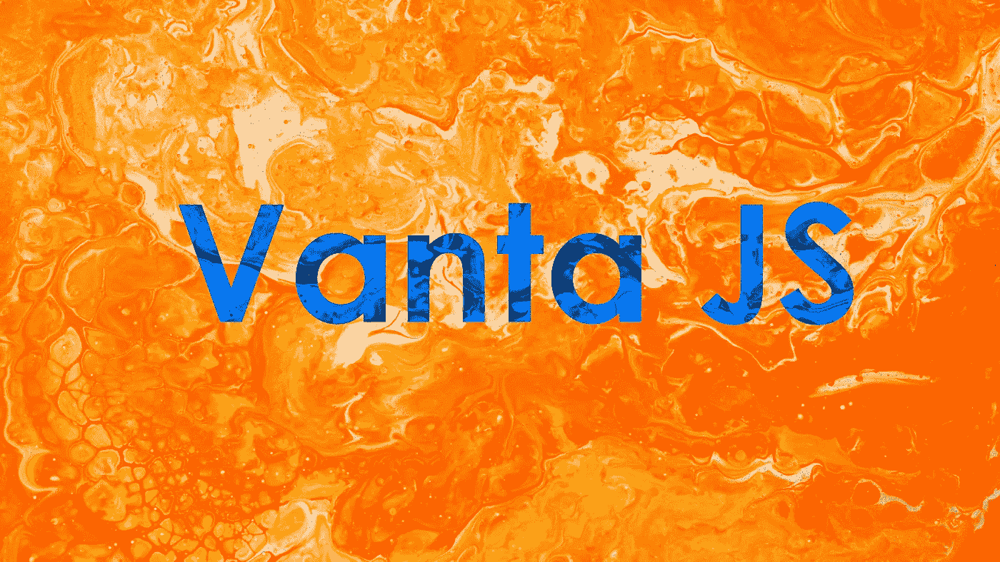
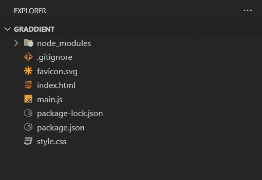
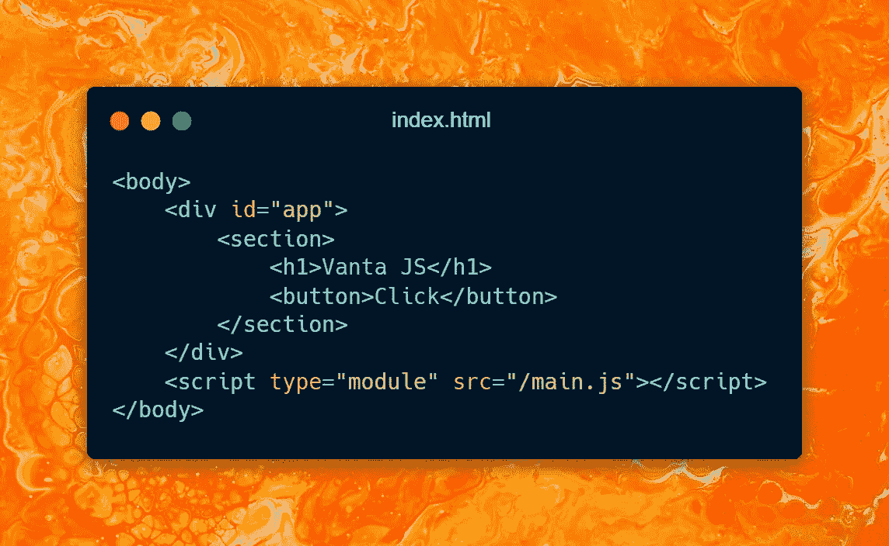
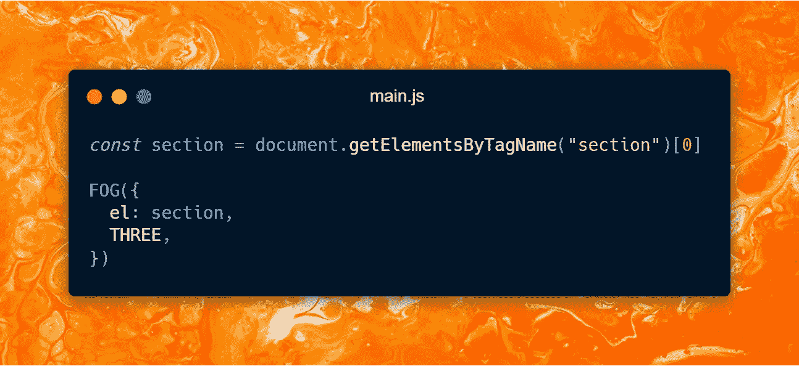
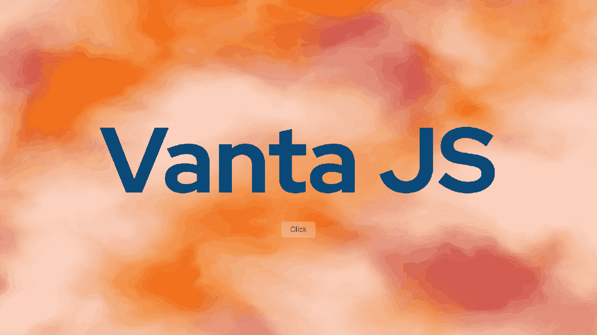
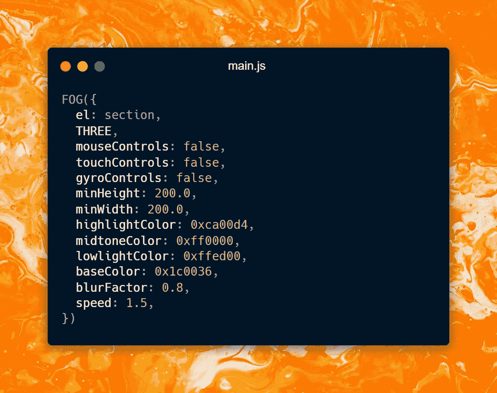
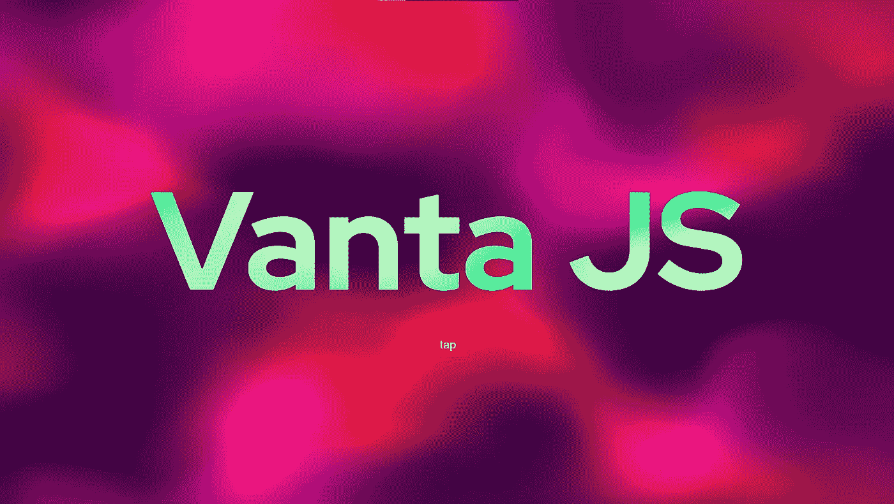
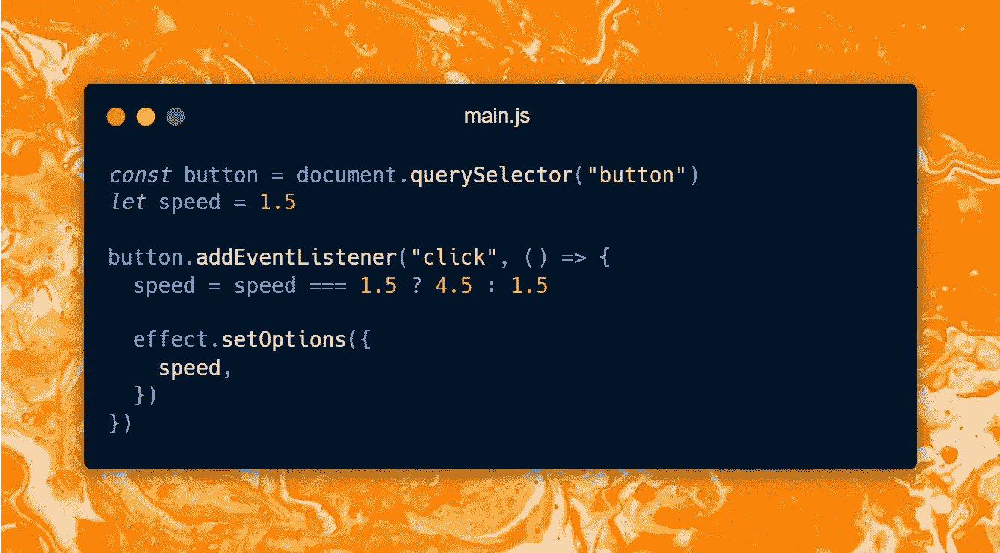

# Vanta.js 入门:在几秒钟内创建迷人的动画背景

> 原文：<https://javascript.plainenglish.io/how-to-get-started-with-vanta-js-create-glamorous-and-animated-backgrounds-in-seconds-c2a386516a73?source=collection_archive---------5----------------------->

## 网格渐变在现代网站中使用，直到最近，我还不知道如何创建一个。然后就遇到了 Vanta.js。



Photo by [FLY:D](https://unsplash.com/@flyd2069?utm_source=unsplash&utm_medium=referral&utm_content=creditCopyText) on [Unsplash](https://unsplash.com/s/photos/gradient?utm_source=unsplash&utm_medium=referral&utm_content=creditCopyText)

渐变是在网站上使用的最酷的技术之一，如果使用得当，用户界面和体验会变得越来越好。使用 CSS，我们可以创建良好的梯度，如线性，径向，圆形梯度，但当我们想要有更复杂和抛光梯度，我们必须深入到 JavaScript 和画布。

通常情况下，为了创建一个像上图这样的渐变，我们必须使用 WebGL 和一些着色语言。然而，这个过程是一种低层次的，难以维持。有一些库如 Three.js 来处理 WebGL 的低级本质，但学习着色语言仍然是必要的。

我想在我的网站上有一个惊人的和生动的渐变，因为它看起来优雅和现代，但我不想学习一个全新的概念，因为我认为这不会是我每天使用的东西。这就是我遇到 Vanta.js，决定试一试的时候。

# Vanta.js 是什么？

Vanta 是一个 JavaScript 库，它提供了 13 个预建的 3D 和动画背景，在网站上看起来非常棒。我第一次看到它时，我认为这些背景是预先构建的，而且很少。因此，使用它们可能有点不合适，因为使用 Vanta，任何人都可以创建相同的网站，网站不再是唯一的。然而，当我深入配置时，我发现使用 Vanta，你可以只用一个样本创建许多独特的背景。你可以设置变化率，你可以调整使用的颜色和许多其他配置。你可以在 [Vanta.js 网站](https://www.vantajs.com/)了解更多。

因此，让我们创建一个项目，并看看它的运行情况。我将使用 [Vite](https://vitejs.dev/) 快速引导一个普通的 JavaScript 项目。键入`npm init vite`并选择`vanilla`模板。在这一步，您可以使用任何您想要的捆绑器，也可以不使用捆绑器。如果你想看我们将建造的最终版本，你可以从这里访问。



Initial project structure created with [Vite](https://vitejs.dev/)

现在我们有了项目设置，是时候安装 Vanta 和一些依赖项来创建一个漂亮的动画渐变了。

在创建这些背景时，Vanta 利用 Three.js 或 p5.js 在画布上进行渲染。所以，我们需要安装并添加其中一个，让 Vanta 完成剩下的工作。

要安装所需的依赖项，请在终端中键入以下代码片段。我决定使用 Three.js，但是你也可以使用 p5.js。

```
npm install --save vanta three 
```

在`index.html`内部，有一个`div#app`将是项目的根。在它的内部，让我们创建一个`section`，它将包含一个标题和一个按钮。



现在我们有了标记设置，是时候设计应用程序了。我将让`section`占据视窗中所有可用的空间，并将内容居中。在这个故事中，我不会分享 CSS 代码，但是你可以在 [this repository](https://github.com/XenoverseUp/graddient) 找到它们。

在实现 Vanta 之前，我们必须决定我们要使用哪种背景。在 [Vanta 网站](https://www.vantajs.com/)有所有效果的预览。所以只要去那里选一个给你留下最深刻印象的。

我选择*雾*是因为它看起来很华丽，如果配置得当，它可以在任何网站上使用。

为了添加*雾*效果，我们必须从`vanta/dist/vanta.fog.min`导入它。导入源将根据您使用的效果而变化。所以，干脆把上次导入改成`vanta.effectName.min`。另外，`THREE`应该也是进口的。


You can import the effect you want by changing the last import, Vanta.

导入后，让我们选择我们想要添加效果的部分，并使用我们导入的 Vanta 效果实现效果。



就是这样！现在我们在网站上有了这个惊人的动画背景，这很酷，是吧？



Vanta FOG effect without any configuration.

使用 CSS 和几行 JavaScript，我们已经有了这个看起来很酷的背景。但是我们可以随意改变和定制它。我们可以改变很多属性，比如速度、颜色、模糊系数或缩放。你可以在 [Vanta 网站](https://www.vantajs.com/)的 GUI 上玩这个属性，然后粘贴到项目中。我想要一个低模糊系数的略带紫色的渐变和一些黄色。这是我的配置。



这是它生成的背景。



现在让我们学习如何以编程方式更改一些属性。我们的目标是每当点击按钮时，在两个值之间切换移动的速度，一个是慢的，另一个是快的。

为了实现这一点，让我们首先为我们创建的 *FOG* 实例分配一个变量，并将其命名为`effect`或任何您想要的名称。然后定义一个名为`speed`的变量，设置为 1.5。这将是速度的初始值。现在，是时候给按钮添加一个事件监听器了，根据速度，在 1.5 和 4.5 之间切换。



这个故事到此为止。在下一篇中，我将讨论如何将 Vanta 与 React 和其他库一起使用。确保使用这个[链接](https://graddient.vercel.app/)看到最终项目。如果你想看完整的源代码，你可以访问这里的库。

谢谢你们的阅读。希望你喜欢。下一个故事再见。

*更多内容尽在*[***plain English . io***](http://plainenglish.io/)