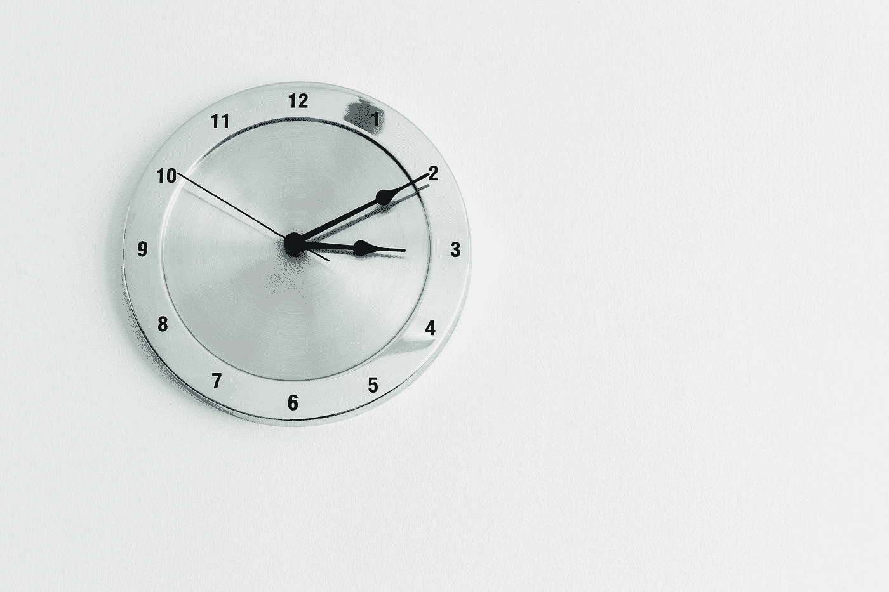

# 如何用 JavaScript 获取两次约会之间的分钟数？

> 原文：<https://javascript.plainenglish.io/how-to-get-the-number-of-minutes-between-two-dates-with-javascript-b9ea6f8dba23?source=collection_archive---------4----------------------->



Photo by [Paweł Czerwiński](https://unsplash.com/@pawel_czerwinski?utm_source=medium&utm_medium=referral) on [Unsplash](https://unsplash.com?utm_source=medium&utm_medium=referral)

有时，我们想用 JavaScript 得到两次约会之间的分钟数。

在本文中，我们将看看如何用 JavaScript 获得两次约会之间的分钟数。

# 将日期转换为时间戳后减去 2 个日期，并将差值转换为分钟

我们可以将 JavaScript 日期对象转换为时间戳，减去时间戳，然后将差值转换为分钟。

为此，我们写道:

```
const d2 = new Date(2020, 2, 1);
const d1 = new Date(2020, 1, 1);
const diffMs = +d2 - +d1;
const diffMins = Math.floor((diffMs / 1000) / 60);
console.log(diffMins)
```

我们有`d2`和`d1`日期对象，我们希望得到它们之间的分钟差。

在第三行中，我们将`d2`和`d1`日期对象转换成以毫秒为单位的时间戳，前面有`+`操作符。

然后我们用`diffMs`除以 1000 来换算秒差。

然后除以 60，转换成分钟。

然后从控制台日志中，我们应该看到`d2`和`d1`之间的分钟数差是 41760。

我们还可以用`getTime`方法将`d2`和`d1`转换成时间戳。

例如，我们可以写:

```
const d2 = new Date(2020, 2, 1);
const d1 = new Date(2020, 1, 1);
const diffMs = d2.getTime() - d1.getTime();
const diffMins = Math.floor((diffMs / 1000) / 60);
console.log(diffMins)
```

我们得到了和以前一样的结果。

# 结论

我们可以通过转换成以毫秒为单位的时间戳来获得以分钟为单位的两个日期之间的差值，减去这两个时间戳，然后将差值转换成分钟。

*更多内容请看*[***plain English . io***](http://plainenglish.io)