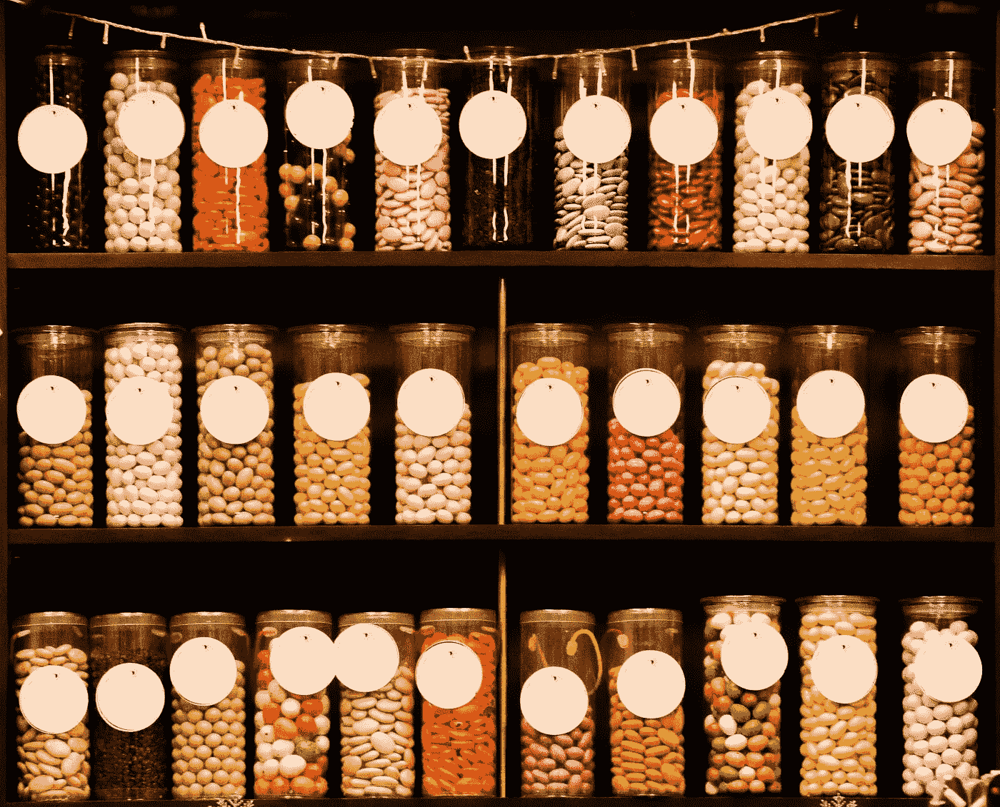
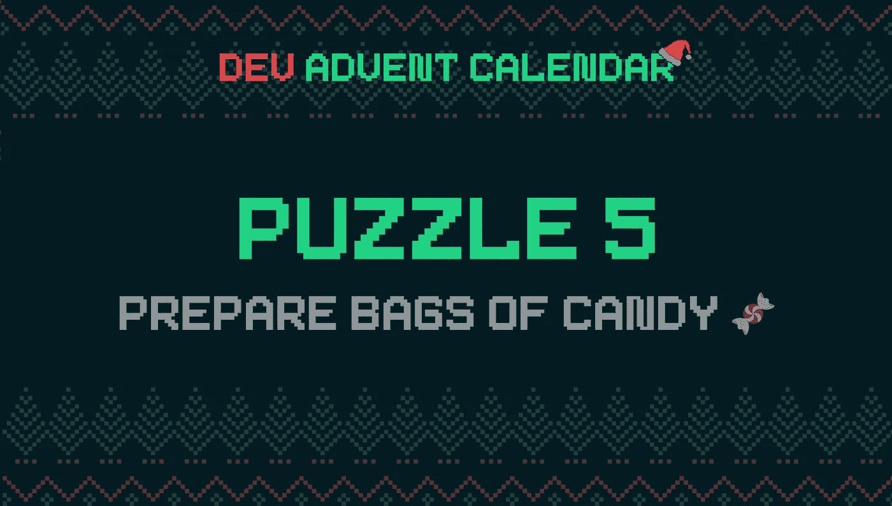

# 如何在 JavaScript 中从列表中获取唯一值

> 原文：<https://javascript.plainenglish.io/how-to-get-unique-values-from-a-list-in-javascript-301675602985?source=collection_archive---------4----------------------->

Photo by [Viktor Talashuk](https://unsplash.com/@viktortalashuk?utm_source=unsplash&utm_medium=referral&utm_content=creditCopyText) on [Unsplash](https://unsplash.com/s/photos/candies?utm_source=unsplash&utm_medium=referral&utm_content=creditCopyText)

最终，小精灵们放下了他们的商业野心，回到了他们的工作上:帮助圣诞老人给孩子们准备礼物。他们的准备工作已经晚了，必须赶紧准备包裹。好像这还不够，圣诞老人决定添加一些糖果。

# 难题:准备几袋糖果🍫🍬🍭

今天的问题可以分成两个不同的部分。第一个包括创建一个全球唯一标识符(UUID)。第二个与数组的操作有关，从数组中选择“n”个随机且不重复的项目。或者换句话说，如何在 JavaScript 中从列表中获取唯一值。

# 创建 UUID 标识符的 JavaScript 函数

我没有听从马克·巴克斯和 T2 的建议。建议使用 [uuid](https://www.npmjs.com/package/uuid) 包来生成唯一的代码。对于一个“真正的”项目，我可能会这样做。相反，我决定创建一个独立的函数来实现相同的结果。为此，我遵循了来自 w3resource 的一个练习页面的建议:

基本上，我从一个日期开始生成了一个随机数序列。我使用一个字符串作为模板，以确保唯一的格式。这样，我可以轻松地生成独特的代码，而不需要外部依赖。

# 从 JavaScript 列表中获取唯一值

第二个问题是从数组中选择未知数量的元素。处理这种情况有各种各样的方法。许多解决方案都涉及到使用某种形式的`for loop`。

然而，我越来越相信，我可以通过尽可能避免循环来降低代码的复杂性。我没有时间来验证我的假设，也许我会在未来回来。

我想做什么？因为我从一个包含我需要的所有元素的数组开始，我只需要混合不同元素的顺序来得到一个新的数组。然后我从这个数组中提取前 n 个元素。

最困难的事情是弄清楚如何洗牌。网上有几个帖子解释了怎么做。最好的解释之一是弗拉维奥·科普斯的这篇文章。顺便说一句，我推荐浏览他的博客，里面充满了有趣的技巧和窍门。

另一个请求是，如果请求的糖果太多，就返回一个错误。这种情况下，一个简单的条件就足够了:

# 让我们把它们放在一起

写完这两个函数后，解决今天的难题就很简单了:

今天的问题到此为止。但是在说再见之前，我想稍微考虑一下。当我决定参加这个 **Dev 降临节日历时，**我不知道问题会有多难。拼图速度很快。写这些帖子需要更多的时间。但我发现报告我所学到的东西很有教育意义。我意识到我从来没有在这类问题上花时间，在某些情况下，我总是认为它们超出了我的能力。我也喜欢测试的存在:实时测试代码的可能性非常有用。在未来，我将不得不寻找其他类似的比赛。

感谢阅读！敬请关注更多内容。

***不要错过我的下一篇文章—报名我的*** [***中邮箱列表***](https://medium.com/subscribe/@el3um4s)

 [## 通过我的推荐链接加入 Medium—Samuele

### 阅读萨缪尔的每一个故事(以及媒体上成千上万的其他作家)。不是中等会员？在这里加入一块…

el3um4s.medium.com](https://el3um4s.medium.com/membership) 

*原载于 2021 年 12 月 6 日 https://blog.stranianelli.com***。**

**更多内容请看* [***说白了就是***](http://plainenglish.io/) ***。*** *报名参加我们的**[***免费每周简讯这里***](http://newsletter.plainenglish.io/) ***。*****