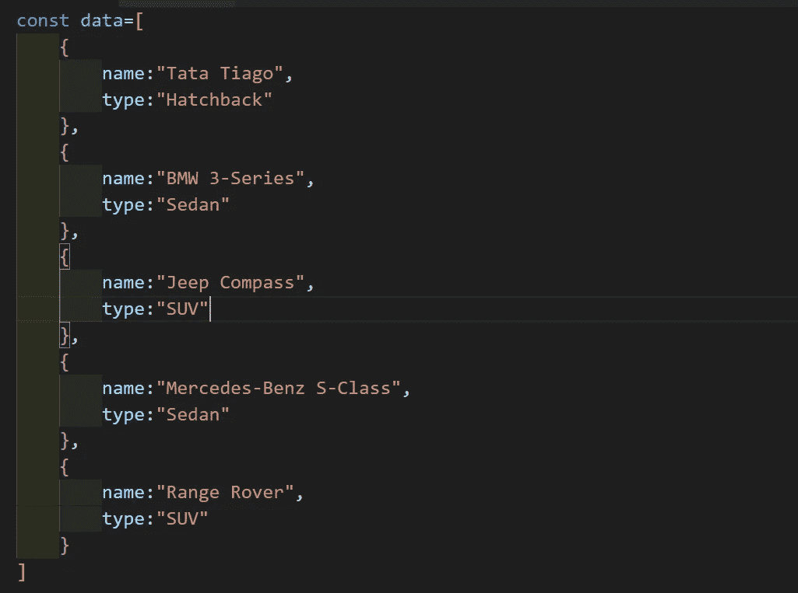
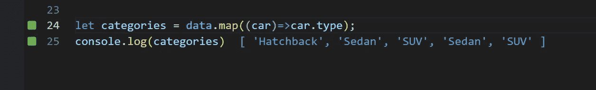
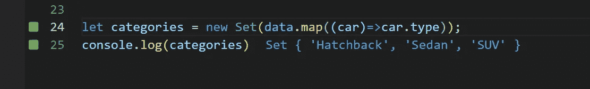
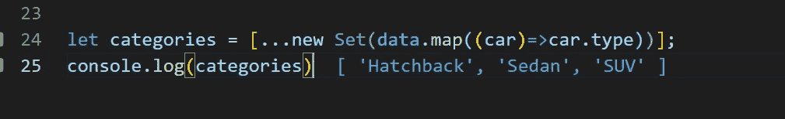

# 如何在 JavaScript 中从数组中获取唯一值？

> 原文：<https://javascript.plainenglish.io/how-to-get-unique-values-from-an-array-a9896a4c0c4?source=collection_archive---------2----------------------->

ES6 确实是 JavaScript 现代特性发展的一大飞跃。

ES6 使 JS 易于使用，是一种开发人员友好的语言。

这里我将解释从数组中获取唯一值的一千种方法。这只是一行代码，开发人员喜欢一行代码(💖).

在这里，我已经采取了一系列的对象，你可以根据自己的需要修改。

在这个数据里，我们有，1-两厢车，2-SUV，2-轿车。我们需要一组唯一的值，所以答案应该是['掀背车'，'轿车'，' SUV']。

在下面的图片中，我只是简单地使用映射对数据数组进行了迭代，并返回了包含所有类型的新的类别数组。

> *注意:输出就在“Console.log()”旁边，我已经使用 VSCode 扩展“Quokka.js”实现了这一点。*

现在，为了获得唯一的值，我们需要使用 ES6 功能。Set 数据类型包含在 ES6 的 javascript 中。集合只包含唯一的元素。这是你如何使用它。

现在的问题是，这里我们有一个对象，正如我前面提到的，我们需要一个数组，所以我们将使用 spread 运算符来实现这一点。

# **感谢您宝贵的时间**。

*更多内容看* [*说白了。在这里注册我们的*](http://plainenglish.io/) [*免费周报*](http://newsletter.plainenglish.io/) *。*