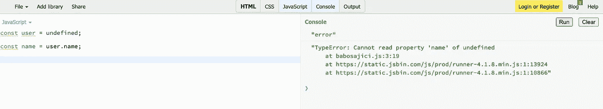
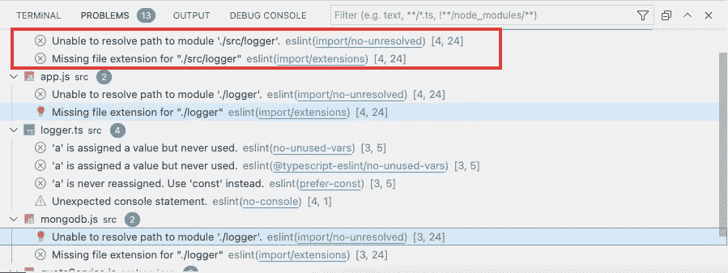
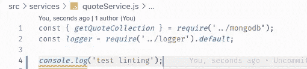
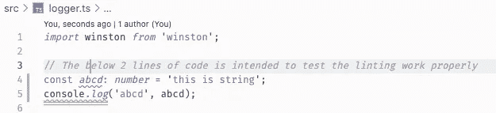
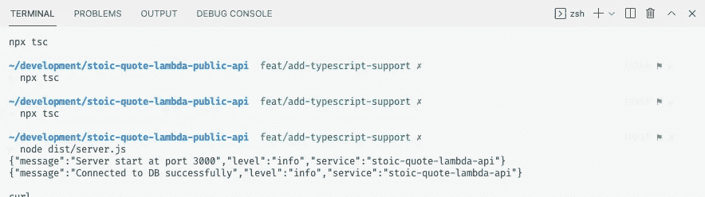

# 如何在现有的 Express 项目中逐步采用 TypeScript

> 原文：<https://javascript.plainenglish.io/how-to-gradually-adopt-typescript-into-an-existing-express-project-28a0f7a67f2e?source=collection_archive---------1----------------------->

## 添加类型脚本、林挺和构建项目的分步指南


Photo by [Denise Jans](https://unsplash.com/@dmjdenise?utm_source=medium&utm_medium=referral) on [Unsplash](https://unsplash.com?utm_source=medium&utm_medium=referral)

在这个故事中，我将记录如何在您的 JavaScript 项目中逐步采用 TypeScript。

这个故事分为三个部分:

*   为什么要在现有的 JavaScript 项目中采用 TypeScript？
*   在 JavaScript 项目中采用 TypeScript 的最简单方法
*   如何设置 TypeScript 的分步指南

# 为什么要在现有的 JavaScript 项目中采用 Typescript？

有很多帖子解释了 TypeScript 的好处以及为什么应该使用 TypeScript。但在我看来，能让你信服的**主要好处**是:

> Typescript 提前验证您的 Javascript 代码**。**

**这到底是什么意思？它只是意味着— **在你遇到错误之前，TypeScript 可以告诉你代码中的错误。这很酷，对吧？想象一下，如果你能避免生活中发生的大多数不幸事件。****

**大多数时候，当 JavaScript 项目扩展时，我们总是会遇到许多运行时问题。下面的截图是我们可能遇到的最常见的错误:**

****

**当我们试图访问一个未定义/空变量的属性时，这种情况经常发生。事实上，空值检查是我们经常遇到的最常见的错误之一。**

**然而，我们可以通过在现有的 JavaScript 项目中采用 TypeScript 来减少这个问题。这就是动力的来源。**

# **在 JavaScript 项目中采用 TypeScript 的最简单方法**

**既然我们现在有一个明确的期望，我们可以使用 Typescript 来减少意外的错误，下一个问题将是开始的问题。**

**当我试图在现有的 JavaScript 项目中采用 TypeScript 时，我经常问自己上面的问题。**

*   **我应该从哪里开始？**
*   **我需要把现有的所有代码都改成 TypeScript 吗？**
*   **我能在不破坏现有代码的情况下做到这一点吗？**

**经过一些研究和试验，我推荐的采用 TS 的最小方法是:**

> **保留现有的 JS 代码，开始用 Typescript 编写新代码**

**以下是使用上述方法的优点:**

*   **避免在已经奏效的事情上花费精力。已经起作用的东西在这里保持不变。然而，这将是一个主观的观点。如果您仍然需要不断地进行修改&来增强旧代码，那么将现有的 JS 代码改为 Typescript 可能是个好主意。总之，要看情况&场景。**
*   ****通过开发功能来关注重要的事情**。同时，享受新代码的 Typescript 好处。**

# **如何安装 TypeScript 的分步指南**

**在我们开始之前，这里有一个现有的 Express 项目[存储库](https://github.com/tlcheah2/stoic-quote-lambda-public-api)。本项目采用以下技术:**

*   **快速框架——构建 REST API**
*   **ESLint Airbnb JavaScript 风格指南**
*   **MongoDB**

**接下来，我们将向这个 ExpressJS 项目添加 Typescript 支持。**

## **步骤 1 —添加类型脚本支持**

**首先，我们将通过运行下面的 npm 命令将 typescript 支持添加到现有的 JavaScript 项目中。**

```
// Install Typescript as dev dependency
npm i --save-dev typescript// It will create default tsconfig.json
npx typescript --init// Install Node.js Typed Definition
npm i --save-dev @types/node
```

**之后，我们需要填充我们的`tsconfig.json`。这是对我们的设置来说足够的最低配置。**

**Minimal setup for tsconfig.json**

## **步骤 2-验证现有 JS 文件上的 TypeScript 设置**

**现在，我们将通过满足以下条件来验证我们的 TypeScript 配置是否工作正常:**

*   **首先，应该成功编译代码，并且编译后的代码在`dist`文件夹中生成。**
*   **其次，编译后的代码应该能够成功运行**

**接下来，运行命令`npx tsc`将成功编译代码，您将看到`dist`文件夹已创建。最后，在你的终端上运行`node dist/server.js`，你会看到你的应用程序成功运行。**

## **步骤 3 —用 TypeScript 编写新代码**

**我决定用 [Winston](https://github.com/winstonjs/winston) + TypeScript 写一个日志程序代码。然后我将用我创建的记录器替换所有的`console.log`。**

**下面的要点是用 TypeScript 编写的日志程序代码。**

## **步骤 4 —为混合的 JS 和 TS 代码库配置 ESLint**

**现在，我们有了我们的`logger.ts`文件。但是，您可能已经注意到一些奇怪的林挺问题，例如:**

****

**Missing file extensions & Unable to resolve path to module linter issue**

**因此，在这一步，我将配置 ESLint，使其同时适用于 JavaScript 和 TypeScript 文件。**

**因为我首先使用的是 Airbnb JS 风格指南，所以我需要安装 Airbnb ESLint config for TS，[ESLint-config-Airbnb-typescript](https://www.npmjs.com/package/eslint-config-airbnb-typescript)。你可以从上面的 npm 包中找到安装指南。但是，我仍然会在这篇文章中介绍所有的步骤。**

****安装** `**eslint-config-airbnb-typescript**` **和所有需要的对等依赖项。****

```
npm install eslint-config-airbnb-typescript \
            @typescript-eslint/eslint-plugin@^4.29.3 \
            @typescript-eslint/parser@^4.29.3 \
            --save-dev
```

****更新您的 ESLint 配置。我正在用** `**yml**` **格式写我的 ESLint 配置。下面是支持 JS & TS 代码的完整 ESLint 配置。****

**此时，您的 ESLint 配置应该在 **JS** 和 **TS** 文件中运行良好。下面的屏幕截图显示林挺在 JS 和 TS 文件中都能正常工作。**

********

**ESLint Linting Warning & Error Screenshot in both JS and TS file**

## **步骤 5 —成功构建和运行**

**接下来，我们将编译我们的混合 JS 和 TS 代码库项目，并确保该项目可以成功运行。**

```
// Build the JS & TS Project
npx tsc// Start the project using the compiled
node dist/server.js
```

**下面的截图显示，该应用程序成功运行了编译后的代码。**

****

**Screenshot of running built code successfully**

# **结论**

**在这篇文章中，我分享了:**

*   **我们采用 TypeScript 的最终原因是提前知道错误。**
*   **在 ExpressJS 项目中采用 TypeScript 的**最小方法****
*   **关于如何在现有的 Express 项目中设置 TypeScript 和林挺的**分步指南**。**

**我希望你喜欢它，并在下一篇文章中看到你。**

# **参考**

**[](https://www.npmjs.com/package/eslint-config-airbnb-typescript) [## eslint-config-Airbnb-typescript

### 通过 TypeScript 支持增强 Airbnb 的 ESLint 配置确保您有常规的 Airbnb 配置设置。看…

www.npmjs.com](https://www.npmjs.com/package/eslint-config-airbnb-typescript) 

*更多内容请看*[***plain English . io***](http://plainenglish.io/)**