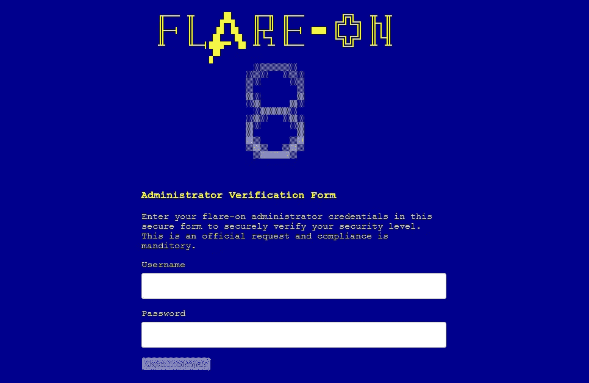
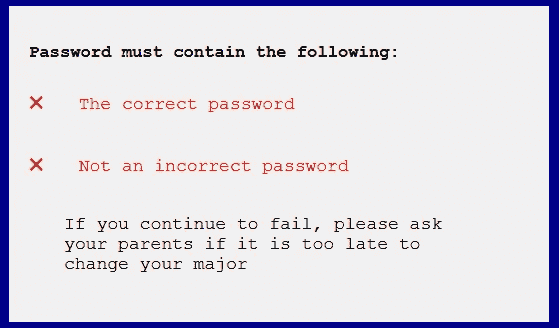

# 如何破解一个简单的 JavaScript 驱动的 Web 应用程序

> 原文：<https://javascript.plainenglish.io/how-to-hack-a-simple-javascript-driven-web-application-caf2d3b5befc?source=collection_archive---------3----------------------->


Base Image: Frame from [Archie’s Weird Mysteries Intro](https://www.youtube.com/watch?v=Qy-LmJ12d0I)

在我看来,[FLARE-ON](http://flare-on.com/)capture the flag 是最难的在线逆向工程竞赛之一。我通常会着手解决手头的挑战，但并没有找到所有的解决方案，尽管如此，我还是觉得这是一次宝贵的学习经历。它们是我接触信息安全技能发展的一个很好的方式。在这篇文章中，我想讨论我必须解决的唯一的问题。

# 试探一下

> 欢迎来到第八频道！这个挑战是你即将开始的史诗任务的指导任务。逆向工程 Javascript 代码，以确定正确的用户名和密码的网页正在寻找，它会显示您的标志。在此输入旗帜以进入下一阶段。所有标志都将采用有效电子邮件地址的格式，并且都以“@flare-on.com”结尾

挑战被打包到一个 7zip 存档文件中。我下载了它，将其解压缩，然后使用 *PowerShell* 获得其文件系统的列表:

```
**PS C:\flareon\01_credchecker > ls**Directory: C:\flareon\01_credcheckerMode                LastWriteTime         Length Name
----                -------------         ------ ----
d-----        9/10/2021   9:14 AM                img
-a----        8/31/2021   1:40 PM           3873 admin.html
```

看起来很有趣，所以我打开它，看到了以下内容:



接下来，我决定探究一下 web 应用程序的行为，所以我在`Username`和`Password`字段中输入`test`，然后点击“检查凭证”我得到了以下信息:



Yeah, well I changed my major from computer science to gender studies, so jokes on you cos’ most GS majors are better coders than the average CS majors ;-)

我不喜欢使用暴力，所以我决定尝试一些不同的东西。

# 检查源代码

使用我的网络浏览器的源代码检查工具，我能够发现“检查凭证”按钮调用了`admin.html`文件中一个名为`checkCreds()`的函数。然后，我在文本编辑器中打开了`admin.html`文件，并导航到`checkCreds()`函数:

该函数接收来自`Username`和`Password`字段的信息，然后如果`username`和`password`匹配，则运行解密程序。在用户名的情况下，很容易看出它是“Admin”然而，`password`字段实现了一些基本的安全性。

我决定使用已经存在的过程，而不是重新实现解密函数中使用的过程。我研究了`atob()`函数，发现它将一个 *base64* 编码的字符串解码成 ASCII 文本( [MDN Web Docs，n.d.](https://developer.mozilla.org/en-US/docs/Web/API/atob) )。然后我用一个 *base64* 编码器对`goldenticket`进行编码，结果是`Z29sZGVudGlja2V0`。然后我将`goldenticket`的 *base64* 编码输入到密码表单中，结合已经发现的用户名“Admin”，得到了标志:`enter_the_funhouse@flare-on.com`

# 结论

这是一篇关于我的逆向工程技能的报告，希望能启发 web 开发人员考虑在他们的 web 应用程序中实现强大的 AppSec。

虽然读者可能会认为本文讨论的是一个“简单”的逆向工程挑战，但是请记住，一些开发人员会犯这样的错误，将他们的密码嵌入到登录页面的 JavaScript 中。例如， [IOActive (2018)](https://ioactive.com/wp-content/uploads/2018/05/Security-Vulnerabilities-in-Routers.pdf) 报告了一个影响 *LB-LINK* 路由器模型的关键漏洞，在该模型中，管理员凭据被嵌入到路由器的管理 web 应用程序的登录页面中。

对于任何对解决这个捕获旗帜难题的材料感兴趣的读者，以及对我试图解决 FLARE-ON 的第二个逆向工程难题(涉及原生二进制)的材料感兴趣的读者，请查看下面的补充材料。

## 补充材料

[](https://github.com/Alekseyyy/ctfs/tree/master/infosec/2021/flareon8) [## ctfs/infosec/2021/flare on 8 at master Alekseyyy/ctfs

### infosec ctfs、编码拼图和其他竞赛。通过在…上创建帐户，为 Alekseyyy/ctfs 的发展做出贡献

github.com](https://github.com/Alekseyyy/ctfs/tree/master/infosec/2021/flareon8) 

*更多内容请看*[***plain English . io***](http://plainenglish.io/)