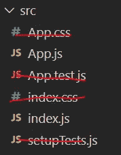
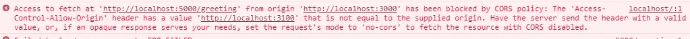
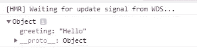

# 如何同时运行 Express 和 React

> 原文：<https://javascript.plainenglish.io/how-to-handle-cors-in-express-how-to-run-express-server-and-react-client-concurrently-a76d551a8553?source=collection_archive---------4----------------------->

## 以及如何在 Express 和 Node.js 服务器中处理 CORS


Photo by [Christina @ wocintechchat.com](https://unsplash.com/@wocintechchat?utm_source=medium&utm_medium=referral) on [Unsplash](https://unsplash.com?utm_source=medium&utm_medium=referral)

在本文中，我们将演示:

1.  如何处理 Express 和 Node.js 服务器中的 CORS 问题
2.  如何用一个 npm 命令同时运行服务器和客户端？

## 服务器端

首先，我们将学习 Visual Studio 代码，我们将从后端开始

在终端，我们运行“npm init -y”来创建 package.json.
我们将安装我们的依赖项，包括 express 和 concurrently。

```
npm i express concurrently
```

并发允许我们同时运行后端 Express 服务器和 react 服务器，我们只需在 package.json 中添加一些脚本

```
"scripts": {"test": "echo \"Error: no test specified\" && exit 1","client": "npm start --prefix client","dev": "concurrently \"nodemon server\" \"npm run client\""},
```

我们将添加"--前缀 client "，这将进入客户端文件夹和
，然后运行和 npm 启动。

然后我们创建 server.js，引入 express 并初始化它。

```
const express = require('express');const app = express();
```

接下来，监听端口 5000

```
app.listen(5000,()=>console.log('server started'))
```

创建一个用于返回 json 对象的端点。

```
app.get('/greeting',(req,res)=>{res.json({greeting:'Hello'})})
```

## 客户端

我们将继续讨论反应部分，我们将使用

```
npx create-react-app client
```

它将在一个名为 client 的文件夹中生成 react 应用程序，我们将删除一些不必要的文件



我们还删除了 App.js 中不必要的代码

```
function App() {fetch('http://localhost:5000/greeting').then(response => response.json()).then(data => console.log(data));return (<div className="App">app</div>);}
```

然后我们去 App.js，用 JavaScript fetch api 取“http://localhost:5000/greeting”。

```
fetch('http://localhost:5000/greeting').then(response => response.json()).then(data => console.log(data));
```

现在我们可以运行“npm run dev”来同时运行服务器和客户机。

在 chrome 开发者工具的控制台，我们会看到一条 cors 错误消息。



因此，我们需要导入另一个包“cors”，回到根文件夹并运行“npm i cors”

CORS 是一个节点。js 包，用于提供一个连接/快速中间件，该中间件可用于支持具有各种选项的 CORS。

转到 server.js，导入 cors 并启用所有 cors

```
const express = require('express');**const cors = require('cors');**const app = express();**app.use(cors())**;
```

现在，我们可以看到从服务器返回的 JSON 数据。



本教程的视频版本:

[](https://www.youtube.com/channel/UCu4-4FnutvSHVo9WHvq80Ww) [## ckmobile

### 无论你是在后台还是前台工作，JavaScript 现在都非常重要。NodeJS、Angular、VueJS 或 React all…

www.youtube.com](https://www.youtube.com/channel/UCu4-4FnutvSHVo9WHvq80Ww) 

源代码:

[](https://github.com/cyrus8050/yt-react-express-concurrent-cors) [## Cyrus 8050/yt-react-express-concurrent-CORS

### 在 GitHub 上创建一个帐户，为 Cyrus 8050/yt-react-express-concurrent-CORS 开发做出贡献。

github.com](https://github.com/cyrus8050/yt-react-express-concurrent-cors)