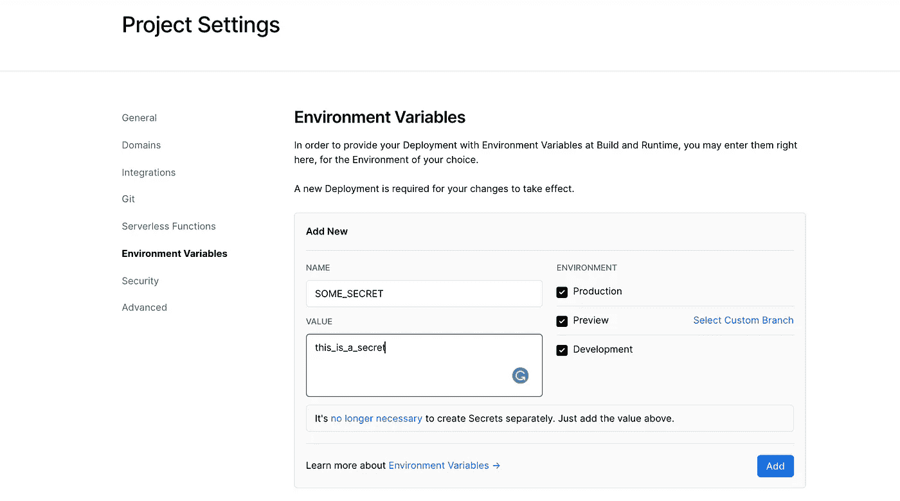

# 如何在 Next.js 应用程序中处理不同的环境

> 原文：<https://javascript.plainenglish.io/how-to-handle-different-environments-in-a-next-js-application-8dc4aef6ad9b?source=collection_archive---------1----------------------->

## 关于 Next.js 中的环境变量，您需要知道的一切


Credit: Pixabay Free Photos

处理多种环境是任何现代应用程序必不可少的一部分。我们不想在开发和生产过程中混淆我们的秘密。

今天，我们将看到一个如何通过环境变量在 Next.js 应用程序中管理多个环境的实际例子。

我们开始吧。

# 步骤 1:创建一个项目

如果您已经有一个正在运行的 Next.js 应用程序，请转到步骤 2。否则，从终端运行以下命令

```
yarn create next-app next-environment-demo
```

这将为您创建一个新的 Next.js 应用程序。

# 步骤 2:了解变量类型

转到项目根文件夹，创建一个名为`.env.local`的新文件。这将是我们的第一个环境文件。随着我们的前进，我们将创造其他人。

有两种类型的环境变量。一些变量向浏览器公开，而其他变量则不公开。让我们将下面一行写入我们的环境文件。

```
SOME_SECRET = this_is_a_secret
```

现在，变量 SOME_SECRET 只能从服务器环境中访问。例如在`getStaticProps`中，我们可以像下面这样访问变量。

但是如果你试图在浏览器中访问它们(这意味着在你的可视组件的代码中)，它会返回`undefined`

所以只有当你想在前端存储一些不需要的秘密时才使用它。(例如不同支付集成的密钥)

但是如果你想让一些变量暴露给浏览器，你需要在秘密前面加上前缀`NEXT_PUBLIC_`

```
NEXT_PUBLIC_SOME_SECRET = this_is_a_browser_exposed_secret
```

现在在你的组件内部，你可以得到这样的值。

这将正确地打印值。

# 不同的环境

现在，环境变量的主要用途是能够为不同的环境更改值。例如，如果您正在使用条带，那么您就不希望在开发时使用活动密钥。

那么我们如何做到这一点呢？一种方法是在开发时更改密钥，并在上线时再次更改。

但是它可扩展吗？显然不是。让我们看看如何处理这个问题。

创建两个新文件，分别命名为`.env.development`、`.env.production`。所以现在你应该有 3 个环境文件。

1.  `.env.local` - >该文件可用于任何值

这意味着该文件中的值将在任何环境中加载。

2.`.env.development` - >仅开发所需的值

这意味着这些值将在运行`next dev`命令时生成。所以把开发秘密留在这里

3.`.env.production` - >将仅是生产所需的值

这意味着运行`next start`命令时将要加载的值。在这里保守生产秘密。

> 请记住，`.env.local`将覆盖`.development`或`.production`文件上的任何内容。

仅此而已。你不需要担心其他任何事情。如果您定义了一个名为

```
NEXT_PUBLIC_SECRET = a   // inside .env.developmentNEXT_PUBLIC_SECRET = b   // inside .env.production
```

然后当你访问`process.env.NEXT_PUBLIC_SECRET`时，当你正在开发时，它会给出`a`，如果你正在生产，它会产生`b`。

就这么简单！

# 在 Vercel 上定义:最佳实践

你永远不应该在 GitHub 这样的源代码控制系统中包含你的环境变量。

那么，当您准备部署应用程序时，应该做些什么呢？

一种选择是在部署之前手动添加文件(如果您自己管理您的部署)

但是如果您在下一个 js 应用程序部署中使用`vercel`(您应该这样做),那么请转到`Project Settings`


Project Settings Tab on Vercel

在这里你可以选择`Environment Variables`并在那里定义你的秘密。

像下面这样



Vercel Dashboard

所以你走吧。现在您知道了如何在下一个 js 应用程序中管理环境变量。

祝您愉快！

**通过**[**LinkedIn**](https://www.linkedin.com/in/56faisal/)**或我的** [**个人网站**](https://www.mohammadfaisal.dev/) **与我取得联系。**

## 资源:

[https://nextjs . org/docs/basic-features/environment-variables](https://nextjs.org/docs/basic-features/environment-variables)

*更多内容请看*[***plain English . io***](http://plainenglish.io/)