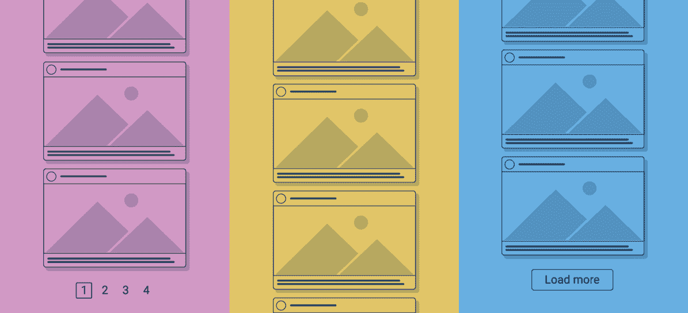

# 如何在前端处理大型列表:详细指南

> 原文：<https://javascript.plainenglish.io/how-to-handle-large-amounts-of-data-in-a-list-on-the-frontend-80725661ff51?source=collection_archive---------3----------------------->

## 分页、无限滚动、加载更多、反应虚拟化和反应窗口

Pagination, Infinite scrolling, and Load more

随着时间的推移，Web 应用程序不断变大，单个屏幕上显示的内容也在不断增加。现在这里出现的问题是渲染如此大量的数据。

列表是大多数 web 应用程序不可或缺的一部分，因为它们有助于以更可展示的格式显示数据。但是当一个应用程序试图处理一个列表中的太多数据时，往往会导致性能问题。有许多方法可以解决与列表相关的性能问题，比如分页、无限滚动、加载更多按钮、react-virtualized 和 react-window。

# 页码

> 分页是一种技术，其中在线内容被分成几个网页，而不是被集中在一个巨大的内容块中。

*   分页允许您在页面中呈现数据，而不是一次呈现所有信息。通过这种方式，您基本上控制了页面上显示的数据量，因此您不必对 DOM 树施加太多压力。
*   对于基于 React 的应用程序，大多数 UI 库都带有分页组件，但是如果您想快速实现分页而不需要安装 UI 库，您可能需要查看`[react-paginate](https://www.npmjs.com/package/react-paginate)`。该库呈现一个分页组件，该组件接受一些帮助您浏览数据的道具。
*   如果您滚动到使用分页的网页底部，您将会看到一行页码或让您导航到下一页的下一页/上一页链接。这些是导航控件，它们允许用户通过手动点击直接访问分页系列中的每个网页——从第一页到最后一页。
*   这些控件还向 Google crawlers 发送消息，表明该系列中的所有内容都是连接的和可索引的，即使它们分散在多个页面上。
*   这种信息呈现方式为用户提供了完全理解内容所需的结构和层次，尽管这需要更多的点击，但这些操作是有意义的，因为它们使用户更接近他们想要的结果。用户通常喜欢给他们的搜索一个清晰的结尾，因为它满足了完成的需要。

分页的一个很好的例子是搜索引擎结果页面。每个分页页面底部的导航控件让用户知道哪些资源是最相关的，当前选择了哪个页面，还有多少页面需要筛选。

*Google’s search results are housed on 10 different pages*

这增加了搜索过程的清晰度，并引导用户准确地找到他们要搜索的内容。

电子商务网站也经常使用分页，因为通常提供的产品非常多，最好将它们放在多个页面上。

*Amazon’s inventory is so large it makes sense to separate its product listings across many pages.*

React paginate code implementation

# **无限滚动**

> 无限滚动是一种网页设计技术，当用户向下滚动页面时，**连续加载内容**，消除了分页的需要。

*   无限滚动包括当您向下滚动列表时将数据追加到页面的末尾。当页面最初加载时，只加载数据的子集。当您向下滚动页面时，会追加更多的数据。在 React 中实现无限滚动有几种方法。个人比较喜欢用`[react-infinite-scroll-component](https://www.npmjs.com/package/react-infinite-scroll-component)`。
*   分页将大量内容分散到一系列网页中，而无限滚动允许您从一个网页中浏览全部内容。
*   一旦滚动条到达页面底部，新的内容会自动加载，允许无休止的滚动。这对于使用移动设备的用户来说尤其重要，因为在移动设备上滚动更加直观。页码栏太小，无法在手机上正常点击。
*   还可以考虑社交媒体订阅——无限滚动是脸书和 Twitter 等社交媒体网站以及 Pinterest 和 Instagram 等画廊网站的一种流行技术，因为它可以促进用户参与。这些网站通常选择无限滚动，因为这是对他们希望用户与他们的内容进行交互的一种恭维。

它显示连续的内容，为*浏览*的用户提供更多的机会来寻找有价值的东西。

 [## JavaScript 无限滚动引号

### 无限滚动—示例

www.javascripttutorial.net](https://www.javascripttutorial.net/sample/dom/infinite-scroll/) 

React infinite scroll component code implementation

基本上，这里发生的事情是每当用户滚动到页面的末尾时，它检查`hasMore`属性是否为假。如果不是，它会向页面追加更多数据。它一直将数据追加到页面的末尾，直到`hasMore`属性变为 false。

# 加载更多按钮

*   加载更多按钮提供了无限滚动和经典分页之间的中间地带。它由页面底部的一个按钮组成，单击该按钮将提供更多内容，让用户可以简单地决定是查看更多结果还是到达页面末尾。
*   “加载更多”是一个简单的设计，它不会给用户带来必须浏览一系列页面的负担，而是直接问:“你想看到更多结果吗？”有趣的是，因为加载额外的产品需要一个主动的选择和点击，用户倾向于在有加载按钮的网站上比在无限滚动的网站上更仔细地阅读显示的内容。
*   加载更多的页面增加了可见性，因为当用户加载页面时，广告经常会在视图中弹出。广告单元被留在折叠线之下看不见从而无用的机会更少。
*   根据最近的电子商务可用性实验，受试者通常在无限滚动页面上浏览最多的产品，其次是加载更多页面和标准分页。然而，与无限滚动相比，用户在加载更多页面时参与和查看内容的时间更长。这显然是建立一个电子商务页面时的优先事项，并且可能会转化为其他形式的内容，在这些内容中，你希望保持用户的注意力更长一段时间

# react-虚拟化和 react-窗口

*   我们不应该简单盲目地把它们扔进你的世界。并不是你的应用程序的每个用户都像许多开发人员那样拥有一台顶级的机器。考虑延迟加载当前不可见的行。在基于 React 的应用程序中有很好的工具，例如 [react-window](https://www.npmjs.com/package/react-window) (每周约 60 万次下载)或其前身 [react-virtualized](https://www.npmjs.com/package/react-virtualized) (每周约 75 万次下载)。
*   `[react-virtualized](https://www.npmjs.com/package/react-virtualized)`专为呈现大型列表和表格数据而设计。它使用了一种类似于无限滚动的技术，叫做窗口技术。使用窗口时，只有列表的可见部分才会呈现在屏幕上。

React virtualized code implementation

*   `List`组件使用`width`和`height`道具来设置窗口的尺寸。它还采用了代表列表中每一项的高度的`rowHeight`属性和代表数组长度的`rowCount`。`rowRenderer`采用一个负责渲染每一行的函数。
*   `[react-window](https://www.npmjs.com/package/react-window)`是一组用于在 React 中高效呈现大型列表的组件。该库完全重写了`react-virtualized`，旨在解决与大小和速度相关的缺点。`react-window`也比`react-virtualized`涵盖了更多的边缘案例。

React window code implementation

*   代码和`react-virtualized`很像。我们使用了一个`List`组件，它接受一组定义列表的 props，并传入一个`Row`组件函数，负责呈现列表中的每一行。

# 结论

处理大型列表时，不要一次呈现所有数据以避免 DOM 树过载，这一点很重要。提高性能的最佳方法取决于您的用例。如果您喜欢在一个地方呈现所有数据，无限滚动或窗口技术将是您的最佳选择。否则，您可能更喜欢将数据分成不同页面的分页解决方案。

一如既往，感谢阅读。如果你喜欢这篇文章，请分享它并查看我在 Medium 上的其他文章。

*更多内容尽在*[***plain English . io***](http://plainenglish.io)