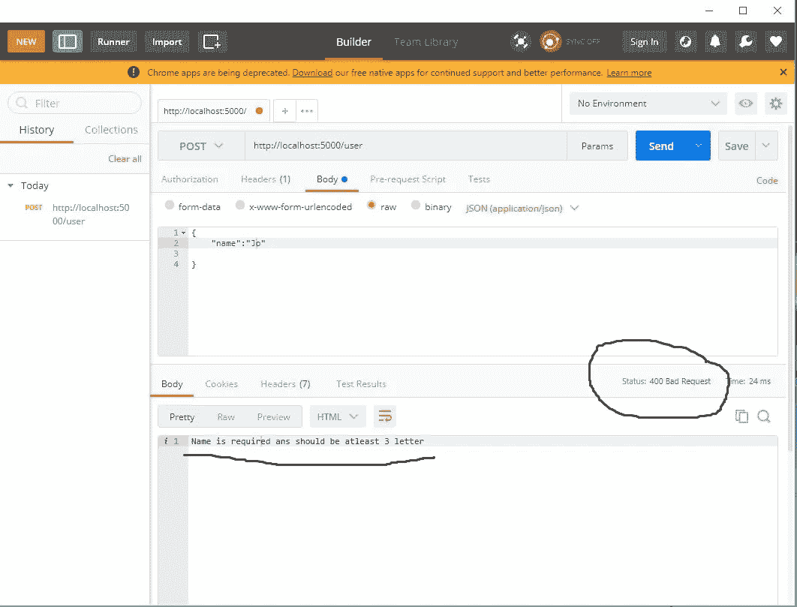

# 如何使用 Express 处理路由

> 原文：<https://javascript.plainenglish.io/how-to-handle-routing-with-express-1c2f64e3407b?source=collection_archive---------7----------------------->

## 通过示例了解如何在 express 中执行输入验证。


Photo by [Vishnu R Nair](https://unsplash.com/@vishnurnair?utm_source=medium&utm_medium=referral) on [Unsplash](https://unsplash.com?utm_source=medium&utm_medium=referral)

在上一个教程中，我们看了如何用 POST HTTP 动词或方法将数据发送到不同的端点。

本文将研究用 POST 验证发送到不同端点的输入的多种方法。

我们将看看如何在没有任何包的情况下进行验证，然后我们将看看如何使用各种包进行数据验证。对于我们的案例，我们将查看 joi npm 验证包。

# 输入验证

假设我们将一些数据发布到一个特定的端点，比如'/user '端点，我们希望在创建数据并保存到服务器之前执行一些验证。

许多开发人员认为，不应该信任客户端发送的数据，所以，以免使用执行一些验证规则。

假设用户正在向我们发送他的名字。首先，我们希望确保名称保持一定的最大数量，并且不应该为空。

```
*// route handler*router.post('/user', (req, res, next) => {*// check if the sent name is blank**if* (!req.body.name || req.body.name.length < 3) {*// send back a 400 bad request*res.status(400).send("Name is required ans should be atleast 3 letter")*return*}res.json({status: 'success',data: req.body})});
```

从上面的代码片段来看，我们正在验证用户的输入。

您可以注意到我们有一个 if 语句，它将接受名称并检查它是否为空或者至少是一个三个字母的单词。

如果它没有通过测试，我们将向用户发送一个状态码 400，否则我们将把数据发送回用户。

# 测试端点

让我们用 Postman 测试端点。

如果您不熟悉 postman，请打开 Postman 应用程序并按照步骤操作。

*   创建新请求
*   将方法更改为 POST(默认情况下，它是 GET)
*   在 URL 栏上，输入您用 express 配置的路线；在我们的例子中，它是'/user '
*   所以，在地址栏上，你应该有:[http://localhost:5000/user](http://localhost:5000/friends/1)
*   单击 body 选项卡，将其更改为 raw(默认情况下，它是表单数据或无)
*   因此，将格式改为 application/JSON(默认情况下，它是文本格式)

现在我们已经配置了 Postman，现在可以测试我们的 post API 端点了

# 使用错误请求进行测试

让我们看看我们传递的输入是否少于三个，看看我们的应用程序将向用户返回什么。

在邮递员正文中输入以下数据，然后单击发送

```
{"name":"Jo"}
```



Bad request Postman

如果您检查 Postman 上的响应，您会注意到我们的验证规则捕捉到了错误。同样，空白输入也会出错。

假设我们有许多来自用户的输入需要验证。为每个输入写下验证可能很耗时，并且经常会导致不为人知的错误。

在这种情况下，我们可以利用 npm 包管理器来加快我们的开发过程。我们将看到如何使用 joi 包管理器来执行输入验证。

# 使用 Joi 进行输入验证

首先，我们需要在我们的应用程序开发环境中安装 joi 验证包。

## **使用国家预防机制**

```
npm i joi
```

安装后，我们需要请求它，并使它在我们的应用程序中可用。

```
const Joi = require(‘joi’);
```

之后，我们可以使用 joi 为姓名输入创建验证规则，如下所示。

```
const schema = { name: Joi.string().min(3).required() };const validInput = Joi.validate(req, body, schema);*if* (validInput.error) {res.status(400).send(result.error);*return*;}
```

从上面的代码片段可以看出，我们可以将 max、min 和 required 等验证链接在一起。

这是一个展示我们如何用 joi 执行验证的例子。

要深入了解 joi，你可以点击这里查看。

# 结论

感谢您阅读本文到目前为止。如果你觉得它令人兴奋，不要犹豫，让我知道在评论区和分享。

**更多阅读**

[](/how-to-handle-routing-with-express-7c1870a2ff89) [## 如何使用 Express 处理路由

### 了解快速路由

javascript.plainenglish.io](/how-to-handle-routing-with-express-7c1870a2ff89) 

*更多内容尽在*[***plain English . io***](http://plainenglish.io)