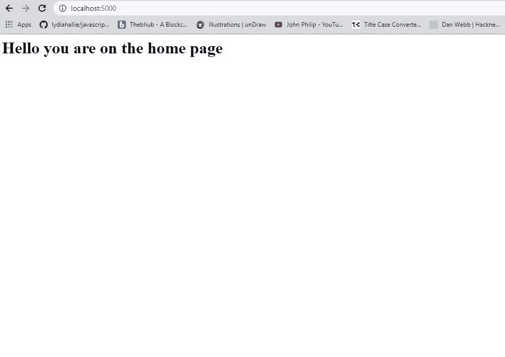

# 如何使用快递处理路线

> 原文：<https://javascript.plainenglish.io/how-to-handle-routing-with-express-67c0648c52f9?source=collection_archive---------7----------------------->

## 了解如何使用 Node.js 框架 Express 处理路由。


Photo by [Grzegorz Walczak](https://unsplash.com/@grzegorzwalczak?utm_source=medium&utm_medium=referral) on [Unsplash](https://unsplash.com?utm_source=medium&utm_medium=referral)

Express 是一个 Node.js 框架，完全是为了在服务器上运行 JavaScript 代码而构建的。

Express 提供了用 JavaScript 设置后端创作的应用程序体系结构，并使之变得容易。它在语法上很容易学习，并且消除了 Node.js 的一些复杂性。

路由是指应用程序的端点(URIs)或路径如何响应不同的客户端请求。路由只是在满足给定条件时，配置其他应用程序端点来做某些事情。

设置路由时，我们必须将它们与不同的方法关联起来。

不同的方法包括

**GET**-从特定终点获取信息

**发帖** —创建并发送数据

**删除** —删除数据

**PUT** —更新信息

简单的路由实现

**应用程序。方法(路径，处理程序)**

**方法-(张贴、删除、获取、放置)**

**路径** —指定要命中的网址或路线

**处理程序** —指当特定路线或路径被命中时运行的功能。

## **让我们创建一个简单的项目。**

创建一个文件夹并命名为路由。创建文件夹后，用您的首选代码编辑器打开它。

在开发人员终端上，运行命令

```
 npm init 
```

这个命令将创建我们的 express 应用程序的框架。

键入信息并按 enter 键，直到完成。

接下来，运行以下命令。

```
 npm install express –save 
```

该命令将在我们的应用程序支架中安装 express，并将其作为依赖项保存在 package.json 中。

此外，运行以下命令:

```
 npm i nodemon 
```

这个命令将安装 nodemon，它将保持我们的开发服务器运行，即使在进行更改之后。

## **配置我们的应用**

在文件夹的根目录下创建一个文件夹名为 ***服务器***

在服务器文件夹内，创建一个文件，并命名为 ***index.js***

index.js 将包含我们的代码。

我们本可以在文件夹的根目录下创建它，但是为了简单起见，最好将其放在一个单独的文件夹中，以避免文件过于拥挤。

在 package.json 文件中，我们将做一个小小的改变。

打开 package.json 文件，在脚本对象上，用这个替换它

```
 "scripts": {"start": "node server/index.js","dev": "nodemon server/index.js"}, 
```

这只是一个微调配置，以确保我们的开发设置在 nodemon 上运行。

## **基本布线**

首先，我们需要导入 express，并使其可用于我们的应用程序。

我已经对代码做了一些评论，所以它将会很容易理解。

```
 *// import express*const express = require('express'); *// instantiate express instance*const app = express() *// configure our server port*const port = process.env.PORT || 5000; *// handle routing and send back info to client*app.get('/', (req, res) => {res.send("<h1> Hello you are on the home page</h1>");})*// check if our app is running*app.listen(port, () => {console.log(`Server is running on port ${port}`)}); 
```

现在潜入您的开发人员终端并运行命令

```
 npm run dev 
```

进入浏览器***localhost:5000***，您会注意到我们的应用已经启动并运行了。



Express.js server running

# 结论

感谢您阅读这篇文章。如果你觉得它有帮助，请不要犹豫，在评论区告诉我，并与他人分享。

## **更多阅读:**

[](/handle-job-rejections-the-right-way-as-a-developer-99b5658d035b) [## 作为一名开发人员，以正确的方式处理工作拒绝

### 作为开发人员，面对工作拒绝的更好方式

javascript.plainenglish.io](/handle-job-rejections-the-right-way-as-a-developer-99b5658d035b) 

*更多内容尽在*[plain English . io](http://plainenglish.io/)