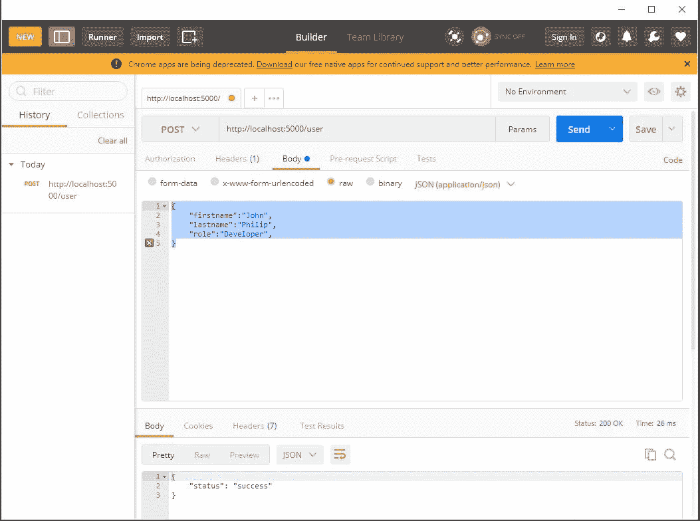

# 如何使用 Express 处理路由

> 原文：<https://javascript.plainenglish.io/how-to-handle-routing-with-express-7c1870a2ff89?source=collection_archive---------22----------------------->

## 了解快速路由


Photo by [ThisisEngineering RAEng](https://unsplash.com/@thisisengineering?utm_source=medium&utm_medium=referral) on [Unsplash](https://unsplash.com?utm_source=medium&utm_medium=referral)

在本教程中，我们将研究在 express.js 中使用 POST HTTP 方法处理数据的各种方法

本教程是后续 express 教程的一部分。如果您不熟悉 express，并且想了解一下，请随时通过下面的链接查看。

[](/how-to-handle-routing-with-express-67c0648c52f9) [## 如何使用 Express 处理路由

### 了解如何使用 Node.js 框架 Express 处理路由。

javascript.plainenglish.io](/how-to-handle-routing-with-express-67c0648c52f9) 

## **搬运岗位**

先决条件

*   Postman——Postman 使我们能够测试各种端点，以确定我们的 API 工作正常。

当我们想要创建一些数据并通过各种端点发送时，使用名为 POST 的 HTTP 方法。

```
 router.post(‘/user’, routeHandler); 
```

上面的代码将通过“/user”端点发送和创建一些数据。

让我们看一个例子。

在项目根目录下，创建一个文件夹，将其命名为 ***路线*** 。在创建的“routes”文件夹中，创建一个文件并将其命名为 ***routes.js*** 。

在 ***routes.js*** 文件里面

我们将有下面的代码。

```
 const express = require('express');const router = express.Router();*// route handler*const routeHandler = (req, res) => {res.json({status: 'success',data: req.body});};router.post('/user', routeHandler);module.exports = router; 
```

从上面的代码片段中，您可以注意到我们已经配置了端点 ***/user*** 并将其附加到 POST 的 HTTP 方法。类似地，我们传递了一个 **routehandler** 函数给它。

上面代码片段中的 **routeHandler** 函数将负责返回一个成功的响应，并将发布的信息赋给数据变量。

每当 post 请求到达用户的端点时，express 将启动 **routeHandler** 函数并返回一个响应。

## **测试终点**

让我们用 Postman 测试端点。

如果您不熟悉 postman，请打开 Postman 应用程序并按照步骤操作。

*   创建新请求
*   将方法更改为 POST(默认情况下，它是 get)
*   在 URL 栏上，输入您用 express 配置的路线；在我们的例子中，它是'/user '
*   所以，在网址栏上，你应该有:[http://localhost:5000/user](http://localhost:5000/user)
*   单击 body 选项卡，将其更改为 raw(默认情况下，它是表单数据或无)
*   因此，将格式改为 application/JSON(默认情况下，它是文本格式)

现在我们已经配置了 Postman，现在可以测试我们的 POST API 端点了

在邮递员正文中输入以下数据，然后单击发送。您可以输入自己选择的数据。

{

“名字”:“约翰”，

“姓氏”:“菲利普”，

“角色”:“开发人员”，

}

如果成功，你会在你的邮差上看到一条成功消息；检查下面相似的一个。



Postman endpoint

您将会收到类似上面的示例响应。

```
{"status": "success","data": {"firstname": "John","lastname": "Philip","role": "Developer"}}
```

在收到成功消息后，我们确信我们的应用程序正在按预期成功运行。

此外，需要注意的是，我们可以实现数据验证，以确保我们不会存储我们不想要的数据。

在接下来的系列文章中，我们将研究如何在 express 中执行数据验证规则。

## **结论**

感谢您阅读本文到目前为止。如果你觉得它令人兴奋，不要犹豫，让我知道在评论区和分享。

[](/how-to-improve-your-skills-as-a-developer-ccff0d676ff5) [## 如何提高开发人员的技能

### 用这些技巧提高你的技能。

javascript.plainenglish.io](/how-to-improve-your-skills-as-a-developer-ccff0d676ff5) 

*更多内容尽在*[***plain English . io***](http://plainenglish.io)