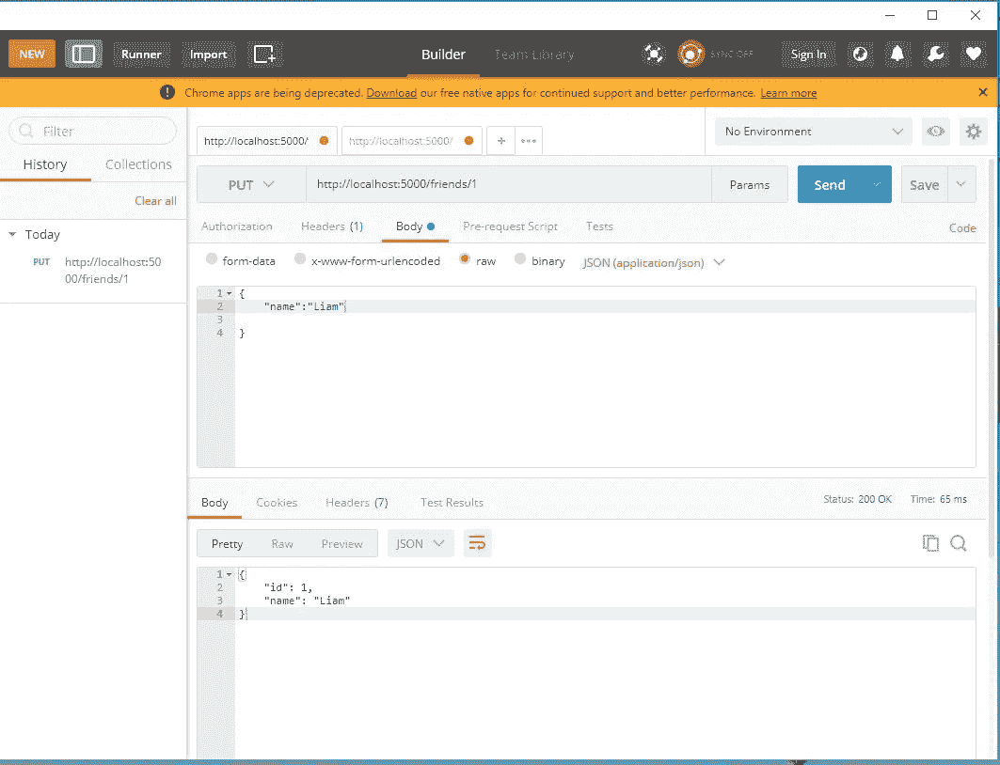
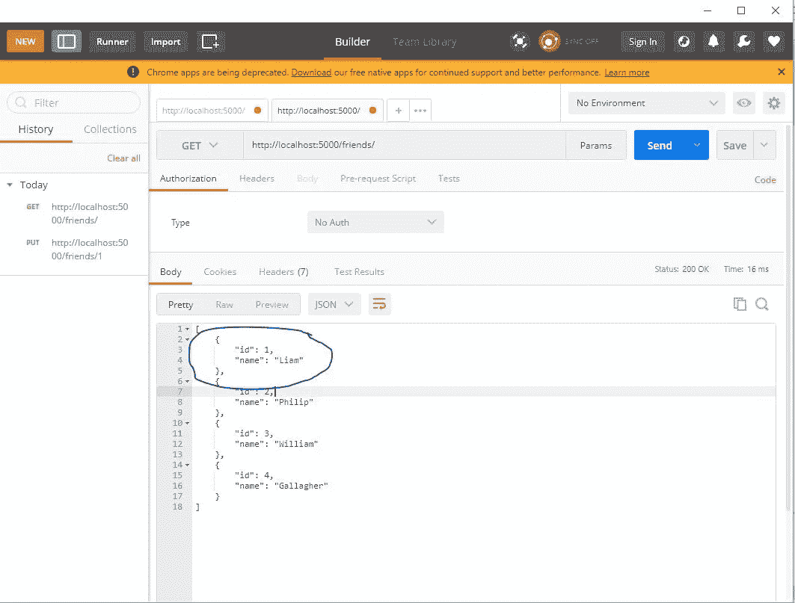

# 如何使用 Express 处理路由

> 原文：<https://javascript.plainenglish.io/how-to-handle-routing-with-express-dd6b8bbc3bf1?source=collection_archive---------19----------------------->

## 如何在 Express 中执行 PUT 请求并举例说明？


Photo by [AltumCode](https://unsplash.com/@altumcode?utm_source=medium&utm_medium=referral) on [Unsplash](https://unsplash.com?utm_source=medium&utm_medium=referral)

在我们之前的教程中，我们确定了如何使用本地 JavaScript 和 joi 验证包在 express 中执行验证。

## **之前的教程**

[](/how-to-handle-routing-with-express-1c2f64e3407b) [## 如何使用 Express 处理路由

### 通过示例了解如何在 express 中执行输入验证。

javascript.plainenglish.io](/how-to-handle-routing-with-express-1c2f64e3407b) 

如果你想用 Express 查看输入验证的教程，请查看下面的链接。

在本教程中，我们将了解如何执行其他 HTTP 方法，如 PUT 和 DELETE。

从上面的列表中我们可以看到，这些 HTTP 动词有各种各样的用例。

上传-编辑数据

执行 PUT 方法

PUT HTTP 动词或方法用于我们想要编辑已经存储或保存在应用程序后端的数据的情况。

该方法将接受使用 id 来引用应该编辑的数据。类似地，如果找到了具有相同 id 的数据，我们将执行编辑，否则如果没有找到具有给定引用的数据，它将向用户返回一条消息，确认没有找到具有给定引用的数据。

**让我们看一个例子**

首先，让我们制作一个包含朋友名字的数组，如下所示

```
const friends = [{ id: 1, name: ‘John’ },{ id: 2, name: ‘Philip’ },{ id: 3, name: ‘William’ },{ id: 4, name: ‘Gallagher’ }]
```

我们可以向 API 端点写一个 GET 请求，并发回我们朋友的数组。

```
 router.get(‘/friends’, (req, res, next) => {res.status(200).send(friends)});
```

当我们去找我们的邮差和[T5 的 localhost http://localhost:5000/friends](http://localhost:5000/friends)**并执行一个 get 请求时，我们朋友的数组会被发回给我们。**

**现在我们可以配置 put 并尝试编辑我们一个朋友的名字。**

```
*// configuring put request*router.put(‘/friends/:id’, (req, res, next) => {*// find the friend with the given ID*const friend = friends.find(c => c.id === parseInt(req.params.id))*if* (!friend) {*// if not send back the message*res.status(400).send(‘Friend with the given ID was not found’);} *else* {*// if found update the name*friend.name = req.body.name;res.send(friend)}});
```

**现在我们可以在 postman 中测试端点**

**如果您不熟悉 postman，请打开 Postman 应用程序并按照步骤操作。**

*   **创建新请求**
*   **将方法更改为 PUT(默认情况下，它是 GET)**
*   **在 URL 栏上，输入您用 express 配置的路线；在我们的例子中，它是'/朋友'**
*   **所以，在网址栏上，你应该有:[**http://localhost:5000/friends/1**](http://localhost:5000/friends/1)**
*   **单击 body 选项卡，将其更改为 raw(默认情况下，它是表单数据或无)**
*   **因此，将格式改为 application/JSON(默认情况下，它是文本格式)**

**现在我们已经配置了 Postman，现在可以测试我们的 post API 端点了**

**使用 PUT 测试此端点。**

**在邮递员正文中输入以下数据，然后单击发送**

```
{“name”:”Liam”}
```

****

**Example PUT request**

**注意从 API 发回的数据。**

**现在，我们可以对/friends 端点执行 get 请求，以检查数据是否已经更改。**

**如果您不熟悉 postman，请打开 Postman 应用程序并按照步骤操作。**

*   **创建新请求**
*   **将方法更改为 PUT(默认情况下，它是 GET)**
*   **在 URL 栏上，输入您用 express 配置的路线；在我们的例子中，它是'/user '**
*   **所以，在网址栏上，你应该有:[**http://localhost:5000/friends/**](http://localhost:5000/friends/)**

**现在我们已经配置了 Postman，现在可以测试我们的 post API 端点了**

****

**Example showing change on the friends array**

**请注意，我们的名字变了**

## ****结论****

**感谢您阅读本文到目前为止；如果你觉得这篇文章有趣，请在评论区告诉我并分享。**

**你也可以评论你感兴趣并推荐的作品集博客网站。**

****更多阅读:****

**[](/5-blog-portfolios-to-inspire-your-next-website-1a4129324262) [## 启发你下一个网站的 5 个博客组合

### 你正在努力建立你的网站组合吗？使用这些网站来激发你的下一个网站组合。

javascript.plainenglish.io](/5-blog-portfolios-to-inspire-your-next-website-1a4129324262) 

*更多内容请看*[*plain English . io*](http://plainenglish.io/)**