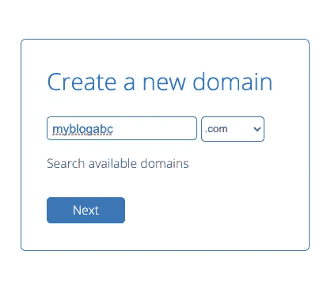

# 如何在几分钟内托管自己的网站

> 原文：<https://javascript.plainenglish.io/how-to-host-your-own-website-in-just-minutes-f8d76109765a?source=collection_archive---------27----------------------->

面向自由职业者、小企业或非盈利企业主的快速分步指南。

Photo by [Sincerely Media](https://unsplash.com/@sincerelymedia?utm_source=medium&utm_medium=referral) on [Unsplash](https://unsplash.com?utm_source=medium&utm_medium=referral)

***(* ***)披露:*** *本文包含附属链接，我可能会从 BlueHost 获得少量佣金，如果您选择通过我的链接购买，则无需额外费用)**。*

# 所以你准备好了:

*如果你是一个博客写手——你可能会说*“…就是它了。我正在做。我正在创建自己的博客网站，我将拥有一群可以每天联系的读者。

如果你是自由职业者、小企业主或非营利组织的负责人，你可能准备好将你的品牌、产品或服务**提升到下一个层次**。

*真有你的！*拥有一个稳定且可扩展的网站是推广你的品牌、业务、产品或服务的好方法*，但更重要的是*——**与你的观众、客户或利益相关者建立良好的关系。**

在本指南中，我将向你展示如何开始在 [**BlueHost**](https://www.anrdoezrs.net/click-100417643-11660078) 上托管你自己的 **WordPress 站点**。假设你有*很少或没有*主持网站或博客的经验，**我会一步一步地指导你完成最初的过程**。

在继续这些步骤之前，确保你的网站/博客已经完成并准备上线。如果您需要帮助来设置您的博客或网站，请随时给我发消息。我有多年使用 WordPress 的经验。你可以在这里或者通过我的网站联系我，网址是—*[***【Pjcodes.com***](https://www.pjcodes.com/)*。**

# ***步骤 1)***

*去 [**BlueHost 网站**](https://www.anrdoezrs.net/click-100417643-11660078) 。*(你可能想在一个新标签中打开它)。**

# *第二步)*

*如果你对页面上的大量信息感到有点不知所措，看看下面这篇文章，帮助你更好地理解 [**BlueHost**](https://www.anrdoezrs.net/click-100417643-11660078) 服务。*否则，跳到步骤 3。**

**(请记住，计划/服务可能会随着时间的推移而变化，因此最好访问*[****blue host 网站****](https://www.anrdoezrs.net/click-100417643-11660078) **获取最准确和最新的信息)。***

** [## 2021 年 WordPress 网站的最佳托管解决方案。

### 所以你已经建立了你的网站，你需要给它一个家…别再找了。

javascript.plainenglish.io](/the-best-hosting-solution-for-wordpress-sites-in-2021-f076af9d51dd) 

# 第三步)

选择一个计划。 [**BlueHost**](https://www.anrdoezrs.net/click-100417643-11660078) 推荐自己**选择加**计划。与**基本**或**加**相比，**选择加**计划的好处在于，你可以获得 1 个域隐私&自动备份……(*你甚至不用支付那么多钱)。*

现在我认为 **Choice Plus 计划**是显而易见的，因为除了隐私之外，你要记住，你希望你的博客/业务/品牌**与时俱进**。**可扩展性**随着时间的推移，它会给你带来更多的流量和收入。

# 第四步)

选择你的域名。您可以创建自己的域名，使用现有的域名，或者决定以后使用哪个域名。假设您*没有域名，请在“创建新域”字段中输入您想要的域名。
( *我以 myblogabc* 的身份进入了一个域)。此外，选择你的 **TLD** (顶级域名)名称，如**。com** 或**。org** 。*点击下一个*。*

Image belongs to author (screen shot taken from BlueHost.com)

# 第五步)

浏览表单并相应地填写您的所有信息，或者使用 Google 帮助您登录。浏览表格，如果您有任何问题，请联系 BlueHost 支持部门。可以去**聊天或者打 [***BlueHost 网站***](https://www.anrdoezrs.net/click-100417643-11660078) ***标题里的***栏目。**

现在你成功了！要获得更深入的设置和/或技术支持，建议联系他们的支持团队，他们可以从他们那里获得*，因为这将涉及更多的技术问题和更多的客户特定问题。*

我希望这有助于理解所有最初的晦涩难懂的东西，并为您节省大量的研究时间。

如果你有任何问题，不要犹豫给我发信息！感谢阅读！

**到 Pjcodes.com**[来找我](https://www.pjcodes.com/)。

*更多内容尽在*[*plain English . io*](http://plainenglish.io/)**