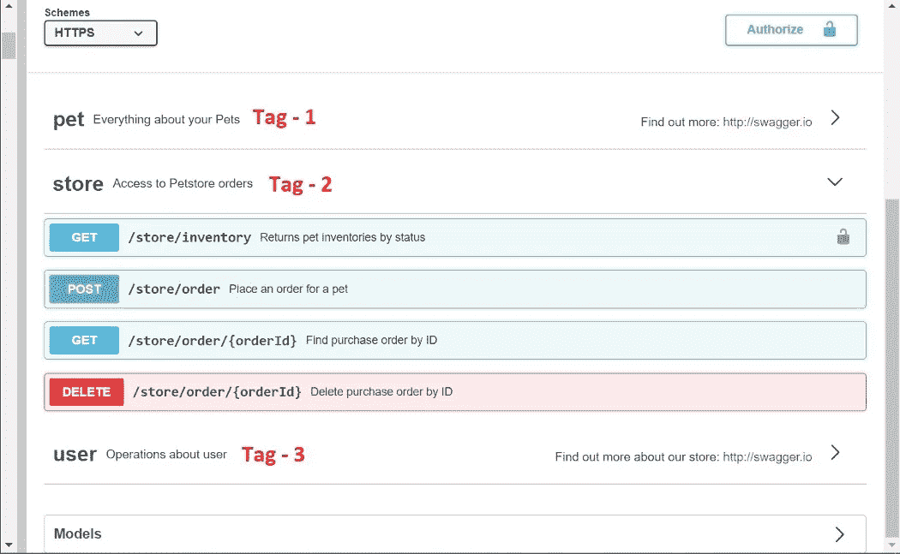

# 如何在 Node.js 中实现和使用 Swagger

> 原文：<https://javascript.plainenglish.io/how-to-implement-and-use-swagger-in-nodejs-d0b95e765245?source=collection_archive---------0----------------------->


# OpenAPI

OpenAPI 定义了一些使用的标准；

*   对于 RESTful web 服务器的设计，
*   为了测试 API，不需要访问源代码，
*   用于 API 的文档化

你可以用 *OpenAPI* 通知你的 API 的用户关于

*   端点
*   CRUD 操作
*   认证方法
*   联系信息

# 时髦的

Swagger 是一套围绕 *OpenAPI* 规范构建的开源软件工具，我们可以用它来构建、记录和测试我们的 API。

你可以从它的网站上获得更多关于 Swagger 的信息。

在这篇文章中，我将谈到；

*   如何在用 Node.js 构建的 RESTful web 服务器上实现 Swagger
*   Swagger UI
*   API 文档

我将继续讲述，假设你至少在基本水平上熟悉 **Node.js** 和 **RESTful API** 概念，我将使用 **VS Code** 作为代码编辑器。

首先让我们创建一个 RESTful web 服务器:

我将光标导航到我将在终端中创建项目的文件，我正在使用以下命令创建 **package.json** 文件:

```
npm init --y
```

因为我不会在项目中使用数据库，所以让我们创建假数据。为此，我创建了一个名为 **data.js** 的文件，并添加了一个由一些 **JSON** 格式的信息组成的数组。假数据的情况是一些作者和他们的文章。

data.js file

现在让我们添加创建服务器所必需的包:

```
npm install express cors morgan body-parser dotenv
```

为了语法的方便；

让我们将**巴别塔**模块添加到项目中:

```
npm install @babel/core @babel/node @babel/preset-env
```

***ii* )** 让我们创建**。babelrc** 文件并添加以下代码:

```
{
  “presets”: [“@babel/preset-env”]
}
```

最后，让我们将以下代码添加到 *package.json* 文件中的**脚本字段**中。

```
“start”: “nodemon — exec babel-node src/index.js”,
```

如果你的电脑里没有 **nodemon** ，我建议全球安装。

然后让我们创建 **src/index.js** 文件并添加以下代码:

如你所见，我们将从端点为 **/posts** 的 *index.js* 文件到达包含 API 的 **posts.js** 文件。

现在让我们创建 *posts.js* 文件，并向其中添加 **CRUD** 操作:

the posts.js file

在最后一种情况下，项目文件应该如下所示:


现在我们有了一个运行在 4001 端口上的 RESTful web 服务器。您可以简单地用 **npm start** 命令运行它。你可以用 **Postman** 测试 CRUD 操作。

也许你会发现用*邮递员*测试 API 有点复杂。斯瓦格上场了。

# 为项目增加霸气

首先，让我们安装文档和用户界面(UI)所需的两个模块:

```
npm install swagger-jsdoc swagger-ui-express
```

我正在将这两个模块导入到 **index.js** 文件中:

```
import swaggerUI from “swagger-ui-express”;
import swaggerJsDoc from “swagger-jsdoc”;
```

现在，在 *index.j* 中，让我们为 API 的文档和*swag UI*的实现做一些必要的定义:

**选项**变量是一个 *OpenAPI* 对象。可以用这个给出一些关于 API 的信息(标题、版本信息、联系信息等。).

更多信息请点击[链接](https://swagger.io/specification/#oas-document)。

我们看到只有一行代码才能实现。

当我们在显示屏上看到**定义**字段下的定义时会更清楚。请注意，服务器 URL 和 API 是在*选项*变量中指定的。

现在我们可以在运行服务器后用 **/api-docs** 端点显示*swag UI*:


现在我们可以在*斯瓦格*屏幕上的**Routes/post . js**文件中制作显示和运行我们的 API 的规范。我们使用 **JSON** 格式来定义 *index.js* 文件中的*选项*变量。但是对于*模式*的定义，我们将使用 **YAML** 格式。(两种格式都可以使用)。

# 组件对象

我从定义**组件对象**开始。该对象被定义用于文档的各个部分。我们可以说这是我们将要使用的数据的一个模式。除非它不会被文档的任何属性调用，否则它对 API 没有影响。

更多关于如何为 *Components Object 添加更多属性的信息，请点击*链接。

# 标签

借助斯瓦格的**标签**功能，我们可以创建一个*标签*列表，通过该列表我们可以区分斯瓦格界面上的哪个功能属于哪个数据。因为我们有只属于*帖子*数据的 API，所以不会有关于 API 函数的混淆。但是在包含与多种数据相关的 API 的文档中，*标签*是不可避免的。

让我们通过另一个 RESTful API 文档的截图来更好地理解标签问题:



我们的用户界面看起来还像这样:


# HTTP 方法的文档

## GET 方法

让我们从 **GET** 操作的文档开始:

如果需要谈论，首先我们指定端点:

```
/posts
```

然后我们添加了一个描述，并指定它属于哪个标签。然后我们添加了**回复**信息。

更多关于 HTTP 方法的文档资料，可以查看[这个链接](https://swagger.io/docs/specification/paths-and-operations/)。

关于*响应对象*的更多信息，可以查看[这个链接](https://github.com/OAI/OpenAPI-Specification/blob/master/versions/3.0.3.md#responses-object)。

我们会看到 *GET* 功能已经添加到 *Swagger UI* 上的 **Posts 标签**中:


## 带参数的 GET 方法

现在，让我们为通过 id 调用单个帖子的函数制作文档:

注意，与前一个不同，id 是作为 **/posts / {id}** 添加到路径中的。因为我们现在需要函数中的一个参数来调用一篇文章的 id，所以文档中增加了一个**参数对象**。由于我们在访问 API 时选择了“将参数添加到路径”的方法，下面的语句包含在*参数*字段下。

```
-in : path
```

也可以用不同的方式来实现。

关于*参数对象*的更多信息，可以查看[这个链接](https://github.com/OAI/OpenAPI-Specification/blob/master/versions/3.0.3.md#parameter-object)。

通过 id 参数调用数据的 *GET* 方法在接口中将是这样的:


## 过帐方法

现在让我们制作向当前数据添加新帖子的 **POST** 方法的文档:

有了上面的文档，下面显示的**发布按钮**(绿色的)将被添加到 Swagger 界面中:


当我们查看文档时，我们会看到 **requestBody** 字段，与其他字段不同。这为我们提供了一个区域，我们可以在 *Swagger UI* 的 *POST* 函数中创建一个新帖子。当点击**试用**按钮时，该区域将打开。我们在开始时定义的模式中的一个示例 *post 对象*在这个区域中是默认的。如果需要，可以更改示例中的字段。

关于*请求体*的更多信息，可以查看[这个链接](https://github.com/OAI/OpenAPI-Specification/blob/master/versions/3.0.3.md#operation-object)。

## PUT 方法

众所周知，在 *RESTful* 方法中，使用 **PUT** 功能更新现有数据。为此，通常需要待更新数据的 id。因此，我们在 *PUT* 函数的文档中添加了一个参数字段，并在 */ post* 结束点之后添加了表达式{id}。为了更新用其参数捕获的数据的属性，我们在 *POST* 函数中添加了 *requestBody* 。对于不存在属于输入的 id 信息的数据的情况，我们将 **404** 响应添加到响应部分:

*在*霸气*显示屏上进行*操作如下:


## 删除方法

通常只给函数一个 id 就足以删除数据。我们也是。为此，我们将参数字段和显示响应的响应字段添加到文档中:

*删除*操作在*霸气*显示屏上会是这样的:


# 结论

在本文中，我们讨论了如何使用 **OpenAPI** 方法在 **Node.js** 中创建的 web 服务器中记录 **RESTful API** 。我们讨论了在**swag UI**上可以进行哪些设置来查看该文档。我们一起创建了一个模型项目。

您可以通过以下 [Github 链接](https://github.com/azizkale/Swagger-in-NodeJS)访问该项目。