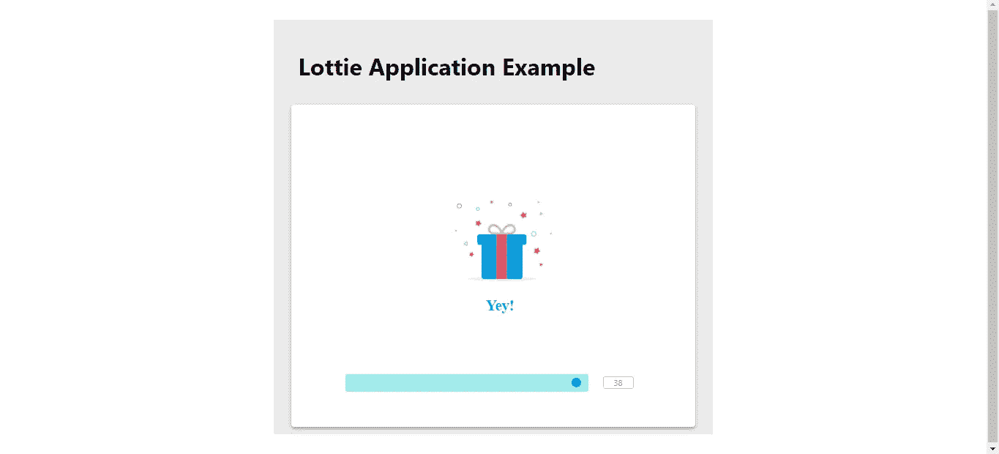

# 如何在 React 应用中将动画实现为 JSON(包括代码)

> 原文：<https://javascript.plainenglish.io/how-to-implement-animation-as-json-in-a-react-app-includes-code-df179f8c88a4?source=collection_archive---------7----------------------->

以 JSON 格式将动画添加到您的下一个 React web 和移动应用程序项目中。


Photo by Karan Jagota

几乎每一个我们在日常生活中使用和交互的网络和移动应用程序都有相当不错的动画效果。它不仅使应用程序在视觉上更具吸引力，还能增强用户体验。从入职屏幕到付款结账，开发人员在应用程序中到处添加动画。我相信我们都同意让一个静止的物体(或)图像在代码中移动是多么困难。

现在，大多数开发者都在努力简化在应用程序中添加动画的过程。在一些开源库和软件包的帮助下，我们现在可以在我们的应用程序中以 JSON 的形式实现动画，这使得前端开发人员的工作比以往任何时候都简单，因为他们大多数人都习惯于从 web 上获取 JSON 数据。

## **关于洛蒂的文件**

Lottie 文件是轻量级的、可扩展的、交互式的 Lottie 动画，只需几行代码就可以添加到您的移动和 web 应用程序中。该网站还提供了一个地方，开发者可以免费选择和下载 Lottie 资产。制造商声称，AppStore 上排名前 500 的应用程序使用 Lottie 来互动和吸引他们平台上的用户。

Lottie 提供了三种方法来创建和编辑它，以便在 web 和移动应用程序中使用。它们如下:

1.  **在线洛蒂编辑器** -免费洛蒂编辑器，用户可以自定义洛蒂动画文件。
2.  **After Effect 插件** -设计师可以使用 Adobe After Effects 直接创建和编辑洛蒂动画。
3.  **网络播放器集成**——直接集成 Lottie 文件到 WordPress、Shopify 等等，不需要写任何代码。

在本帖中，我们将为 React 应用添加一个新的 Lottie 动画。

## **实施**

通过在终端中键入以下命令，创建一个新的 React 应用程序:

```
npx create-react-app lottie-app
cd lottie-app
```

在您选择的代码编辑器中打开该文件夹。

此外，我们将在应用程序中使用材料用户界面。因此，我们还需要将 npm 包添加到项目中。在终端中编写以下命令:

```
npm install — save @lottiefiles/react-lottie-player
npm install @material-ui/core
```

在 app.js 文件中添加以下代码。

> 要点链接:[app . js(github.com)](https://gist.github.com/karanjagota/dd11b1e5f5914678781b24f8379faedd)

```
import logo from './logo.svg';
import './App.css';
import {Button, Container, Paper, Fab} from '@material-ui/core';
import { Player, Controls } from '@lottiefiles/react-lottie-player';function App() {
return (
<Container maxWidth="sm" style={{backgroundColor:'#ebebeb'}}>
<h1 style={{color:'#000000'}}>Lottie Application Example</h1>
<Paper elevation={3}>
<Player
autoplay
loop
src="https://assets3.lottiefiles.com/packages/lf20_UJNc2t.json"
style={{ height: '300px', width: '300px' }}>
<Controls visible={true} buttons={['play', 'repeat', 'frame', 'debug']} />
</Player>
</Paper>
</Container>);}export default App;
```

使用以下命令运行应用程序:

```
npm start
```



Screenshot

正如我们在上面的代码中看到的，我们从 *react-lottie player* 库中导入了两个组件——播放器和控件，并将这两个组件添加到 material-ui 包的容器组件中。

播放器组件接受自动播放、循环、源和样式作为道具。

你可以在这里找到动画 JSON 文件[的链接。](https://assets3.lottiefiles.com/packages/lf20_UJNc2t.json)

## 结论

我们在上面的帖子中简单讨论了以下事情-

1.  什么是洛蒂文件和洛蒂动画。
2.  如何在 React 应用程序中实现相同的代码。

科技行业在不断发展。越来越多的开发人员每天都在开发新的库和包，以帮助其他开发人员简化他们的整体开发过程。我相信洛蒂动画就是这样一个技术(或)库。你怎么想呢?你会在下一个网络和移动应用中使用它吗？请在评论区告诉我。

*您可以点击下面的链接下载以下应用的完整源代码:*

 [## karanjagota/Medium-博客

### 这个知识库包括我在空闲时间写的所有博客的精选列表和材料。它帮助我留下来…

github.com](https://github.com/karanjagota/Medium-Blogs/tree/master/LottieApp/lottie-app) 

*更多内容尽在*[plain English . io](http://plainenglish.io/)