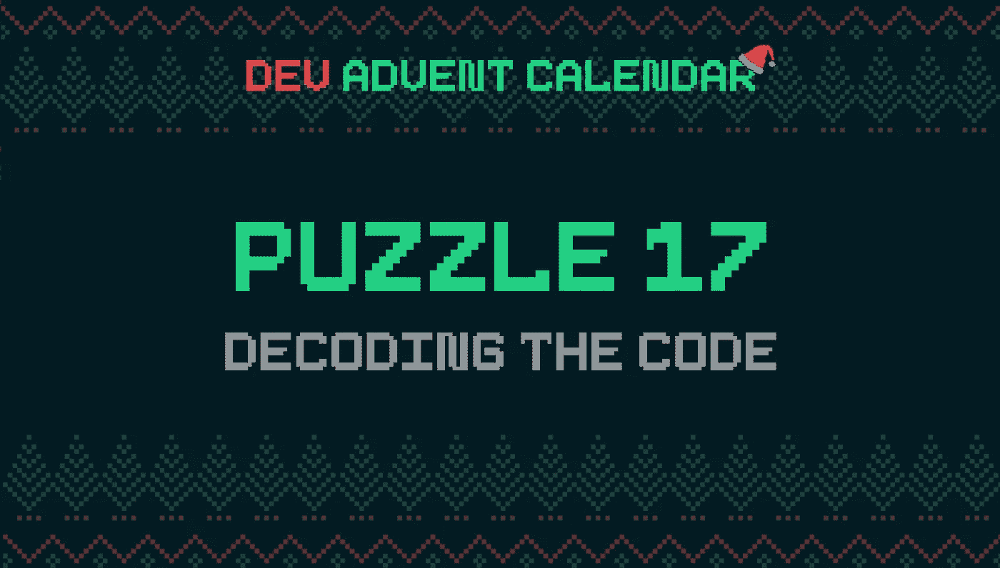

# 如何在 JavaScript 中实现对哈希值的暴力攻击

> 原文：<https://javascript.plainenglish.io/how-to-implement-brute-force-attacks-on-hash-values-in-javascript-954a01163b9d?source=collection_archive---------6----------------------->

Photo by [Victoria Heath](https://unsplash.com/@vheath?utm_source=medium&utm_medium=referral) on [Unsplash](https://unsplash.com?utm_source=medium&utm_medium=referral)

我教小精灵们如何用 JavaScript 创建密码，结果他们把密码弄丢了。这是一个问题，因为中央精灵计算机系统没有保存密码的副本。它只是存储散列，而散列本身实际上是不可能被解码的。我能怎么做呢？

# 谜题:解码代码🔐

[Dev 降临节日历拼图 17🎅](https://github.com/devadvent/puzzle-17)可以这样总结:如何用 JavaScript 黑掉一个密码？如何将 [bruteforce](https://en.wikipedia.org/wiki/Brute-force_search) 做成哈希表？

显然，这个问题是无解的。散列加密函数是不可侵犯的。在解决这个问题之前，最好理解一下散列函数的含义

# 加密哈希函数

维基百科很好地解释了特征是什么。

它是如何工作的？哈希函数获取数据并将其转换为固定大小的二进制字符串。每个数据集产生不同的散列。相似的数据产生非常不同的散列。

这些算法旨在抵御各种类型的攻击，并具有 3 个安全级别:

*   **前像阻力**:给定一个 hash 值 h，应该很难找到任何消息 m 使得 h = hash(m)。这个概念与单向函数的概念相关。缺少此属性的函数容易受到原像攻击。
*   **第二前像阻力**:给定一个输入 m1，应该很难找到不同的输入 m2 使得 hash(m1) = hash(m2)。这种特性有时被称为弱抗碰撞性。缺少此属性的函数容易受到二次前像攻击。
*   **抗碰撞**:应该很难找到两个不同的消息 m1 和 m2 使得 hash(m1) = hash(m2)。这种配对称为加密哈希冲突。这种特性有时被称为强抗碰撞性。它需要的散列值至少是前映像阻力所需散列值的两倍；否则，冲突可能会被生日攻击发现。

这使您可以确定，如果两个散列是相同的，那么起始数据也是相同的。

使用的一个例子是密码。如果我们想创建一个身份验证系统，创建一个包含各种用户密码的数据库是很危险的。建议只保留密码的哈希。当有人试图登录时，我们将请求生成的哈希与保存的哈希进行比较:如果它们相同，则密码是正确的。

这东西让我着迷。能够在不知道密码的情况下验证密码的正确性。另一个特性让我非常着迷:两个相似的密码有非常不同的哈希。

这使得追踪起始密码变得非常困难。

# 计算密码的散列值

为了使问题易于处理，有必要简化。交战规则如下:

*   我们知道要查找的密码的散列值
*   我们知道起始密码是什么形式:`<UPPER CASE LETTER>-<3-DIGIT-NUMBER>`。比如`X-348`、`L-239`、`V-111`。

这是一个很大的帮助。我们可以创建一个测试潜在密码的列表。然后我们计算每一个的散列，直到我们找到正确的一个。

在 NodeJS 中，很容易找到字符串的散列。只需使用[加密](https://nodejs.org/api/crypto.html) API:

# 创建潜在密码列表

创建测试潜在密码列表的最简单方法是使用两个嵌套的`for`循环。我用第一个来滚动字母表中的字母:

然后我插入第二个循环来遍历从`0`到`999`的所有数字

所以我创建了一个`test`变量:

我使用[string . prototype . pad start()](https://developer.mozilla.org/en-US/docs/Web/JavaScript/Reference/Global_Objects/String/padStart)方法使每个密码正好有 3 个数字。这样我就可以把`A-0`变换成`A-000`，`C-12`变换成`C-012`等等。

我得到了哈希

最后，我将它与我已经拥有的进行比较:

我立即退出了该功能:我不需要检查其他密码。一旦我找到了生成正确散列的那个，我也就找到了我要找的东西。

完整的代码如下所示:

# 至折射镜

这是一个简单易懂的解决方案。但是我可以做得更好。我可以删除`nested loop`。我也可以删除两个`returns`中的一个。这样我可以得到更清晰的东西:

实际上，您可以通过添加`listPassword`参数来简化它，而不是在函数内部计算它。但是拼图不允许我这么做。

我决定从`bruteForcePassword`函数中提取与问题无关的所有内容:密码列表的创建和哈希值的比较；

`isPassword`函数直接返回密码，而不是布尔值。这样我就可以利用 JavaScript 的能力，将字符串视为真值，将空值视为假值。我需要它来简化从`for...of`循环的退出。

为了生成密码列表，我将问题分成几个部分。首先，我需要一个包含数字`0`到`999`的数组。我创建了这个函数:

关于这个问题在 [stackoverflow](https://stackoverflow.com/questions/3746725/how-to-create-an-array-containing-1-n) 上有很好的讨论。简而言之，我可以用`Array(n)`创建一个`n`元素的数组。如果我添加 [Array.prototype.keys()](https://developer.mozilla.org/en-US/docs/Web/JavaScript/Reference/Global_Objects/Array/keys) 方法，然后使用 [spread 操作符](https://developer.mozilla.org/en-US/docs/Web/JavaScript/Reference/Operators/Spread_syntax)，我可以得到一个由`n`个元素组成的数组，每个元素都包含一个表示其位置索引的数字:

我使用这个数组和 [Array.prototype.map()](https://developer.mozilla.org/en-US/docs/Web/JavaScript/Reference/Global_Objects/Array/map) 方法将缺少的 0 添加到前 100 个元素中。

我可以很容易地创建一个包含字母表中的字母的数组:

这次我没有使用`keys()`:我可以让数组的所有元素都为空，然后使用索引来获取我想要插入的字母的`charCode`。

我创建了一个助手函数来连接字母和数字:

我用数字把想要的字符加到数组的每个元素上。最后，我创建了潜在密码列表:

综合所有的东西，我得到了我的解决方案:

仅此而已。这个谜题与数字 11 有关:

 [## 如何使用 JavaScript 生成随机密码

### 北极有安全问题。首先圣诞老人丢失消息代码)。然后掌管钥匙的精灵…

javascript.plainenglish.io](/how-to-generate-a-random-password-using-javascript-cbeb4b72ec12) 

感谢阅读！敬请关注更多内容。

***不要错过我的下一篇文章—报名参加我的*** [***中邮箱列表***](https://medium.com/subscribe/@el3um4s)

 [## 通过我的推荐链接加入 Medium—Samuele

### 阅读萨缪尔的每一个故事(以及媒体上成千上万的其他作家)。不是中等会员？在这里加入一块…

el3um4s.medium.com](https://el3um4s.medium.com/membership) 

*原载于 2021 年 12 月 18 日 https://blog.stranianelli.com***。**

**更多内容看* [***说白了就是***](http://plainenglish.io/) ***。*** *报名参加我们的* [***免费每周简讯这里***](http://newsletter.plainenglish.io/) ***。****