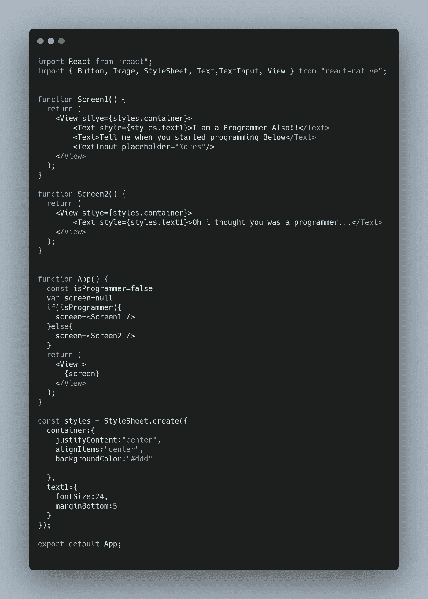

# 如何在 React 和 React Native 中以正确的方式实现条件呈现

> 原文：<https://javascript.plainenglish.io/how-to-implement-conditional-rendering-in-react-and-react-native-the-right-way-f00e2fa7a730?source=collection_archive---------7----------------------->

在 Web 和移动应用中使用动态用户界面

Photo by [Charles Deluvio](https://unsplash.com/@charlesdeluvio?utm_source=medium&utm_medium=referral) on [Unsplash](https://unsplash.com?utm_source=medium&utm_medium=referral)

如果你正在构建一个网络或移动应用程序，你的应用程序中很可能有某种程度的动态元素。

你可能会问，是什么让你的应用充满活力？

如果你的应用程序的一部分基于一些外部因素而改变，这意味着应用程序的一部分在本质上是动态的。

例如，假设您有一个包含三个部分的计数器应用程序:一个递增按钮、一个递减按钮和显示当前计数的文本。

在这种情况下，应用程序的*动态*部分是显示当前计数的文本。这是因为显示的数字取决于一个外部因素:

用户按下递增或递减按钮！

这是单个元素是动态的一个例子。但是如果你想基于外部因素呈现一个完全不同的*用户界面呢？*

这就是**条件渲染**的用武之地！

为了展示条件渲染的强大功能，我们将创建一个小型的 react 本地应用程序。这个应用程序会根据用户回答是否有程序员来显示不同的 UI。

*我们可能在他的例子中使用了 React Native，但是基本概念也适用于 React*

# **项目设置:创建屏幕**

在我们开始使用条件渲染之前，我们需要首先渲染多个屏幕。

在新的 React Native 应用程序中，添加以下两个功能组件和样式表。

如果这个人回答说他们是程序员，则显示屏幕 1。当屏幕 2 被使用时，如果他们回答他们是*而不是*程序员。

Screen 1 Code

Screen 2 Code

Stylesheet

# **添加条件渲染**

现在我们有了需要的两个屏幕，是时候实现条件渲染了。

为此，我们将使用 and if-else 语句将我们的屏幕存储在一个名为 *screen 的变量中。*

这是可能的，因为 React 和 React Native 允许我们将 JSX 元素存储在变量中。

这方面的代码如下:

*我们改变 isProgrammer 的值来表示用户输入，而不是实际接受用户输入。*

# 完整代码

如果有任何机会丢失，这里是完整的代码:

Full Code

# 结论

感谢您阅读完我的文章**‘如何在 React 和 React Native 中实现条件渲染的正确方式**。我希望你有美好的一天。以下是我的一些进一步的文章供你阅读:

 [## 如何在 GSAP 使用滚动触发插件

### 如何使用 GSAP 创建基于滚动的动画

javascript.plainenglish.io](/how-to-use-the-scroll-trigger-plugin-in-gsap-36ecbef854a)  [## 启动你的计算机科学职业生涯的 5 大资源

### 如果让我重来一次，我会选择的路。

javascript.plainenglish.io](/5-great-resources-to-kick-start-your-computer-science-career-ffb243ec8e6d)  [## 作为一名网络开发者，你需要 7 个 Chrome 扩展

### 让你的开发者生活更美好的扩展。

javascript.plainenglish.io](/7-chrome-extensions-you-need-as-a-web-developer-b5521025fb90) 

*更多内容看*[***plain English . io***](http://plainenglish.io/)